# Windows向け環境構築ガイド

このドキュメントでは、Windowsでの環境構築の方法について解説します。

チューターから指示のあったツールをインストールしてください。

## Bun

PowerShell（スタートメニューで「PowerShell」と検索して起動）を開き、次のコマンドを貼り付けて実行します。

```ps
powershell -c "irm bun.sh/install.ps1 | iex"
```

次のような表示になれば成功です。

```
bun was installed successfully to C:\Users\<ユーザー名>\.bun\bin\bun.exe

To get started, add the bun directory to your PATH:
  setx PATH "%PATH%;C:\Users\<ユーザー名>\.bun\bin"

To get started in a new powershell session, run:
  bun --version
```

ターミナルで新しいタブを開いて `bun -v` と入力すると、バージョン情報が表示されるはずです。

```
PS C:\Users\appare45> bun -v
1.3.14
```

## Node.js

Node.jsはJavaScriptをサーバーサイドで実行するためのランタイムである。ここでは **NVM for Windows**（Node Version Manager）を使ってインストールする。NVMを使うと、Node.jsのバージョンを簡単に切り替えられる。

### 1. インストーラのダウンロード

[こちらのリンク](https://github.com/coreybutler/nvm-windows/releases/download/1.2.2/nvm-setup.exe)をクリックしてNVM for Windowsのインストーラ（`nvm-setup.exe`）をダウンロードします。

### 2. インストーラを起動する

ダウンロードした`nvm-setup.exe`をダブルクリックして起動します。次のスクリーンショットの順番に従って進める。

「I accept the agreement」を選択して「Next」をクリックする。

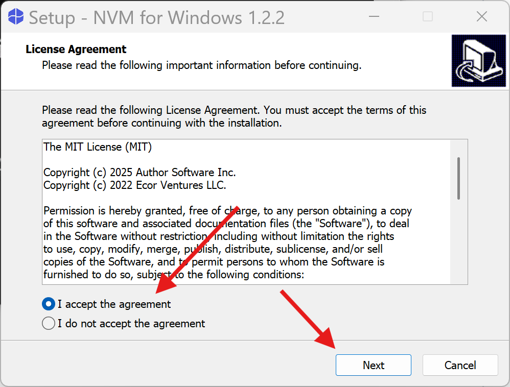

デフォルト（`C:\Users\<ユーザー名>\AppData\Local\nvm`）のまま「Next」をクリック。

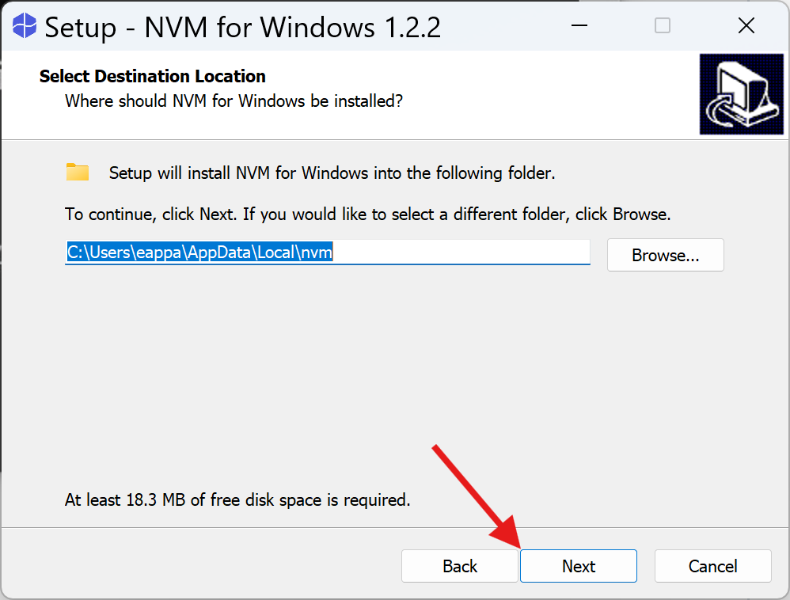

デフォルトのまま「Next」をクリック

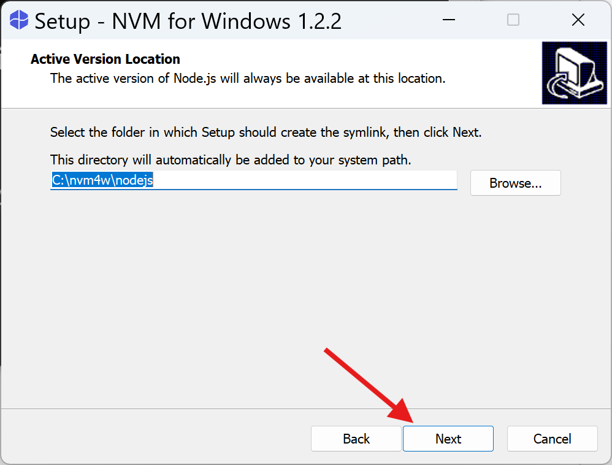

すべてのチェックを外して「Next」をクリックする。

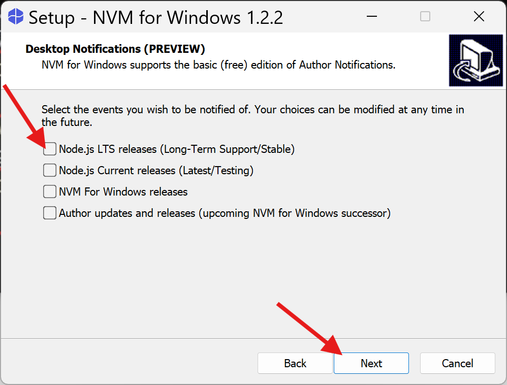

空欄のまま「Next」をクリックする。

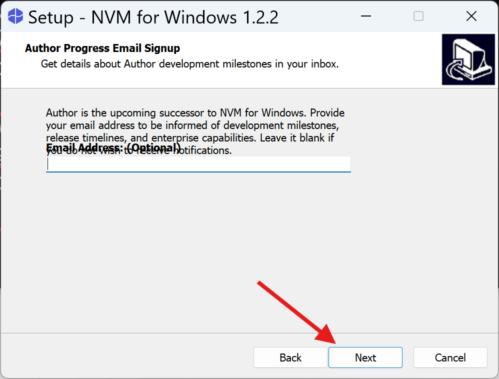

Install」をクリックしてインストールを開始する。

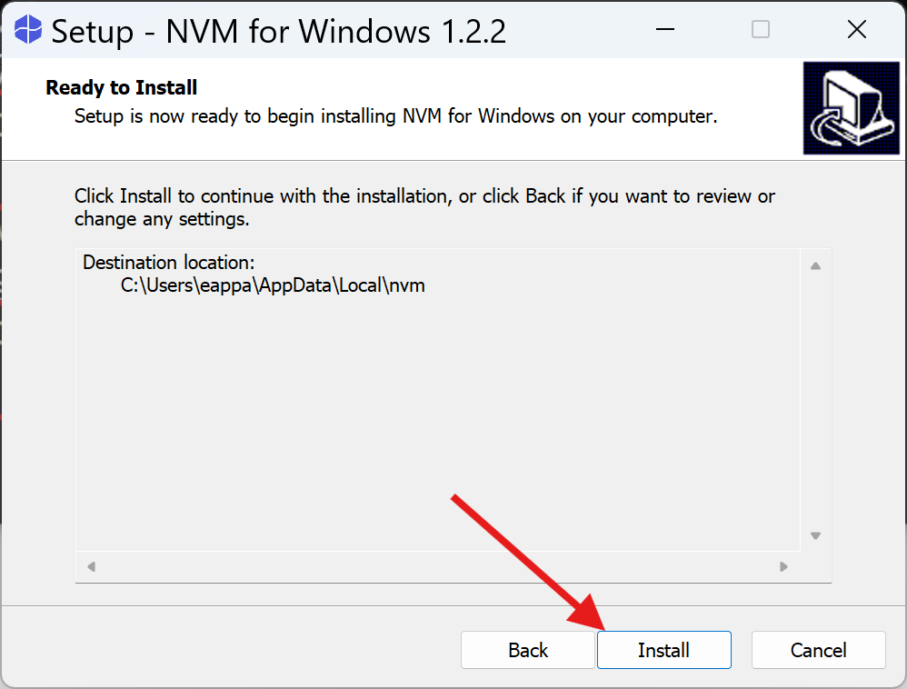

「Finish」をクリックする。

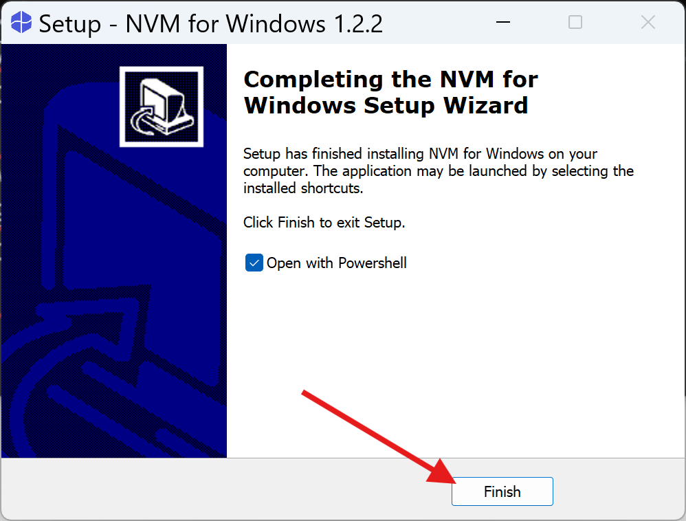

Windows PowerShellが自動的に起動し、「Welcome to NVM for Windows v1.2.2」と表示されたら成功です。

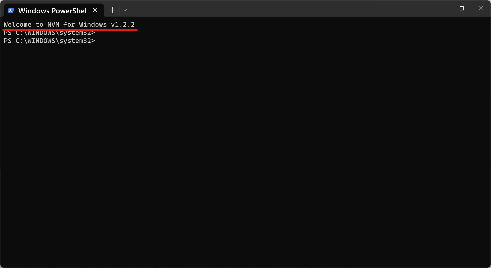

### 3. Node.jsをインストールする

PowerShellを一度閉じてから再度起動し、次のコマンドを順番に実行します。

```ps
nvm install lts
nvm use lts
node --version
```

最後に `v24.16.0` のようなバージョン番号が表示されれば成功です。

```
PS C:\WINDOWS\system32> nvm install lts
Downloading node.js version 24.16.0 (64-bit)...
Extracting node and npm...
Complete
Installation complete.
If you want to use this version, type:

nvm use 24.16.0
PS C:\WINDOWS\system32> nvm use lts
Now using node v24.16.0 (64-bit)
PS C:\WINDOWS\system32> node --version
v24.16.0
```

## Docker

### 1. WSLのインストール

PowerShellを起動して次のコマンドを実行します。

```ps
wsl --install
```

インストールが完了すると次のように表示されます。ユーザー名とパスワードの入力を求められるので好きなユーザー名とパスワードを設定します。

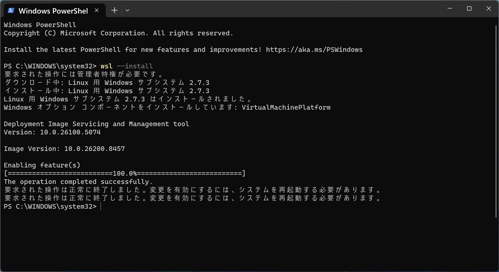

インストール後、次のコマンドでWSLのバージョンを確認します。

```ps
wsl --version
```

以下のように表示されれば正常にインストールされています。

```
PS C:\WINDOWS\system32> wsl --version
WSL バージョン: 2.7.3.0
カーネル バージョン: 6.6.114.1-1
WSLg バージョン: 1.0.73
MSRDC バージョン: 1.2.6676
Direct3D バージョン: 1.611.1-81528511
DXCore バージョン: 10.0.26100.1-240331-1435.ge-release
Windows バージョン: 10.0.26200.8457
```

### 2. Docker Desktopのインストール

[このリンク](https://desktop.docker.com/win/main/amd64/Docker%20Desktop%20Installer.exe)からDocker Desktopのインストーラをダウンロードします。

ダウンロードしたインストーラを起動すると設定画面が表示されるので、デフォルトのまま「OK」をクリックする。

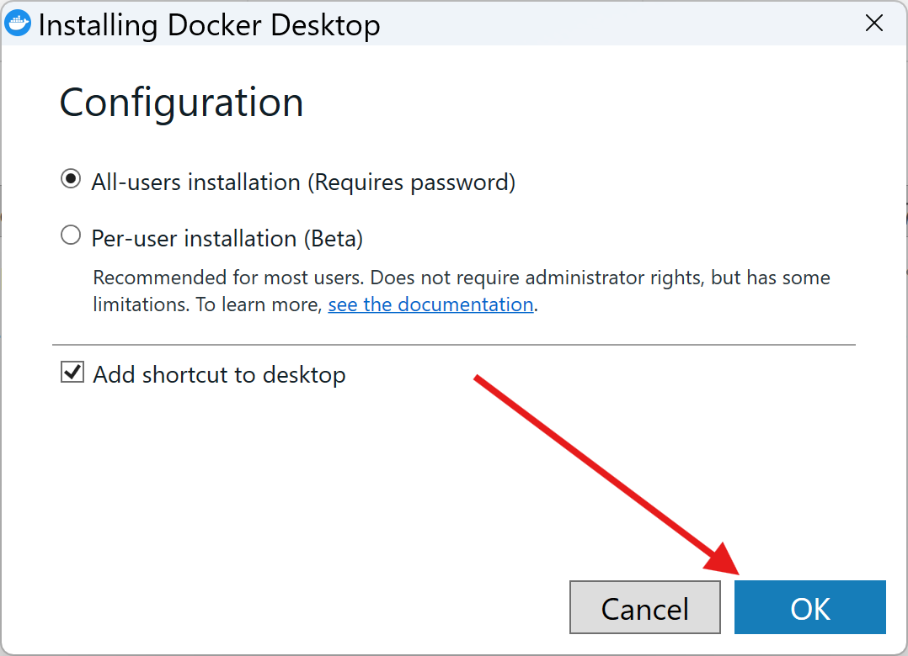

インストールが完了したら「Close and restart」をクリックしてPCを再起動します。

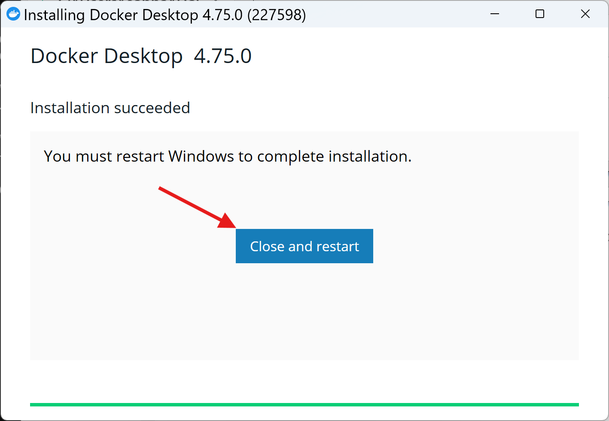

### 3. Docker Desktopの初期設定

再起動後、Docker Desktopを起動します。利用規約（Docker Subscription Service Agreement）が表示されたら「Accept」をクリックします。

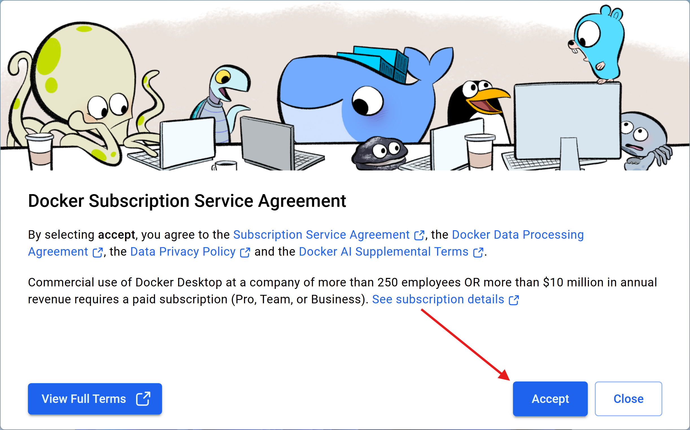

「Welcome to Docker」画面が表示されたら、右上の「Skip」をクリックして先に進みます（アカウントは不要）。

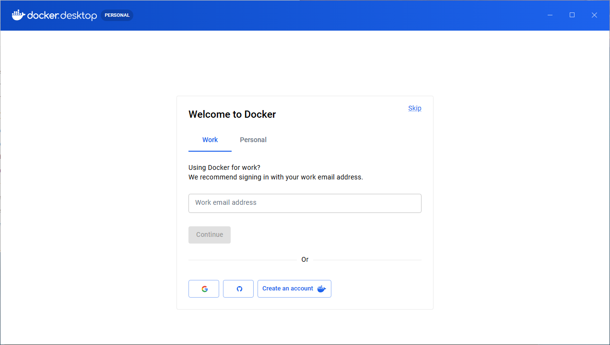

### 4. 動作確認

Docker Desktopのダッシュボードが表示され、左下に「Engine running」と表示されれば正常に起動しています（少し時間がかかります）。

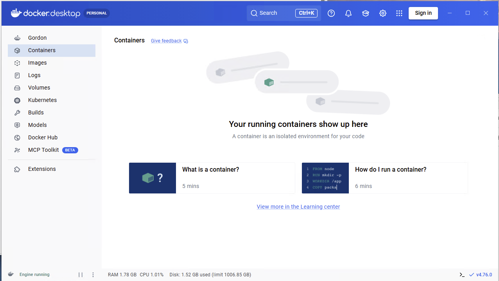
