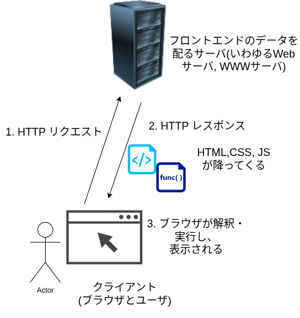
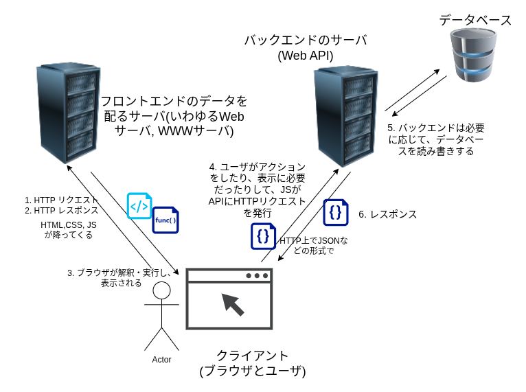

ここでは、Webアプリケーションを俯瞰してみよう/バックエンドって何をしているの?と題して、
Webアプリケーションを構成する登場人物たちを俯瞰し、バックエンドがその中で占めている役割を理解します。

# 登場人物, 挙動

## 静的なWebページ

まず、ホームページといったものがそうであるような、
静的なWebページ(クライアントがデータを登録するというような意味での動的な要素がないWebページ)の場合をおさらいしましょう。

主な登場人物は

- フロントエンドのデータを配るサーバ
- クライアント(ブラウザとユーザ)

の2つで、だいたい以下の画像のようなイメージです。

## バックエンドを持つWebアプリケーション

今度は、バックエンドを持つ動的なアプリケーションを見てみましょう。

主な登場人物は

- フロントエンドのデータを配るサーバ
- クライアント(ブラウザとユーザ)
- バックエンドのサーバ(Web API)
- データベース

の4つがあります。
だいたい以下の画像のようなイメージです。

`1.` \~ `3.`は先ほどと同じです。

バックエンド(Web API)に対するアクセスも同様にHTTPを使って行われますが、
そのうえでデータをどういう形式でやり取りするかは場合に依ります。
予めスキーマを定めて、JSONのような形式でやり取りすることが多いです。

---

**重要:** これらで言っている「サーバ」というやつは、
何も難しいことを考えたり、何か特別な機器を用意したりする必要はなく、
論理的な概念の「サーバ」です。
(サーバの対義語である)「クライアント」が何か要求したら応答を返す(サーブする)してくれる「サーバ」という程度の意味しか持ちません。

そういう意味では、必ずしも1つ1つの「サーバ」が異なる物理マシンで動く必要はありません。
フロントエンドサーバ(Webサーバ)とバックエンドサーバ(Web API)が同一のマシンに載っていたって良いですし、
バックエンドサーバとデータベースが同じマシンでもそうですし、
これからやっていく実践編ではすべてがローカルのPC1台で完結するようにしています(もちろんそのために色々な仮想化技術は使うわけですが)。

なお、世の中でソフトウェアサービスを提供するにあたって「サーバ」の仕事をずっとやらせ続けたいマシンというのはあるわけで、
「サーバ」の仕事に特化したマシンも当然あります。

ラックサーバという形態のマシンは、板状をしており、
ラックと呼ばれるデカい冷蔵庫みたいな棚に何枚も(最大数十枚挿さる場合が多い)挿し込んで使います。
スペースを高密度で利用し、まとめて管理できる、というわけです。
画像にも示されているような「サーバ」と言われて思い浮かべる人がいるかも知れない人より背の高い黒い直方体は、
おそらくラックのイメージでしょう。

詳しくはインフラ部門まで。
jsysではラックは持っていないものの(そんなに要らないので)、ラックサーバ数台程度なら時期になれば登場するかも知れませんよ...!
