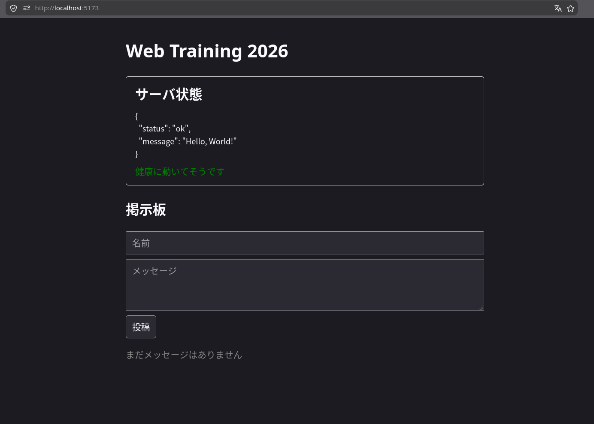

さて、ここまででとにかくレスポンスを返すシンプルなバックエンドのコードを作りました。

しかし、「1章: 知っておきたい! 知識編」で触れたように、Webアプリケーションを構成する登場人物はこれだけではありませんでした。
すでにユーザが登録したデータを読んだり、新たにデータを永続化したりしたいですよね。
そこで、データベースの登場です。

今回は、PostgreSQLというリレーショナル・データベースを、GORMというGo用のORMを介して操作していこうと思います。

## データベースのスキーマ定義

`backend/model/message.go` を見てください。

ここにはSQLの`messages`テーブルの定義のもとになるモデルが書いてあります。

```go
package model

import "time"

// Message は掲示板の1件の投稿を表すモデルです。
// この struct の定義をもとに、GORM が messages テーブルを自動で作ります
// (db/db.go の AutoMigrate を参照)。
//
// `json:"..."` タグは、JSONに変換したときのキー名を指定しています。
type Message struct {
	ID        uint      `gorm:"primaryKey" json:"id"`
	Message   string    `gorm:"size:255;not null" json:"message"`
	UserName  string    `gorm:"size:255;not null" json:"userName"`
	CreatedAt time.Time `gorm:"not null" json:"createdAt"`
}
```

何やら大変なことが書いてありますが、
実は、Phase 2で`docker compose up`をしたときに、すでにこの定義からテーブルが自動で作られています。

`backend/db/db.go` を見ると、アプリの起動時に呼ばれる処理の中に

```go
	// model.Message の定義に合わせて messages テーブルを自動で作成・更新する
	if err := d.AutoMigrate(&model.Message{}); err != nil {
		return fmt.Errorf("failed to migrate database: %w", err)
	}
```

とあります。
この`AutoMigrate`が実行されると、

```sql
CREATE TABLE messages (
  id BIGSERIAL PRIMARY KEY,
  message VARCHAR(255) NOT NULL,
  user_name VARCHAR(255) NOT NULL,
  created_at TIMESTAMPTZ NOT NULL
);
```

のようなSQL文が発行され[^automigrate]、

| id (整数, 行追加時には自動でカウントアップされる) | message (255文字以下の文字列, 空っぽは駄目) | user_name (255文字以下の文字列, 空っぽは駄目) | created_at (時刻, 空っぽは駄目) |
| ------------------------------------------------- | ------------------------------------------- | --------------------------------------------- | ------------------------------- |
| 1                                                 | "こんにちは!\nいまなにしてる?"              | "風吹けば名無し"                              | 2026-06-06T13:00+09:00          |

のようなテーブルがデータベースに作られます。
なお、この段階では何のデータ(レコード, 行)も格納されていません。
(上の表の1行目のレコードは、こうなる予定というイメージです。)

本当にテーブルができているのか、覗いてみましょう。
docker composeには[Adminer](https://www.adminer.org/)という「ブラウザからデータベースの中身を覗けるツール」も入れてあります。
[http://localhost:8080](http://localhost:8080) を開いて、

- System: `PostgreSQL`
- Server: `db`
- Username: `app`
- Password: `app`
- Database: `app`

でログインしてみてください。
たしかに`messages`テーブルができている(そして中身は空っぽな)のが確認できるはずです。

## messageのハンドラ内でデータベースを操作しよう

`backend/api/message.go` を見てください。

```go
package api

// /messages エンドポイントのハンドラをこのファイルに実装していきます。

// ここに追記
```

ここに、以下のように追記してください。
(Goでは`import`はファイルごとに書くので、このファイルにも必要です。)

```go
// ここに追記
import (
	"net/http"

	"github.com/labstack/echo/v4"

	"github.com/twin-te/web-training-2026-template/backend/db"
	"github.com/twin-te/web-training-2026-template/backend/model"
)

// GetMessages は `/messages` への `GET` リクエストのハンドラです。
func GetMessages(c echo.Context) error {
	messages := []model.Message{}
	if err := db.DB.Find(&messages).Error; err != nil {
		return err
	}
	return c.JSON(http.StatusOK, messages)
}
```

`GetMessages`は、Phase 2で`/health`のために書いたのと同じ形のハンドラ関数です。
今度は使い回せるように名前を付けて定義しました。

なお、この`GetMessages`を、次に `main.go` で`/messages`への`GET`リクエストのハンドラとして登録してください。

```go
	/* ここに追記 */
	e.GET("/health", func(c echo.Context) error {
		return c.JSON(http.StatusOK, healthResponse{
			Status:  "ok",
			Message: "Hello, World!",
		})
	})

	// 追記する
	e.GET("/messages", api.GetMessages)
```

`main.go`の`import`にも`api`パッケージの追記が必要ですね。

```go
import (
	"net/http"
	"os"

	"github.com/labstack/echo/v4"
	"github.com/labstack/echo/v4/middleware"

	"github.com/twin-te/web-training-2026-template/backend/api"
	"github.com/twin-te/web-training-2026-template/backend/db"
)
```

もう一度、今 `backend/api/message.go` に追加したコードを見てみましょう。

```go
func GetMessages(c echo.Context) error {
	messages := []model.Message{}
	if err := db.DB.Find(&messages).Error; err != nil {
		return err
	}
	return c.JSON(http.StatusOK, messages)
}
```

この `db.DB.Find(&messages)` を実行すると、

```sql
SELECT * FROM messages;
```

のようなSQL文が発行されます。
`messages`テーブル(先ほど定義を見たテーブルですね)から何でもかんでも(`*`)を取り出すということです。

そうすると取得できたいくつもの行が`messages`(`model.Message`のスライス[^slice])に詰め込まれるので、これまでと同様`c.JSON()`でレスポンスを返します[^nilslice]。

## 動作を検証しよう

今回もまた、curlを使って検証をしていきましょう。
(docker composeを立ち上げっぱなしにしていれば、コードはairが自動でビルドし直してくれていますよ。)

以下のように`/messages`を見に行くと...

```sh
$ curl http://localhost:3000/messages
```

何ということでしょう、`[]`という文字列が返ってきただけです。

```sh
$ curl http://localhost:3000/messages
[]
```

失敗でしょうか...

確認用クライアントからも確認してみましょう。

```sh
# frontend/ 以下で
$ npm i
$ npm run dev
```



> まだメッセージはありません

と表示されています。

そういえば先程見た`messages`テーブルには何のレコードも格納されていませんでしたね。

`[]`はJSONの空の配列を表し、つまり、メッセージが0件取得されたということです。
正しく動いていたのですね!

そうなると、今度はメッセージをデータベースに格納していきたいですね。
さあ、次のフェーズに行きましょう。

---

[^automigrate]: 正確には、GORMは既存のテーブルと見比べて足りないテーブルや列だけを作ってくれます。開発中はモデルをいじって再起動するだけでテーブルが追いついてくるので楽ちんです。本物のサービスの運用では、データベースの変更をもっと慎重に管理するためにマイグレーションファイルを使うことが多いです。

[^slice]: スライスというのはGoの可変長の配列(のようなもの)です。

[^nilslice]: 細かい話ですが、`messages := []model.Message{}`と「空のスライス」で初期化しているのがミソです。`var messages []model.Message`と宣言だけした場合、中身が空だとJSONでは`[]`ではなく`null`になってしまいます。
