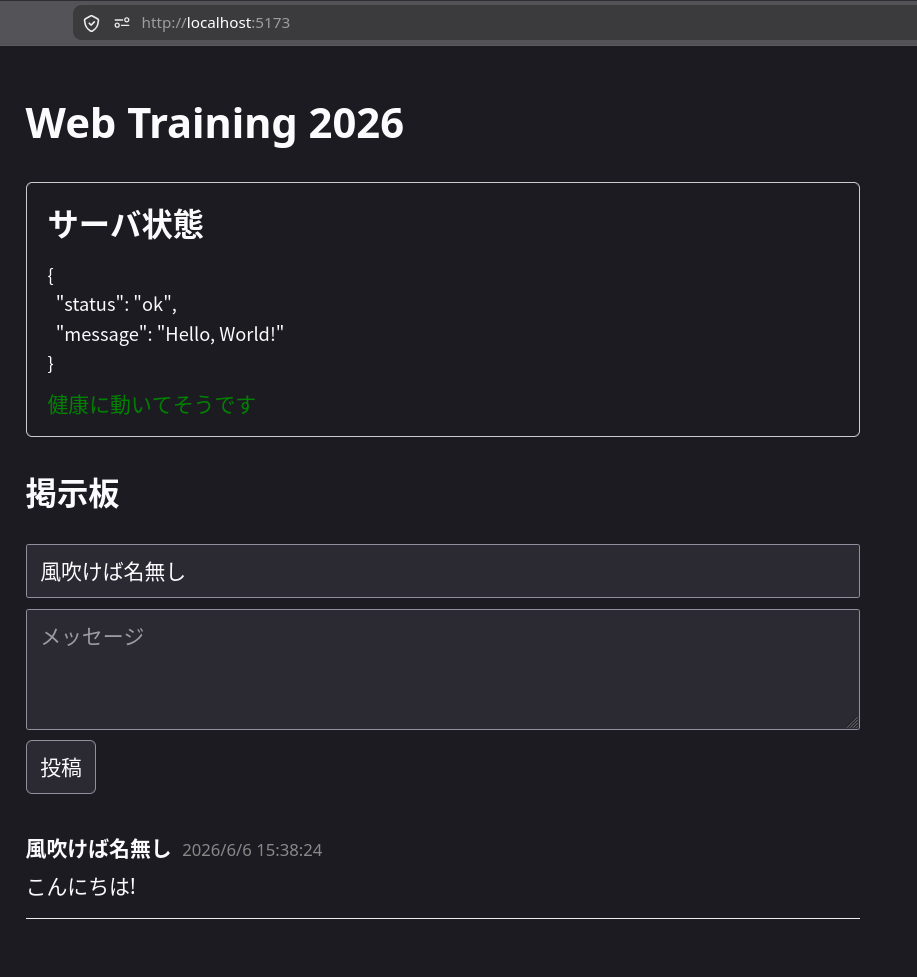

引き続き `backend/api/message.go` で作業をします。

さきほどは`/messages`に来た`GET`をハンドリングする処理を追加しました。

今度は`POST`をハンドリングする処理を追記します。

```go
// 先ほど登録した処理
func GetMessages(c echo.Context) error {
	// 省略
}

// PostMessageRequest は `/messages` への `POST` リクエストのボディの形です。
type PostMessageRequest struct {
	Message  string `json:"message"`
	UserName string `json:"userName"`
}

// PostMessage は `/messages` への `POST` リクエストのハンドラです。
func PostMessage(c echo.Context) error {
	var req PostMessageRequest
	if err := c.Bind(&req); err != nil || req.Message == "" || req.UserName == "" {
		return c.JSON(http.StatusBadRequest, echo.Map{"error": "invalid format"})
	}

	m := model.Message{
		Message:  req.Message,
		UserName: req.UserName,
	}
	if err := db.DB.Create(&m).Error; err != nil {
		return err
	}

	return c.JSON(http.StatusCreated, m)
}
```

`main.go`への登録も忘れずに。

```go
	// 追記する
	e.GET("/messages", api.GetMessages)
	e.POST("/messages", api.PostMessage)
```

上から見ていきましょう。

`c.Bind(&req)`は、リクエストのボディに入っているJSONを、
`PostMessageRequest`のstructに詰めてくれます。
その後の`if`では、JSONとして読めなかったり、`message`や`userName`が空っぽだったりする不正なリクエストに対して、
`400 Bad Request`でエラーを返しています。

次の `db.DB.Create(&m)` を実行すると、

```sql
INSERT INTO messages (message, user_name, created_at) VALUES ('メッセージ', 'ユーザ名', ...);
```

のようなSQL文が発行され、データベースにデータが格納されます。

ここで面白いのは、`Create`に渡したstruct `m` に、
データベース側で採番されたID(`ID`)や作成時刻(`CreatedAt`)がGORMによって書き戻されるという点です。
なので、挿入後にもう一度データベースからレコードを取得し直さなくても、
そのまま`c.JSON()`で「作成されたレコード」をレスポンスとして返すことが出来ます[^reselect]。

フロントエンドからすると、

```json
{
  "message": "こんにちは!",
  "userName": "風吹けば名無し"
}
```

というリクエストを送ると、

```json
{
  "id": 1,
  "message": "こんにちは!",
  "userName": "風吹けば名無し",
  "createdAt": "2026-06-06T06:38:24.690418Z"
}
```

のようにレスポンスが返ってきて、
成功したことや何時に作成されたのかといった付加情報を得ることが出来ます。

## 動作を検証してみよう

curlで以下のようにすると`POST`メソッドを使うことと、
データ(ペイロード)を送信することを指定できます。

```sh
$ curl -X POST http://localhost:3000/messages -d '{ "message": "こんにちは!", "userName": "風吹けば名無し" }'
```

実行してみると...

```sh
$ curl -X POST http://localhost:3000/messages -d '{ "message": "こんにちは!", "userName": "風吹けば名無し" }'
{"error":"invalid format"}
```

あれ、さっき自分で実装したばかりの「不正な形式」エラーが返ってきてしまいました。

実は、curlの`-d`はデフォルトでは「HTMLのフォームです」という宣言でデータを送るため、
バックエンド(の`c.Bind()`)に「これはJSONですよ」というのが伝わっていなかったのです。

HTTPでは、送るデータの形式を`Content-Type`というヘッダで宣言することになっています。
`-H`オプションでヘッダを付けて、もう一度送ってみましょう[^header]。

```sh
$ curl -X POST http://localhost:3000/messages -H 'Content-Type: application/json' -d '{ "message": "こんにちは!", "userName": "風吹けば名無し" }'
{"id":1,"message":"こんにちは!","userName":"風吹けば名無し","createdAt":"2026-06-06T06:38:24.690418Z"}
```

今度は成功レスポンスが返ってきました!

先程は`[]`という空の配列が返ってきた`/messages`への`GET`をし直してみましょう。

```sh
$ curl http://localhost:3000/messages
[{"id":1,"message":"こんにちは!","userName":"風吹けば名無し","createdAt":"2026-06-06T06:38:24.690418Z"}]
```

成功です!
たしかに保存された投稿が取得できました。

また、掲示板UIを使ってブラウザから、「投稿」をしたりしてみてください。



匿名掲示板らしい形になりましたね!

---

[^reselect]: ORMや言語によっては、挿入したレコードのIDを別途受け取って、それを使ってもう一度SELECTし直す必要がある場合もあります。

[^header]: ヘッダについては[3章 Phase 1: 続! HTTP探検隊](/backend/3-improve/phase1/)でもっと詳しく覗いてみます。
