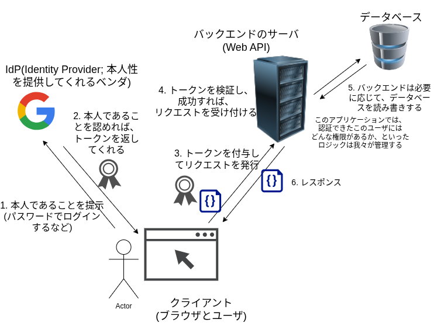

# 認証と認可

まず言葉を整理しておきます。

| 用語     | 英語           | 意味                                        |
| -------- | -------------- | ------------------------------------------- |
| **認証** | Authentication | 「あなたは誰ですか?」を確かめること         |
| **認可** | Authorization  | 「その操作をして良いですか?」を確かめること |

たとえば、SNSで自分のDMを取得するとします。

- **認証**: このリクエストを送ってきたのは @alice 本人である、と確かめる
- **認可**: @alice は自分のDMを読む権限がある、と確かめる

両方が揃って「@alice が自分のDMを読む」という操作が成立します。

# なぜアクセストークンが必要か

「認証のために、リクエストのたびにパスワードを送ればいいんじゃない?」と思うかもしれません。

しかし、パスワードは非常に機密性が高い情報です。
毎回ネットワークに流すのは危険ですし、サーバ側でも毎回ハッシュを比較するのはコストがかかります。

そこで一般的なのは、**一度だけパスワードを送ってログインし、その後は有効期限付きの「証明書」すなわちアクセストークンで通信する**という方法です。

1. クライアントは、 ユーザID + パスワード を サーバ に渡す
2. サーバは ユーザID + パスワード を検証し、正しければ、アクセストークンを発行してクライアントに渡す
3. クライアントは以降認証・認可が必要なリクエストには、アクセストークンを付与してサーバに渡す
4. サーバはアクセストークンを検証し、正しければ、リクエストを受け付ける

リクエストにアクセストークンを付与、というのは、
Phase 1で見たように、HTTPリクエストのヘッダである`Cookie`や`Authorization`にトークンを記載してリクエストする、ということです。

これにより、パスワードという秘密の情報を最小限にしか扱わなくて済むわけです。

## パスワードを扱うことをトークン発行という概念で切り分けたことによる効能その2: 本人であることの根拠の提示を誰かに委ねることができる

アクセストークンの導入により、パスワードを通信路上を運搬する回数を最低限に下げられたわけですが、
依然としてパスワードという機密情報を我々が作るアプリケーションのデータベースに保管する必要があることは変わりません。

攻撃者から見れば大変価値の高い攻撃対象になるわけです。
パスワードやユーザ情報が含まれるデータベースがミスや攻撃で漏洩してしまうと大変です。

パスワードそのものを格納するのではなくハッシュ値(入力から一意に定まる不可逆的に圧縮した値)を格納するとか、
それでも攻撃はあるのでソルトという値を付与するとか...
よくよく考えて防御方法を講じなければなりません。

パスワードを我々のアプリケーションで管理することは大変なコストがかかるのです。

ところで、そういえばみなさんがなんらかのWebアプリケーションにログインしようとしたとき、
_Login with Google_ とか _ソーシャルアカウントでログイン_ というのを見たことがありますよね?

よく思い出すと、あれらはそのアプリケーション自体にはパスワードは登録しておらず、
すでにログインしているメールアドレスなどを使って本人性を確認していますね。

そうです、パスワードを扱うことをトークンの発行と切り分けたことにはもう1つ恩恵があるということです。

パスワードを管理するのはソーシャルアカウントを提供するベンダに任せ、
そのアカウントにログインしていることを示すトークンを発行してもらい、
我々のアプリケーションではそのトークンの検証だけを行えばよいのです。

このように、本人であることの根拠を提示してくれるベンダ, サービス, 主体のことをIdP(_Identity Provider_)と呼びます。

全体としてはこのような登場人物が出てきて、図のように動くわけですね。

| 役割             | 呼び名            | 役割の説明                                                       |
| ---------------- | ----------------- | ---------------------------------------------------------------- |
| IdP              | Identity Provider | ユーザを管理し、トークンを発行する。Auth0、Keycloak、Google など |
| ユーザ(Subject)  | —                 | ログインして操作する人                                           |
| アプリケーション | Resource Server   | トークンを検証し、リクエストを処理するバックエンド               |

## トークンの「検証」ってどうやる?

発行されたトークンは検証出来なければなりません。
これを実現するにはいくつか方法が考えられますが、
トークンが表すユーザや有効期限を誰が持つのかという設計要素があります。

- トークン発行者が、トークンという文字列とユーザや有効期限の組をデータベースに保管しておく
- トークンそのものにユーザIDや有効期限を記述しておく

前者であればトークンの有効性の検証のためにデータベース
(我々が管理していないなら管理しているIdP)にアクセスする必要があります。
このような状態を持つ必要がある設計を「ステートフル」などと表現することがしばしばあります。
また、セッションの管理をしているということで、セッショントークンなどと呼んだりします。

後者であればトークンを見ればユーザIDや有効期限が分かるわけです。
これは便利ですね。
このように状態管理をデータベースなどで行わずとも良い設計を「ステートレス」などと呼ぶことがあります。

しかしながら、よく考えてみてください。
果たしてそのトークンという文字列そのもの(ユーザIDや有効期限などの情報も含め最終的にトークンの形式の文字列にエンコードされているわけですから)は、
真実なのでしょうか?
悪意のあるクライアント(ある種の「攻撃者」ですね)が有効期限を伸ばして来るかもしれませんし、さらにはユーザIDを書き換えてなりすましをしてくるかもしれません。

### クライアントが持つものは、すべて割られうる

ここで1つ持ってほしい大事な考え方を紹介しておきます。

**クライアント(ブラウザ、スマホアプリ)が持っているデータは、すべて攻撃者に読まれたり改ざんされたりする可能性がある**、ということです[^ware]。

Cookieも、ローカルストレージ(ブラウザにJSから利用できるそういうストレージが付いています)も、アプリのコードも、全部です[^client-trust]。

攻撃者というのは、悪意のあるクライアントかもしれませんし、
何らかの方法でアプリケーションをハックして正規のクライアントの情報を抜こうとする人かもしれません。

Webアプリケーションに限らず、クライアント・サーバのモデルを取るあらゆるアプリケーションにおいて、
正当性(権威性)は我々が安全にどこかにホストするサーバのロジックのみが保証できるのです。

今回取り扱っている認証・認可に関しては、このことから、
サーバ(バックエンド)はクライアント(フロントエンド)から送られてきたトークンを**そのまま信用してはいけない**という観点を考えなければなりません。

「このトークンは正規の方法で発行したものであり、改ざんされていない」とサーバ側で検証できる仕組みが必要です。

### 公開鍵とデジタル署名

電子の世界で本人である(または本人によるものである)ことを証明するにはどうしたら良いでしょう。

本人しか持っていないもの、と、
本人しか持っていないものやそれにより連鎖的に決定できるものを誰でも検証できる方法があれば良いわけです。

公開鍵暗号というものがあります。

公開鍵暗号は、

- 本人しか持っていない秘密鍵
- 誰にでも公開して良い公開鍵

の2つの鍵の組がそれぞれ暗号化と復号という逆の処理を担当する暗号方式です。[^public-key-roles]

現実の鍵では閉める鍵と開ける鍵は同じ(つまり共通鍵)なので、そんなことできるの?という気持ちになりますが、
電子の世界では、RSA暗号, 楕円曲線暗号など先人たちが数学を駆使して考案した種々の方法で公開鍵暗号は実現できています。

デジタル署名では、公開鍵暗号を上手く活用して、

- 秘密鍵を持つ本人のみが署名を作成できる
- 公開鍵を誰でも手に入れて署名を検証できる

という仕組みを実現しています。

### JWT

この仕組みを使った代表的なトークン形式が **JWT (JSON Web Token)** です。

署名によりトークンの正当性を検証でき(つまり、内容の改ざんを防ぐことが出来る)、ステートレスなトークンです。

Phase 1 で見た `eyJhbGciOiJSUzI1NiIsInR5cCI6IkpXVCJ9...` という長い文字列は、JWT です[^jwt-alg]。

ヘッダやペイロードといったデータを載せる部分と、それが正しいことを示す署名で構成されています。

ペイロード部分には `{"sub": "alice", "exp": 1234567890, ...}` のような JSON が入っており
(ただし、Base64という方式でアルファベットな文字列にエンコードされています)、
誰のトークンか・有効期限などが読み取れます[^jwt-decode]。

# 登場人物のまとめ

再度、先程の関係図に戻ってみると、

IdPはIdPのみが知る秘密鍵を持っており、クライアントが本人であると検証できれば、その秘密鍵で署名をしたJWTのようなトークンを発行します。

以降クライアントはアプリケーションのバックエンドサーバにリクエストをする際にはトークンを付与するので、

バックエンドサーバは予めIdPが持つ秘密鍵に対応する公開鍵を持っておけばその場でトークンを検証でき、
クライアントが誰であるかを正しく分かることができるわけです。

なお、IdPからのトークン発行に関して標準化されたプロトコルとしてOAuth 2.0やOpenID Connectというものが存在するので、
どこかでこれらの言葉に出遭ったときは認証や認可に関するお作法の話だったと思い出してください。

# 最後に: 自分で実装するな

認証・認可は正しく実装するのが非常に難しい領域です。

脆弱な実装は直接ユーザのアカウント乗っ取りやデータ漏洩につながるため、世界中のエンジニアが常に気を配っています。

- IdP を使う: Auth0・Keycloak・Firebase Authentication など、実績のあるサービスやソフトウェアを使う。パスワード管理, トークン発行の難しい部分を任せてしまう。
- ライブラリを使う: トークンの検証も、実績のあるライブラリに任せる。

学習という意義で車輪の再発明をすることは良いことですが、
実際に使われるサービスにおいてはユーザのデータを守るために信頼できる実装を使うべきだと思われます。

---

[^ware]: 本来窃取されたくないソフトウェアのコードやデータを取得することを「割る」と言います。行為とsoft**ware**をかけて、違法に窃取したソフトウェアを「割れ」と呼ぶこともあります。語源的にはだいぶ古いらしく正確には分かりませんが、そういう風に表現されている例を見たら思い出してくれると良いでしょう。

[^client-trust]: だからこそ HTTPS (TLS) で通信を暗号化したり、Cookie に `HttpOnly` (JS から読めなくする) や `Secure` (HTTPS のみ送る) といった属性をつけたりして、攻撃の難易度を上げる工夫が必要になります。

[^public-key-roles]: 秘密鍵と公開鍵のどちらが暗号化と復号を担うのかの話は、暗号用途と署名用途で逆であり、ややこしいのでカットしました。

[^jwt-alg]: この文字列の先頭部分をBase64デコードすると`{"alg":"RS256","typ":"JWT"}`というヘッダが出てきます。`RS256`は公開鍵(RSA)を使った署名方式です。なお、JWTの署名には`HS256`のような共通鍵(HMAC)方式もあり、その場合は発行者と検証者が同じ秘密の鍵を共有します。ここでは本文の説明に合わせて公開鍵方式を前提にしています。

[^jwt-decode]: ペイロードは署名されているだけで暗号化はされていないので、Base64 をデコードすれば誰でも中身を読めます。秘密情報をペイロードに入れないよう注意が必要です。
