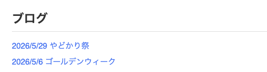

Astroはコンテンツに焦点を当てたWebフレームワークです。jsysではその特徴を活かして、公式Webサイトなどのビジュアルがや内容が重要となる場面に活用されています。またAstroで作成されたページではReactの要素を呼び出すこともできるので、別のプロジェクトで作った要素を埋め込みたい場合や、複雑な操作が必要な部分だけReactで作るといった使い方もできます。

また、Astroは自動的に不要なJavaScriptを削除したり、画像を最適化することで読み込みが高速なWebサイトの作成が可能になります。Astroで作成する`astro`ファイルはHTMLファイルと非常に似ているため、これまで学んできたHTML/CSS/JavaScriptの知識をそのまま使うことができます。実際に下記がAstroのファイルの例ですが、まだAstroについてほとんど知らないみなさんもなんとなくどんなページができるのか想像できるかと思います。

```astro
---
import './styles.css';
---
<html lang="en">
	<head>
		<meta charset="utf-8" />
		<title>はじめてのAstro</title>
	</head>
	<body>
		<h1>ブログ</h1>
		<ul>
			<li><a href="./yadokari" >やどかり祭</a></li>
			<li><a href="/gw">ゴールデンウィーク</a></li>
		</ul>
	</body>
</html>

<script>
	console.log("Hello, Astro!");
</script>
```



ここまでの説明ではAstroは単なるHTML/CSS/JavaScriptの拡張であるかのように見えるかもしれませんが、Astroを使うことでより便利にWebサイトを作成することができます。このチュートリアルではAstroのチュートリアルを参考にしつつ、Astroの特徴的な機能を紹介していきます。
