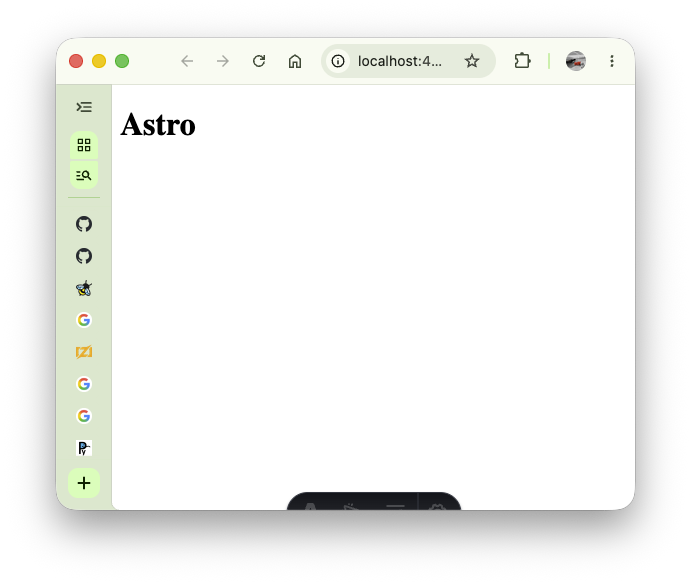
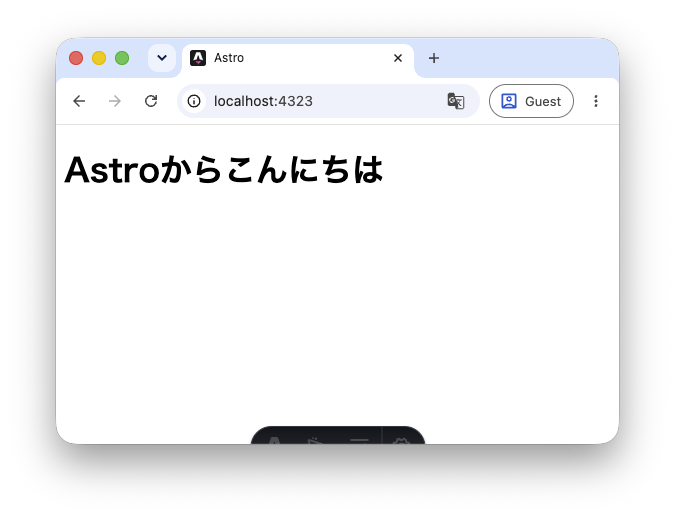

Astroでは開発者はHTMLファイルを書くのではなく、Astroファイルと呼ばれるファイルを作成します。Astroファイルは最終的にHTMLファイルに変換してWebサイトとして公開することができるようになります。このAstroファイルやCSSファイルなどを統合して最終的なHTMLファイルに変換する作業を「ビルド」と呼びます。

この章では、Astroをビルドするための環境構築について解説します。

## 2.1 Astro を取り巻くツール
### 2.1.1 Bun

BunはJavaScriptを実行するソフトウェア（JavaScriptランタイム）です。これまで私たちが書いてきたJavaScriptはWebブラウザ上で動いていましたが、Bunを使うことでブラウザ以外でもJavaScriptを動かすことができるようになります。Astroのビルドを実行するプログラムがJavaScriptで動いているためBunをインストールする必要があります。

### 2.1.2 パッケージマネージャ

**パッケージマネージャ**とは、パッケージを管理するためのツールです。パッケージとはライブラリやモジュールといった概念を包含するもので、公開されたオープンソースのコードと考えて差し支えないでしょう。プログラミングの世界では、**他人が書いたプログラムを自分のプロジェクトに導入して利用するという、ライブラリ**などと呼ばれる概念がありますが、これらを管理するためのツールがパッケージマネージャです。

例えば自分のプロジェクトでライブラリ A を使用するとします。そして、ライブラリ A は別のライブラリ B と C に依存しているとします。このとき、自分のプロジェクトのプログラムを正しく動作させるには、自分のプログラムに加えてライブラリ A, B, C すべてのプログラムが必要です。パッケージマネージャはこのように、ライブラリの依存関係を解析して必要なライブラリを集め（これを**解決**と言います）、管理する役割を果たす、重要なツールです。

Astroのビルドを行うためのプログラムもパッケージとして公開されているため、Astroを使うためにはパッケージマネージャも必要になります。パッケージマネージャは Bun に同梱されているため、追加でインストールする必要はありません。

## 2.2 環境構築
### 2.2.1 Bun のインストール
まだ Bun をインストールしていない人は、次の手順に従ってインストールしてください。

- Windows：[Windows向け環境構築ガイド](/windows-setup#bun)
- macOS：ターミナルで次のコマンドを実行してください

```sh
curl -fsSL https://bun.sh/install | bash
```

### 2.2.2 プロジェクトの作成

Bun がインストールできたら、早速プロジェクトを作成していきます。以下の作業は Windows / macOS 共通です。なお、作業前にプロジェクトを作成しても良い適当なディレクトリに移動しておいてください。

#### 2.2.2.1 プロジェクトの初期化

次のコマンドを実行します。このコマンドは新しいディレクトリを作成し、Astroのビルドに必要な設定ファイルやテンプレートを自動的にセットアップしてくれます。実行するといくつか質問がされますが、次のように設定してください。

```sh
bun create astro@latest
```

- Where should we create your new project? `sample-web`
- How would you like to start your new project? `Use minimal (empty) template`
- Install dependencies? `Yes`
- Initialize a new git repository? `Yes`

#### 2.2.2.2 開発サーバーの起動

Astroのプロジェクトが作成されました。実際にプロジェクトのディレクトリに移動して、開発サーバーを起動してみましょう。

```sh
cd sample-web
bun run dev
```

ターミナルに表示されたリンクをクリックすると次のようなページが表示されるはずです。



#### 2.2.2.3 ファイル構成の確認

作成されたディレクトリをVisual Studio Codeで開いてみましょう。次のようなファイル構成になっているはずです。

```
sample-web/
├── .git
├── .gitignore
├── .vscode
├── astro.config.mjs
├── package.json
├── bun.lock
├── public/
├── src/
│   └── pages/
│       └── index.astro
└── tsconfig.json
```

### 2.2.3 Astro拡張機能のインストール

次に、`src/pages/index.astro`ファイルを開いてみてください。現在の状態では、Astroファイルの色分けが効いていないはずです。これでは、コードが見づらいため、Visual Studio CodeにAstro用の拡張機能をインストールします。

Visual Studio Codeの拡張機能パネルを開き、`Astro`と検索してください。以下の拡張機能をインストールしてください：

- **Astro** by Astro (astro-build.astro-vscode)

[マーケットプレイスのリンク](https://marketplace.visualstudio.com/items?itemName=astro-build.astro-vscode)

拡張機能をインストール後、Visual Studio Codeを再起動すると、Astroファイルの色分けが有効になります。

### 2.2.4 動作確認

環境が正しく構築できているか確認するために、`src/pages/index.astro` を編集してページの内容が変わることを確認しましょう。

開発サーバーが起動した状態で `src/pages/index.astro` を開き、`<body>` の中に次のような内容に変更してみてください。

```astro
---

---

<html lang="ja">
	<head>
		<meta charset="utf-8" />
		<link rel="icon" type="image/svg+xml" href="/favicon.svg" />
		<link rel="icon" href="/favicon.ico" />
		<meta name="viewport" content="width=device-width" />
		<meta name="generator" content={Astro.generator} />
		<title>Astro</title>
	</head>
	<body>
		<h1>Astroからこんにちは</h1>
	</body>
</html>
```

ファイルを保存すると、ブラウザのページが自動的に更新され、「Astroからこんにちは」という見出しが表示されるはずです。ページの内容が変化することを確認できたら、環境構築は完了です。次の章からいよいよAstroの機能について詳しく学んでいきます。


