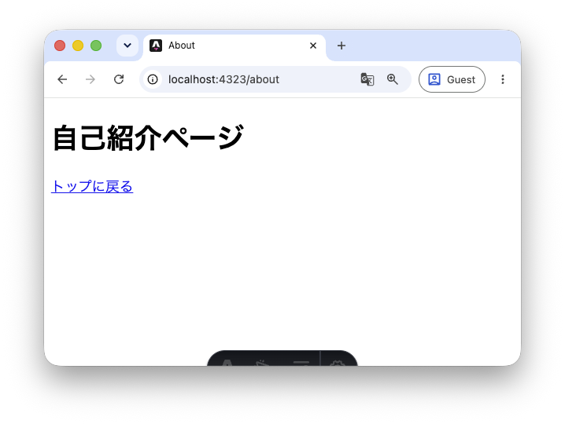
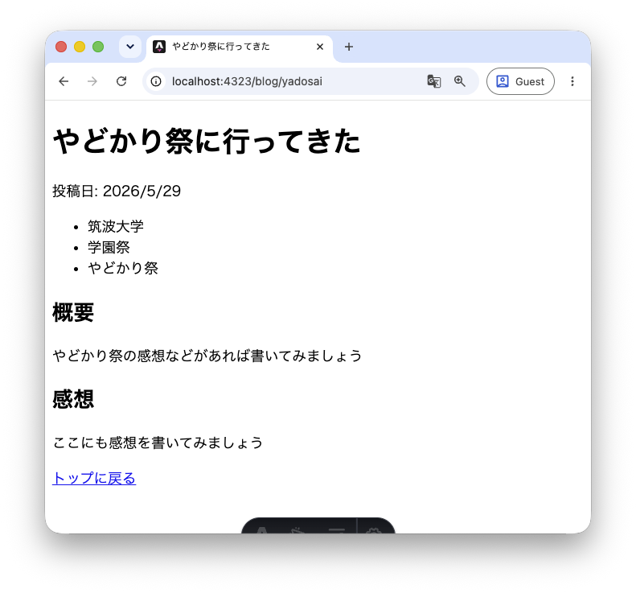

この章ではページの作成について解説します。これまでHTMLファイルを作成してきたときと同様にファイルを追加してページを作成します。

Astroでは`src/pages`ディレクトリに配置された、拡張子が`.astro`・`.md`などのファイルが自動的にページとして処理されます。

## 3.1 新しいページを作成してみよう

Astroのファイル形式 `.astro` はHTMLファイルとの互換性があるため、HTMLファイルに書くことができることはすべてAstroファイルに記述することができます。今のところは**Astroファイル=HTMLファイル**という認識で問題ありません。

実際に`src/pages/about.astro`を作成してみましょう。

```astro
<html lang="ja">
  <head>
    <meta charset="utf-8" />
    <title>About</title>
  </head>
  <body>
    <h1>自己紹介ページ</h1>
    <a href="/">トップに戻る</a>
  </body>
</html>
```

ファイルを保存したら、開発サーバーが起動している状態でブラウザから http://localhost:4321/about にアクセスしてみましょう。作成したページが表示されるはずです。



このように、`src/pages/` 以下のファイルパスがそのままURLに対応します。`src/pages/about.astro` → `/about` というルールです。

## 3.2 ページにリンクを張る

次に、`src/pages/index.astro` から `about` ページへのリンクを追加してみましょう。HTMLと同様に `<a>` タグを使います。

```astro
---

---

<html lang="ja">
	<head>
		<meta charset="utf-8" />
		<link rel="icon" type="image/svg+xml" href="/favicon.svg" />
		<link rel="icon" href="/favicon.ico" />
		<meta name="viewport" content="width=device-width" />
		<meta name="generator" content={Astro.generator} />
		<title>Astro</title>
	</head>
	<body>
		<h1>Astroからこんにちは</h1>
		<ul>
			<li><a href="/about">自己紹介</a></li>
		</ul>
	</body>
</html>
```

`href="/about"` のように、URLのパスを指定することで別のページへリンクできます。

## 3.3 ディレクトリを作る

ここまでは、`src/pages/`にファイルを配置してきました。では、ファイルの代わりにディレクトリを作ったらどうなるでしょうか？

実際に `src/pages/blog/yadosai.astro` を作成しましょう。

```astro
<html lang="ja">
  <head>
    <meta charset="utf-8" />
    <title>やどかり祭に行ってきた</title>
  </head>
  <body>
    <h1>やどかり祭に行ってきた</h1>
    <p>投稿日: 2026/5/29</p>
    <ul>
      <li>筑波大学</li>
      <li>学園祭</li>
      <li>やどかり祭</li>
    </ul>
    <h2>概要</h2>
    <p>やどかり祭の感想などがあれば書いてみましょう</p>
    <h2>感想</h2>
    <p>ここにも感想を書いてみましょう</p>
    <a href="/">トップに戻る</a>
  </body>
</html>
```

ファイルを保存したら、ブラウザから http://localhost:4321/blog/yadosai にアクセスしてみましょう。



`src/pages/blog/yadosai.astro` を作成したことで、URLのパスも `blog/yadosai` というディレクトリ構造に対応しています。ここまで作成してきたファイルとURLの対応をまとめると、次のようになります。

| ファイルパス | URL |
| --- | --- |
| `src/pages/index.astro` | `/` |
| `src/pages/about.astro` | `/about` |
| `src/pages/blog/yadosai.astro` | `/blog/yadosai` |

最後に、`src/pages/index.astro` からこのブログ記事へのリンクも追加してみましょう。

```astro
---

---

<html lang="ja">
	<head>
		<meta charset="utf-8" />
		<link rel="icon" type="image/svg+xml" href="/favicon.svg" />
		<link rel="icon" href="/favicon.ico" />
		<meta name="viewport" content="width=device-width" />
		<meta name="generator" content={Astro.generator} />
		<title>Astro</title>
	</head>
	<body>
		<h1>Astroからこんにちは</h1>
		<ul>
			<li><a href="/about">自己紹介</a></li>
		</ul>
		<h2>ブログ</h2>
		<ul>
			<li><a href="/blog/yadosai">やどかり祭に行ってきた</a></li>
		</ul>
	</body>
</html>
```

これでトップページからブログ記事へ遷移できるようになりました。

:::tip[演習]
`src/pages/blog/` に好きなテーマのブログ記事ページを追加してみましょう。`src/pages/index.astro` にリンクも忘れずに追加してください。
:::
