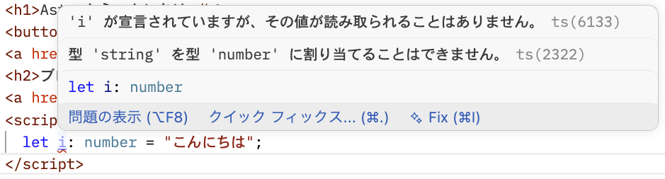
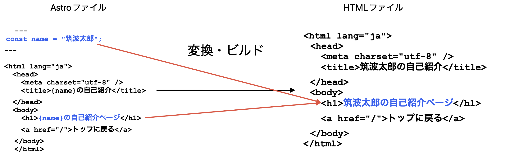

この章ではAstroファイルが普通のHTMLファイルと何が違うのかを解説します。

## 4.1 styleタグを使ったCSSの適用

前章でAstroファイルはHTMLファイルと同じものであると解説しました。そのため[`style`タグを使ってCSSを適用する](/frontend/day1/phase3/01-hajimeni#13-css-での使用)ことも、通常のHTMLファイルと同様にできます。

試しに`src/pages/index.astro`の`</body>`の直前に`style`タグを追加してみましょう。

```astro
    <style>
      h1 {
        color: royalblue;
      }
    </style>
```

ブラウザで確認すると、`h1`が青色になっていることがわかります。

:::tip[演習]
他にも好きなCSSを追加してページを自由にスタイリングしてみましょう。例えばフォントサイズや背景色、余白（`margin`・`padding`）などを試してみてください。
:::

## 4.2 scriptタグの記述とJavaScriptの実行

同様に、[`script`タグを使いJavaScriptを実行する](/frontend/day1/phase3/01-hajimeni#12-html-%E3%81%A7%E3%81%AE%E4%BD%BF%E7%94%A8)こともできます。

試しに`src/pages/index.astro`を次のように書き換えてみましょう。

```astro
<html lang="ja">
	<head>
		<meta charset="utf-8" />
		<link rel="icon" type="image/svg+xml" href="/favicon.svg" />
		<link rel="icon" href="/favicon.ico" />
		<meta name="viewport" content="width=device-width" />
		<meta name="generator" content={Astro.generator} />
		<title>Astro</title>
	</head>
	<body>
		<h1>Astroからこんにちは</h1>
    <button id="test">こんにちは</button>
		<a href="/about">自己紹介</a>
    <h2>ブログ</h2>
		<a href="/blog/yadosai">やどかり祭に行ってきた</a>
    <script>
      const testButton = document.getElementById("test")
      testButton?.addEventListener("click", () => alert("JavaScriptからこんにちは"))
    </script>
    <style>
      h1 {
        color: royalblue;
      }
    </style>
	</body>
</html>
```

実際にボタンをクリックするとアラートが表示されることがわかります。このように、`script`タグ中に記述したJavaScriptはページを訪れた人のブラウザで実行されます。

しかし、Astroファイル中に記述した`script`タグは通常のHTMLファイルと異なりデフォルトでTypeScriptを使うことができるので、型の恩恵を受けることができます。例えば次のように`number`型に`string`を代入しようとするようなTypeScriptを`script`タグ内に記述するとエディターがエラーを表示します。

```ts
let i: number = "こんにちは";
```



## 4.3 フロントマター

Astroファイルの一番上には`---`で囲まれた**フロントマター**と呼ばれる領域を書くことができます。

```astro
---
// ここがフロントマター
---

<html>...
```

フロントマターにもJavaScript（TypeScript）を書くことができます。また、フロントマターで定義した変数は`{}`を使ってHTMLの中で展開することができます。

試しに`src/pages/about.astro`を次のように書き換えてみましょう。

```astro
---
const name = "筑波太郎";
---

<html lang="ja">
  <head>
    <meta charset="utf-8" />
    <title>{name}の自己紹介</title>
  </head>
  <body>
    <h1>{name}の自己紹介ページ</h1>
    <a href="/">トップに戻る</a>
  </body>
</html>
```

ブラウザで`/about`を確認すると、`h1`に「筑波太郎の自己紹介ページ」と表示されているはずです。`name`の値を変えると`title`と`h1`の両方が一度に変わることを確認してみましょう。

ではなぜ、フロントマターと`script`タグの両方にJavaScriptを書くことができるのでしょうか？それは、**実行されるタイミングが異なる**からです。

Astroはサイトを公開する前に、`.astro`ファイルをブラウザが読み込める純粋なHTMLファイルへ変換する**ビルド**という処理を行います。フロントマターに書いたJavaScriptはこのビルド時に実行され、変数の値はHTMLに埋め込まれます。フロントマター自体は最終的なHTMLファイルには含まれません。

なお、[開発中に実行している`npm run dev`（開発サーバー）](/frontend/day3/astro/02-env-setup/#2222-%E9%96%8B%E7%99%BA%E3%82%B5%E3%83%BC%E3%83%90%E3%83%BC%E3%81%AE%E8%B5%B7%E5%8B%95)はファイルを保存するたびに自動でビルドを行っているため、ブラウザでの変更確認が即座にできるようになっています。



一方、`script`タグに書いたJavaScriptは最終的なHTMLファイルにそのまま含まれるため、実際にページを開いたブラウザ上で実行されます。

実際にフロントマターとscriptタグの実行タイミングの違いを確かめてみましょう。`about.astro`を次のように書き換えてみてください。

```astro
---
const name = "筑波太郎";
const buildTime = new Date().toLocaleString("ja-JP");
---

<html lang="ja">
  <head>
    <meta charset="utf-8" />
    <title>{name}の自己紹介</title>
  </head>
  <body>
    <h1>{name}の自己紹介ページ</h1>
    <p>最終更新: {buildTime}</p>
    <a href="/">トップに戻る</a>
    <script>
      console.log("表示日時:", new Date().toLocaleString("ja-JP"));
    </script>
  </body>
</html>
```

ページをリロードしてみると、ページに表示されている「最終更新」の日時は変わらないのに、ブラウザの開発者ツールのコンソールに出力される日時はリロードのたびに変わることがわかります。フロントマターの`buildTime`はビルドした時点で確定し、`script`タグの`new Date()`はページを表示するたびにブラウザで実行されるからです。

`{}`にはJavaScriptの式であれば何でも書くことができます。これを活かして、配列のデータからHTMLの要素を自動生成することもできます。

前の章で作った`src/pages/blog/yadosai.astro`には、タグを`<ul>`・`<li>`で並べていました。タグが増えるたびに`<li>`を追加する必要があります。ここでフロントマターを使ってこれを書き換えてみましょう。

```astro
---
const tags = ["筑波大学", "学園祭", "やどかり祭"];
---

<html lang="ja">
  <head>
    <meta charset="utf-8" />
    <title>やどかり祭に行ってきた</title>
  </head>
  <body>
    <h1>やどかり祭に行ってきた</h1>
    <p>投稿日: 2026/5/29</p>
    <ul>
      {tags.map((tag) => <li>{tag}</li>)}
    </ul>
    <h2>概要</h2>
    <p>やどかり祭の感想などがあれば書いてみましょう</p>
    <h2>感想</h2>
    <p>ここにも感想を書いてみましょう</p>
    <a href="/">トップに戻る</a>
  </body>
</html>
```

表示は変わりませんが、タグの追加・削除が`tags`配列の変更だけで済むようになりました。

`tags.map((tag) => <li>{tag}</li>)` の`map`は、[配列](/frontend/day1/phase3/05-hairetsu)の各要素を別の値に変換するメソッドです。`(tag) => <li>{tag}</li>` は[アロー関数](/frontend/day1/phase3/08-kansuu#83-アロー関数)で、「`tag`を受け取り、`<li>{tag}</li>`に変換する」という処理を表しています。

```
["筑波大学", "学園祭", "やどかり祭"]
    ↓ map
[<li>筑波大学</li>, <li>学園祭</li>, <li>やどかり祭</li>]
```

この変換結果をAstroが`<ul>`の中に並べて出力します。

## 4.4 スコープドCSS

4.1でAstroの`style`タグを使いましたが、実はAstroの`style`タグには通常のHTMLと大きな違いがあります。それは**スコープ**です。

Astroの`style`タグに書いたCSSは、そのファイル内の要素にしか適用されません。例えば先ほど`src/pages/index.astro`に追加したこのCSSは、

```astro
    <style>
      h1 {
        color: royalblue;
      }
    </style>
```

`/about`ページの`h1`には影響しません。ブラウザで`/about`を確認すると、`h1`が青くなっていないことがわかります。

この仕組みにより、あるページやコンポーネントのCSSが意図せず他のページに影響してしまう問題を防ぐことができます。

逆に、すべてのページに共通して適用したいCSSがある場合は、CSSファイルをフロントマターで`import`することができます。

試しに`src/styles/global.css`を作成してみましょう。

```css
a {
  color: royalblue;
  text-decoration: none;
}

a:hover {
  text-decoration: underline;
}
```

このファイルを`src/pages/index.astro`のフロントマターで読み込みます。

```astro
---
import "../styles/global.css";
---
```

`/about`や`/blog/yadosai`など他のページも確認してみましょう。`import`したCSSはスコープが限定されず全ページに適用されるため、各ページのリンクがすべて同じスタイルになっていることがわかります。
