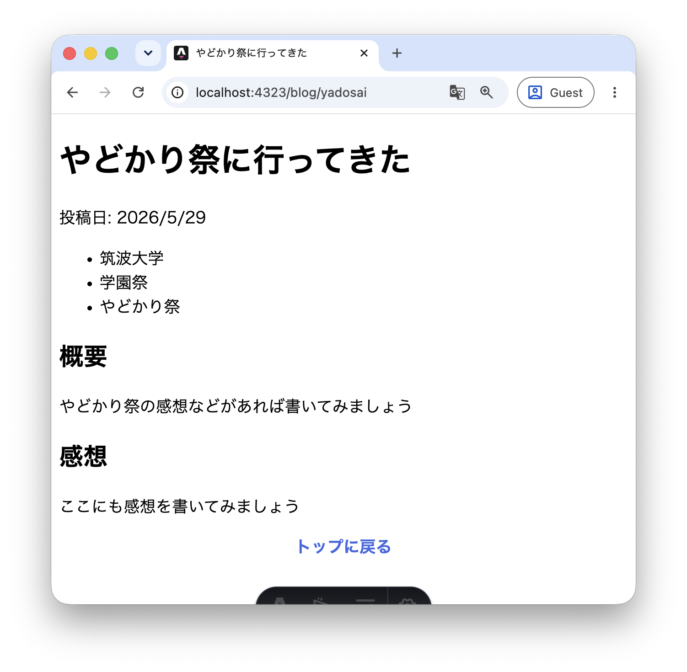
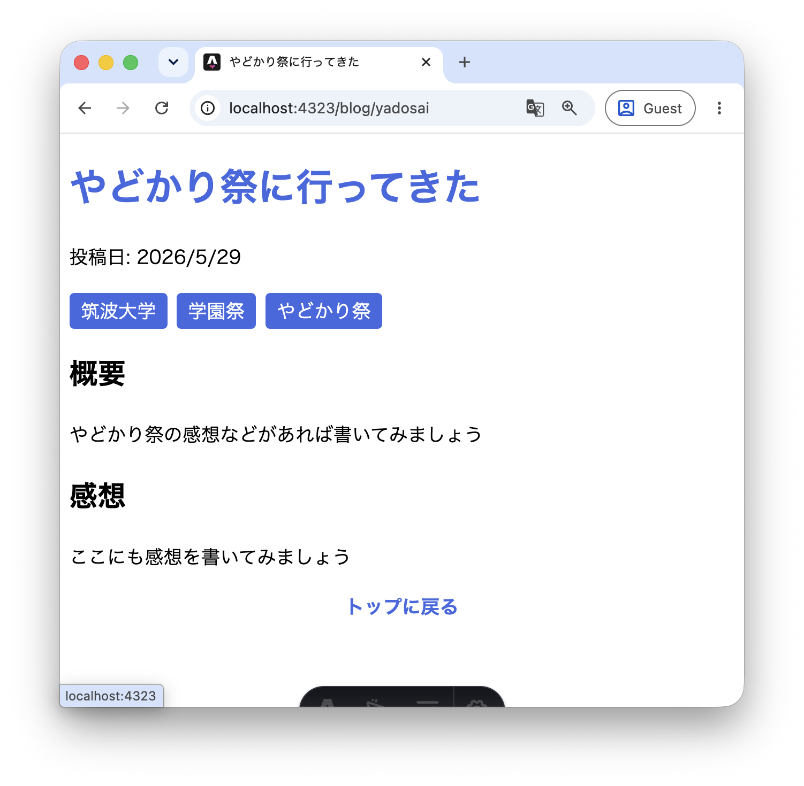
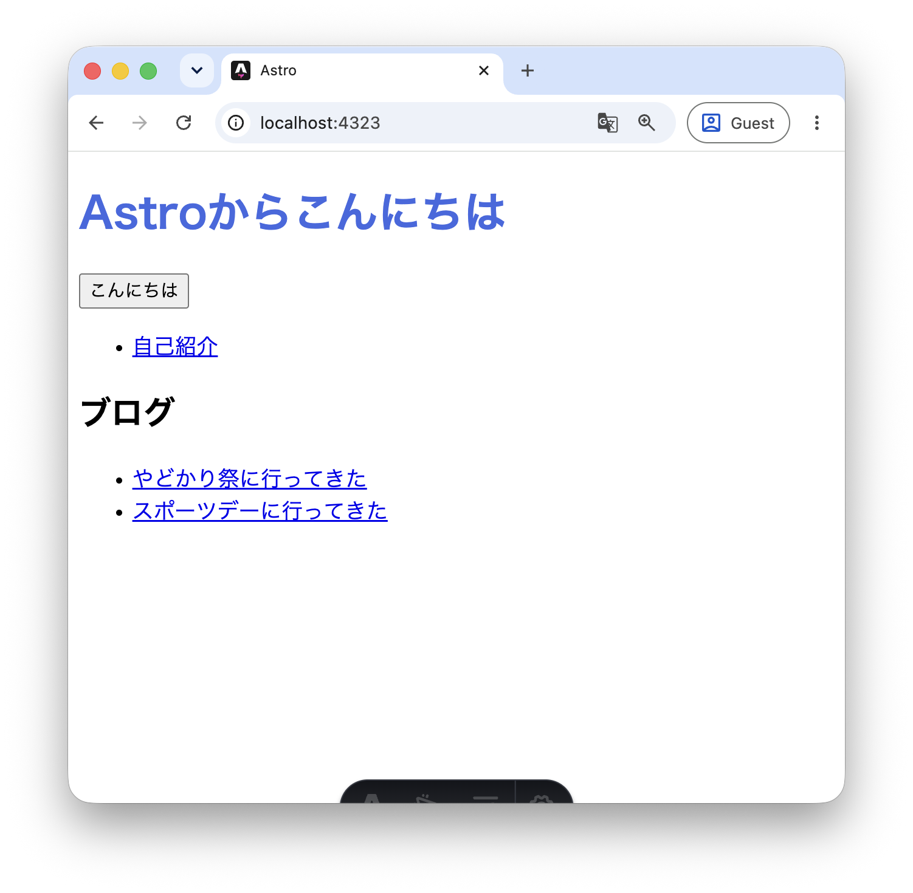
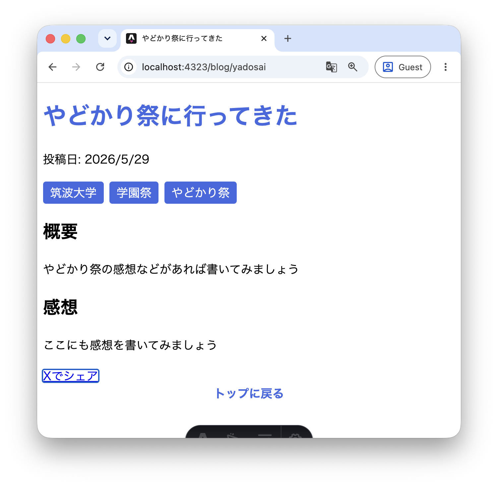

この章では、同じ要素を使いまわす「コンポーネント」の概念と、コンポーネントに外からデータを渡す「Props（プロパティ）」について学びます。

## 5.1 コンポーネント

Webサイトを作るときにはたびたび、同じ要素をいろいろなページで使いまわしたいことがあります。例えばここまでの例だとトップページ以外のすべてのページに `<a href="/">トップに戻る</a>`と書いていました。

もし、この「トップに戻る」に色をつけたり、「ホームに戻る」に変えたくなったらたくさんのファイルを書き換える必要が出てきます。そこで、複数のファイルが同じ要素を使うことができるための仕組み「コンポーネント」が登場します。

Astroのコンポーネントはページと同様に`.astro`ファイルとして作成します。慣習として`src/components/`ディレクトリに置きます。

試しに`src/components/BackLink.astro`を作成してみましょう。中身は再利用したい部分だけを記述します。

```astro
<a href="/">トップに戻る</a>
```

次に、このコンポーネントを`src/pages/about.astro`で使ってみます。別のファイルで定義したものを使いたいときは、フロントマターに`import`文を書いて読み込む必要があります。読み込んだコンポーネントはHTMLタグのように`<BackLink />`と書くことで使えます。

```astro
---
import BackLink from "../components/BackLink.astro";
const name = "筑波太郎";
const buildTime = new Date().toLocaleString("ja-JP");
---

<html lang="ja">
  <head>
    <meta charset="utf-8" />
    <title>{name + "の自己紹介"}</title>
  </head>
  <body>
    <h1>{name}の自己紹介ページ</h1>
    <p>最終更新: {buildTime}</p>
    <BackLink />
    <script>
      console.log("表示日時:", new Date().toLocaleString("ja-JP"));
    </script>
  </body>
</html>
```

同様に、`src/pages/blog/yadosai.astro`にも`BackLink`コンポーネントを追加してみましょう。

```astro
---
import BackLink from "../../components/BackLink.astro";
const tags = ["筑波大学", "学園祭", "やどかり祭"];
---

<html lang="ja">
  <head>
    <meta charset="utf-8" />
    <title>やどかり祭に行ってきた</title>
  </head>
  <body>
    <h1>やどかり祭に行ってきた</h1>
    <p>投稿日: 2026/5/29</p>
    <ul>
      {tags.map((tag) => <li>{tag}</li>)}
    </ul>
    <h2>概要</h2>
    <p>やどかり祭の感想などがあれば書いてみましょう</p>
    <h2>感想</h2>
    <p>ここにも感想を書いてみましょう</p>
    <BackLink />
  </body>
</html>
```

ブラウザで`/about`と`/blog/yadosai`の両方を確認すると、どちらにも「トップに戻る」リンクが表示されているはずです。

次に`BackLink.astro`に`style`タグを追加して、リンクのスタイルを変えてみましょう。

```astro
<a href="/">トップに戻る</a>

<style>
  a {
    color: royalblue;
    font-weight: bold;
    text-decoration: none;
    display: block;
    text-align: center;
  }
</style>
```

ブラウザで`/about`と`/blog/yadosai`を再確認すると、両方のページで「トップに戻る」リンクの下線が消えて青色・太字・中央寄せになっていることがわかります。コンポーネントのファイルを1つ変更するだけで、使っているすべてのページに反映されます。



## 5.2 スコープドCSS

5.1で`BackLink.astro`に`style`タグを追加しましたが、実はAstroの`style`タグには通常のHTMLと大きな違いがあります。それは**スコープ**です。

Astroの`style`タグに書いたCSSは、**そのファイル内の要素にしか適用されません**。`BackLink.astro`に書いた`a { color: royalblue }`は、`BackLink`コンポーネントの`<a>`だけに効いており、同じページにある他の`<a>`タグには影響しません。[^scoped-css]

この仕組みにより、あるコンポーネントのCSSが意図せず別のコンポーネントやページに影響してしまう問題を防ぐことができます。

逆に、複数のページで同じCSSを使い回したい場合は、CSSファイルをフロントマターで`import`することができます。ブログ記事が増えてきたとき、すべての記事に共通のスタイルを当てたいとします。試しに`src/styles/blog.css`を作成してみましょう。

```css
h1 {
  color: royalblue;
}

p {
  line-height: 1.8;
}

ul {
  display: flex;
  gap: 0.5rem;
  list-style: none;
  padding: 0;
}

li {
  background: royalblue;
  color: white;
  padding: 0.2rem 0.6rem;
  border-radius: 4px;
}
```

このファイルを`src/pages/blog/yadosai.astro`のフロントマターで読み込みます。

```astro
---
import "../../styles/blog.css";
import BackLink from "../../components/BackLink.astro";
const tags = ["筑波大学", "学園祭", "やどかり祭"];
---
```

`/blog/yadosai`を確認すると、CSSが適用されていることがわかります。



`import`したCSSはスコープが限定されず、そのファイル全体に適用されます。`style`タグ（スコープあり）と`import`（スコープなし）を使い分けることで、CSSの影響範囲をコントロールできます。

[^scoped-css]: 内部的には、Astroがビルド時にCSSのセレクタと対象の要素に`data-astro-cid-...`というランダムな属性を自動で付与することでスコープを実現しています。ブラウザの開発者ツールで確認できます。

## 5.3 複数の記事を用意する

Propsの動作を確認するために、まず記事ページをもう1つ作っておきましょう。`src/pages/blog/sportsday.astro` を作成してください。

```astro
---
import BackLink from "../../components/BackLink.astro";
const tags = ["筑波大学", "スポーツ", "スポーツデー"];
---

<html lang="ja">
  <head>
    <meta charset="utf-8" />
    <title>スポーツデーに行ってきた</title>
  </head>
  <body>
    <h1>スポーツデーに行ってきた</h1>
    <p>投稿日: 2026/6/10</p>
    <ul>
      {tags.map((tag) => <li>{tag}</li>)}
    </ul>
    <h2>概要</h2>
    <p>スポーツデーの感想などがあれば書いてみましょう</p>
    <h2>感想</h2>
    <p>ここにも感想を書いてみましょう</p>
    <BackLink />
  </body>
</html>
```

`src/pages/index.astro` にもリンクを追加しておきましょう。

```astro
<ul>
  <li><a href="/blog/sportsday">スポーツデーに行ってきた</a></li>
</ul>
```



## 5.4 コンポーネントにPropsを渡す

それぞれの記事にシェアボタンを追加したいとします。先ほど作った`BackLink`は全ページで同じ内容でしたが、シェアボタンはページごとに**コピーするタイトルが違う**ため、コンポーネントを使う側からタイトルを渡す必要があります。

このようなコンポーネントへの「外から渡すデータ」のことを **Props** と呼びます。

まず、使う側から見てみましょう。`yadosai.astro`と`sportsday.astro`にそれぞれ`ShareButton`コンポーネントを追加します（まだ`ShareButton`は存在しませんが、先に使う側を書いてみます）。

```astro
---
import ShareButton from "../../components/ShareButton.astro";
const tags = ["筑波大学", "学園祭", "やどかり祭"];
---
...
    <ShareButton title="やどかり祭に行ってきた" />
...
```

```astro
---
import ShareButton from "../../components/ShareButton.astro";
const tags = ["筑波大学", "スポーツ", "スポーツデー"];
---
...
    <ShareButton title="スポーツデーに行ってきた" />
...
```

`<ShareButton title="..." />` のように、HTMLの属性と同じ形式でPropsを渡します。2つのページから同じコンポーネントを使いながら、`title`の値だけが異なることがわかります。

## 5.5 Propsを受け取るコンポーネントを作る

では、渡された`title`を受け取る`src/components/ShareButton.astro`を作成しましょう。

```astro
---
interface Props {
  title: string;
}
const { title } = Astro.props;
const shareUrl = `https://twitter.com/intent/tweet?text=${encodeURIComponent(`「${title}」を読みました`)}`;
---

<a href={shareUrl} target="_blank">Xでシェア</a>
```

**`interface Props`** でこのコンポーネントが受け取るPropsの型を定義しています。ここでは`title`という`string`型のPropsを受け取ることを宣言しています。

**`Astro.props`** からPropsの値を取り出します。`const { title } = Astro.props` と書くことで、渡された`title`の値が変数`title`に入ります。

`encodeURIComponent` はURLに含められない文字（日本語など）を変換する関数です。

ブラウザで`/blog/yadosai`と`/blog/sportsday`それぞれのリンクをクリックすると、ページごとに異なるタイトルでXの投稿画面が開くことを確認してみましょう。



:::tip[演習]
[4.3節](/frontend/day3/astro/04-astrofile#43-フロントマター)でブログ記事に書いたタグ一覧を、コンポーネントとして切り出してみましょう。

`src/components/TagList.astro` を作成し、`tags: string[]` をPropsとして受け取って`<ul><li>`のリストを表示するコンポーネントを作ってみてください。

```astro
---
interface Props {
  tags: string[];
}
const { tags } = Astro.props;
---

<ul>
  {tags.map((tag) => <li>{tag}</li>)}
</ul>
```

作れたら `yadosai.astro` と `sportsday.astro` の両方で、インラインの`<ul>...</ul>`を`<TagList tags={tags} />`に置き換えてみましょう。

```astro
---
import TagList from "../../components/TagList.astro";
const tags = ["筑波大学", "学園祭", "やどかり祭"];
---
...
    <TagList tags={tags} />
...
```

タグの見た目を変えたくなったときに`TagList.astro`を1か所直すだけで両方の記事に反映されることを確認してみましょう。
:::
