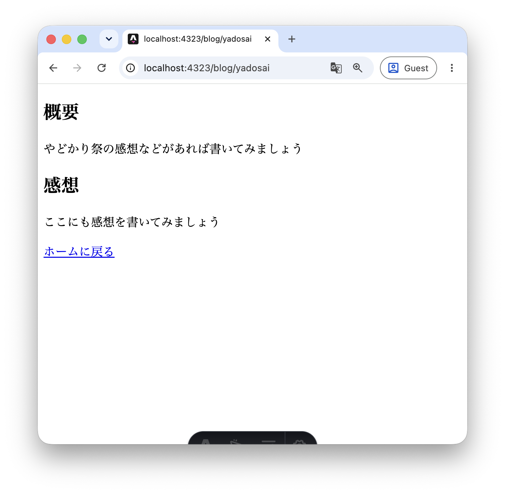
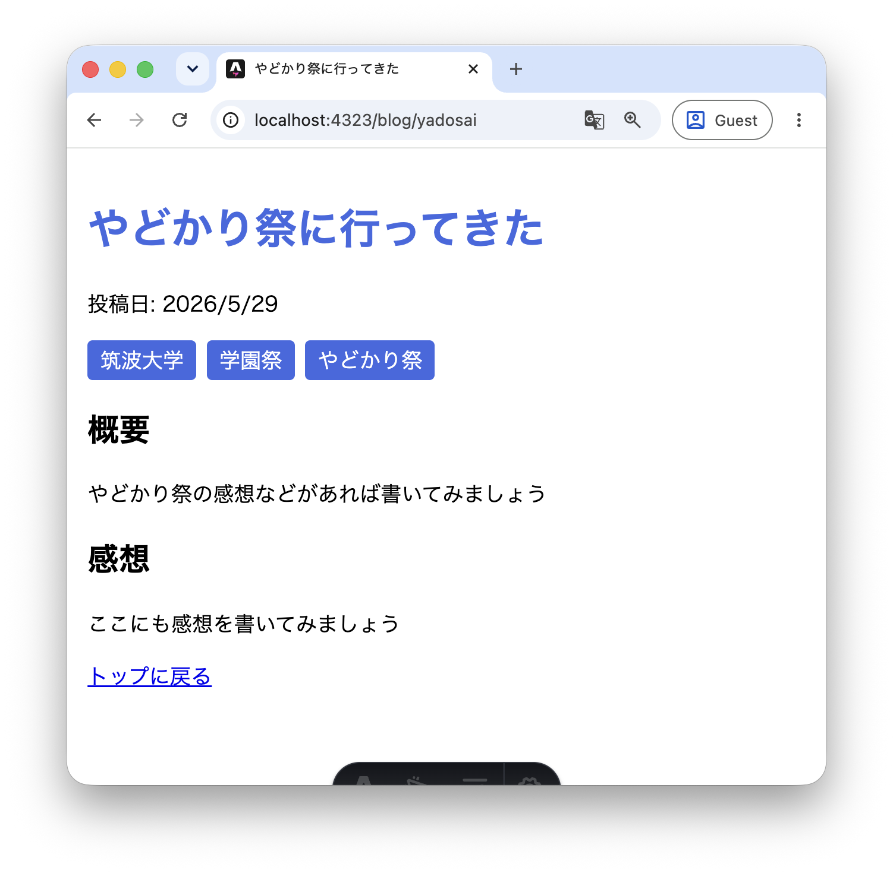

この章ではMarkdownというファイル形式を紹介し、AstroでMarkdownを使ってページを作成する方法を解説します。

## 6.1 Markdownとは

MarkdownはHTMLよりも簡単な記法で書くことができる代わりに、色や動きをつけることができない「[マークアップ言語](/frontend/day1/phase1/01-html-toha#11-概要)」で`.md`という拡張子で保存されます。HTMLほどの自由度が必要ないブログやニュースなどの内容や、メモや議事録を取るのに使われることもあります。今みなさんが読んでいるこの教科書も[Markdownファイル](https://github.com/sohosai/web-training-2026/blob/main/site/src/content/docs/frontend/day1.md)で作られています。
<!-- TODO: このページへのリンクに変更してもいいかも -->

Markdownでは、HTMLタグの代わりに次のような記法を使います。

| Markdown | HTML |
| --- | --- |
| `# 見出し1` | `<h1>見出し1</h1>` |
| `## 見出し2` | `<h2>見出し2</h2>` |
| `**太字**` | `<strong>太字</strong>` |
| `[リンク](URL)` | `<a href="URL">リンク</a>` |

## 6.2 AstroファイルをMarkdownに変換する

これまで作成してきた`yadosai.astro`をMarkdown形式にしてみると下記のようになります。

```md
---
title: やどかり祭に行ってきた
date: 2026/5/29
tags: ["筑波大学", "学園祭", "やどかり祭"]
---

## 概要

やどかり祭の感想などがあれば書いてみましょう

## 感想

ここにも感想を書いてみましょう

[ホームに戻る](/)
```

`---` で囲まれた部分は[Astroファイルのフロントマター](/frontend/day3/astro/04-astrofile#43-フロントマター)と同じく**フロントマター**と呼ばれますが、役割はまったく異なります。Astroファイルのフロントマターにはビルド時に実行されるJavaScript（TypeScript）を書きましたが、Markdownのフロントマターにはコードではなく`title`・`date`・`tags`のようなページに関する情報（メタデータ）をキーと値のペアで記述します。ここに書いた情報は、後の章で紹介するレイアウト機能を使うことでページに反映できます。

実際に `src/pages/blog/yadosai.astro` を削除して、代わりに `src/pages/blog/yadosai.md` として保存してみましょう。ブラウザから http://localhost:4321/blog/yadosai にアクセスすると、同じURLで引き続きページが表示されることが確認できます。



:::tip[演習]
`src/pages/blog/sportsday.astro` も同様に `src/pages/blog/sportsday.md` へ変換してみましょう。フロントマターには `title`・`date`・`tags` を含めてください。
:::

## 6.3 Layoutを使ってMarkdownファイルにスタイルを適用する

MarkdownファイルはHTMLファイルと違い、`style`タグや`script`タグを書いてスタイルを適用することができません。そこでAstroでは**Layout（レイアウト）**という仕組みを使い、Astroファイルでスタイルや共通のHTML構造をMarkdownファイルに適用することができます。

Layoutは、ページの「外枠」を提供するAstroコンポーネントです。**`<slot />`** と書いた場所に自動でMarkdownの本文が展開されます。慣習としてレイアウトは `src/layouts/` ディレクトリに置きます。

まず `src/layouts/BlogLayout.astro` を作成しましょう。

```astro
---
interface Props {
  frontmatter: {
    title: string;
    date: string;
    tags: string[];
  };
}
const { frontmatter } = Astro.props;
---

<html lang="ja">
  <head>
    <meta charset="utf-8" />
    <title>{frontmatter.title}</title>
    <style>
      body {
        max-width: 800px;
        margin: 0 auto;
        padding: 1rem;
        font-family: sans-serif;
      }
      h1 {
        color: royalblue;
      }
      ul {
        display: flex;
        gap: 0.5rem;
        list-style: none;
        padding: 0;
      }
      li {
        background: royalblue;
        color: white;
        padding: 0.2rem 0.6rem;
        border-radius: 4px;
      }
    </style>
  </head>
  <body>
    <h1>{frontmatter.title}</h1>
    <p>投稿日: {frontmatter.date}</p>
    <ul>
      {frontmatter.tags.map((tag) => <li>{tag}</li>)}
    </ul>
    <slot />
    <a href="/">トップに戻る</a>
  </body>
</html>
```

フロントマターの情報（タイトル・日付・タグ）は **`Astro.props.frontmatter`** を通じて受け取ることができます。`<slot />` の位置にMarkdownの本文が挿入されます。

次に、`src/pages/blog/yadosai.md` のフロントマターに `layout` キーを追加してLayoutを指定します。

```md
---
layout: ../../layouts/BlogLayout.astro
title: やどかり祭に行ってきた
date: 2026/5/29
tags: ["筑波大学", "学園祭", "やどかり祭"]
---

## 概要

やどかり祭の感想などがあれば書いてみましょう

## 感想

ここにも感想を書いてみましょう
```

ブラウザで `http://localhost:4321/blog/yadosai` を確認すると、Layoutで定義したスタイルやリンクがMarkdownコンテンツの周囲に追加されて表示されます。

## 6.4 LayoutからMarkdownのフロントマターを参照する

現在のLayoutではタイトルが「ブログ記事」で固定されています。Markdownファイルのフロントマターに書いた `title` や `date` などをLayoutから参照できれば、記事ごとに正しいタイトルを表示できます。

LayoutコンポーネントはMarkdownのフロントマターを **`Astro.props.frontmatter`** として受け取ることができます。`BlogLayout.astro` を次のように書き換えてみましょう。

```astro
---
import TagList from "../components/TagList.astro";

interface Props {
  frontmatter: {
    title: string;
    date: string;
    tags: string[];
  };
}
const { frontmatter } = Astro.props;
---

<html lang="ja">
  <head>
    <meta charset="utf-8" />
    <title>{frontmatter.title}</title>
    <style>
      body {
        max-width: 800px;
        margin: 0 auto;
        padding: 1rem;
        font-family: sans-serif;
      }
      h1 {
        color: royalblue;
      }
    </style>
  </head>
  <body>
    <h1>{frontmatter.title}</h1>
    <p>投稿日: {frontmatter.date}</p>
    <TagList tags={frontmatter.tags} />
    <slot />
    <a href="/">トップに戻る</a>
  </body>
</html>
```

`interface Props` で `frontmatter` の型を定義し、`const { frontmatter } = Astro.props` で値を取り出します。これはコンポーネントのProps（[5.5節](/frontend/day3/astro/05-component#55-propsを受け取るコンポーネントを作る)）と同じ仕組みです。

ブラウザで再確認すると、Markdownのフロントマターに書いたタイトル・日付・タグがLayoutを通じて表示されます。Markdownの本文（`## 概要` 以降）は引き続き `<slot />` の位置に挿入されます。



:::tip[演習]
`src/pages/blog/sportsday.md` にも同じ `layout` を指定してみましょう。フロントマターの `title`・`date`・`tags` がそれぞれのページで正しく表示されることを確認してください。
:::

## 6.5 LayoutはAstroファイルでも使える

ここまでMarkdownファイルにLayoutを適用してきましたが、Layoutは**Astroファイルにも同じように使えます**。

例えば `src/pages/about.astro` を開いてみると、`<html>`・`<head>`・`<body>` という骨格が毎回書かれています。ページが増えるにつれて、サイト名や共通のナビゲーションを変えたくなったときに全ページを修正する必要が出てきます。

そこで、サイト全体で共通する骨格を1つのLayoutにまとめる使い方が一般的です。Astroファイルでは、コンポーネントと同様に`import`してタグとして書きます。`src/pages/about.astro` を次のように書き換えてみましょう（まだ `BaseLayout` は存在しませんが、先に使う側を書いてみます）。

```astro
---
import BaseLayout from "../layouts/BaseLayout.astro";
const name = "筑波太郎";
const buildTime = new Date().toLocaleString("ja-JP");
---

<BaseLayout title={name}>
  <h1>{name}の自己紹介ページ</h1>
  <p>最終更新: {buildTime}</p>
</BaseLayout>
```

`<BaseLayout title={name}>` と `</BaseLayout>` で囲んだ部分が `<slot />` の位置に展開されます。`<html>`・`<head>`・`<body>` をページごとに書く必要がなくなり、コードがすっきりします。

では、`src/layouts/BaseLayout.astro` を作成しましょう。

```astro
---
interface Props {
  title: string;
}
const { title } = Astro.props;
---

<html lang="ja">
  <head>
    <meta charset="utf-8" />
    <title>{title} | 筑波太郎のブログ</title>
    <style>
      body {
        max-width: 800px;
        margin: 0 auto;
        padding: 1rem;
        font-family: sans-serif;
      }
      header {
        border-bottom: 1px solid #ccc;
        margin-bottom: 1rem;
      }
    </style>
  </head>
  <body>
    <header>
      <a href="/">筑波太郎のブログ</a>
    </header>
    <main>
      <slot />
    </main>
  </body>
</html>
```

ブラウザで `/about` を確認すると、ヘッダーと共通のスタイルが適用されているはずです。ヘッダーのデザインを変えたいときは `BaseLayout.astro` を1か所直すだけで全ページに反映されます。

:::tip[演習]
`src/pages/index.astro` も `BaseLayout` を使うように書き換えてみましょう。
:::

