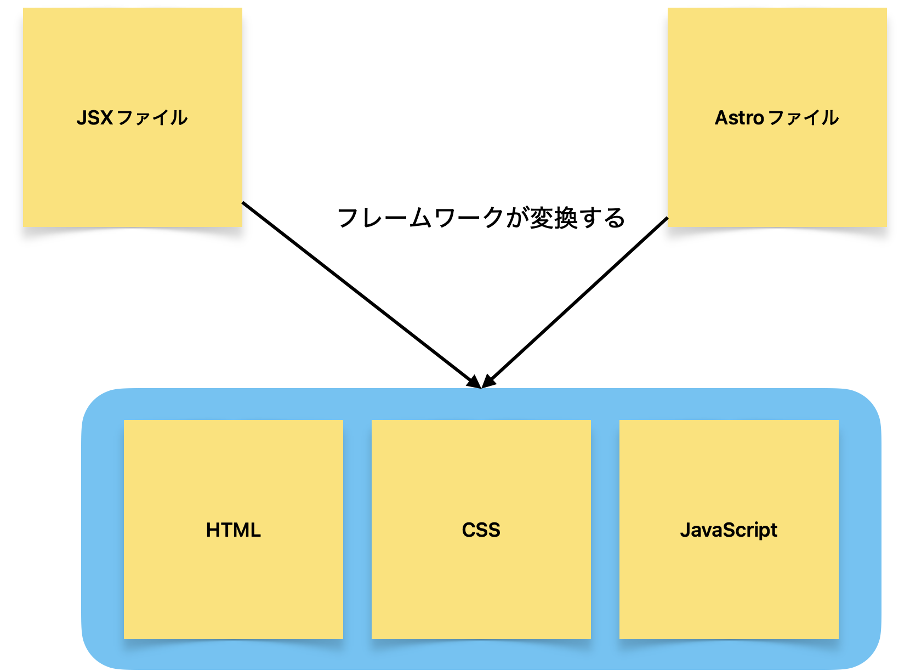

著：[ちゅるり](https://x.com/chururi_)

このフェーズでは **React・Astroの基本** を学んだのち、学んだフレームワークを用いて実用的なアプリケーションを作成します。

## 事前準備

このフェーズでは、常に手を動かしながら学ぶことが求められるため、作業をするためのディレクトリが必要です。このフェーズの学習を始める前に、自分の作業ディレクトリに `phase1` ディレクトリを作成してください。以降、このフェーズにおける演習は `phase1` ディレクトリ内で作業するものとします。また特に断りのない限り、エディタには **Visual Studio Code（VSCode）** を使用するものとします。

## ReactとAstro

ここからは**React**と**Astro**という2つの技術のどちらかを学びます（両方を進めても問題ありません）。ここではそれぞれの特徴について説明します。

ReactもAstroも「フレームワーク」と呼ばれる、Webアプリケーションを作るのを簡単にするための技術です。これらのフレームワークでは、開発者はReactの場合は**JSXファイル**・Astroの場合は**Astroファイル**を作成し、フレームワークがこれらのファイルをこれまで学んできたHTML/CSS/JavaScriptのファイルに変換します。

jsysではこれらの技術をそれぞれの長所に合わせて使い分けています。ここからはそれぞれの特徴や違いについて紹介します。

### Astro

Astroはコンテンツの表示に特化したWebフレームワークです。そのためブログやイベント・Wikiページのような、表示内容とスピードが求められる場面で利用されます。また、記述方法がこれまで学んできたHTML/CSS/JavaScriptなどと似通っており始めやすいながらも、AstroとReactを併用するといった使い方もできる柔軟性を持ち合わせています。

一方で、Webアプリケーションの開発を目的としているわけではないので、多数の要素をアプリケーションのように動かす目的にはあまり向いていません。

jsysでは次のようなシステムがAstroを採用しているほか、この研修サイトもAstroで作成されています。

- [公式サイト](https://sohosai.com/)
- [本番Webサイト](https://51st.sohosai.com/)
- [そぽたんWeb](https://sopotan.com/)

[Astroを始める方はこちら](./day3/astro/01-hajimeni)

### React

Reactは複雑な操作や、多くの要素を効率的に描画することを得意としており、[X](https://x.com)や[Instagram](https://instagram.com)のように、世界中で利用されているWebアプリケーションで使われています。

Reactの大きな特徴としてすべての要素がJavaScriptの関数として実装されていることがあります。これにより複雑なロジックを簡潔に記述することができるため、よりプログラミングに近い形になります。

一方で記述にはJavaScriptの中で要素を表示する方法などReact固有の概念を学ぶ必要があり、使いこなすまでには少々時間が必要です。

jsysでは次のようなシステムがReactを採用しています

- [雙峰祭オンラインシステム](https://github.com/sohosai/sos26/tree/main/apps/web)
- 物品管理システム
- 企画検索システム

[Reactを始める方はこちら](./day3/react/01-hajimeni)

## 参考文献

- asakohattori . 基礎から学ぶ React / React Hooks 実践入門 . C&R 研究所 , 2021
- Udemy . React と Vue.js はどっちがいい？それぞれの特徴や違いを解説！ . Udemy メディア . 2024 . <https://udemy.benesse.co.jp/development/system/react-vue.html>（2024/6/15 閲覧）
- とほほ . npm 入門 . とほほの WWW 入門 . 2024 . <https://www.tohoho-web.com/ex/npm.html>（2024/6/15 閲覧）
- Kazuki Matsuda . 2024 年 React 環境構築 with Vite . Zenn . 2024 . <https://zenn.dev/kazukix/articles/react-setup-2024>（2024/6/15 閲覧）
- Wikipedia . プログラミングパラダイム . Wikipedia . 2024 . <https://ja.wikipedia.org/wiki/プログラミングパラダイム>（2024/6/15 閲覧）
- MDN . Array.prototype.map() . mdn web docs . 2024 . <https://developer.mozilla.org/ja/docs/Web/JavaScript/Reference/Global_Objects/Array/map>（2024/6/15 閲覧）
- MasanoriIwakura . React のスタイリング手法まとめ in 2023 . Qiita . 2024 . <https://qiita.com/MasanoriIwakura/items/157aecd290e334a8c78a>（2024/6/15 閲覧）
