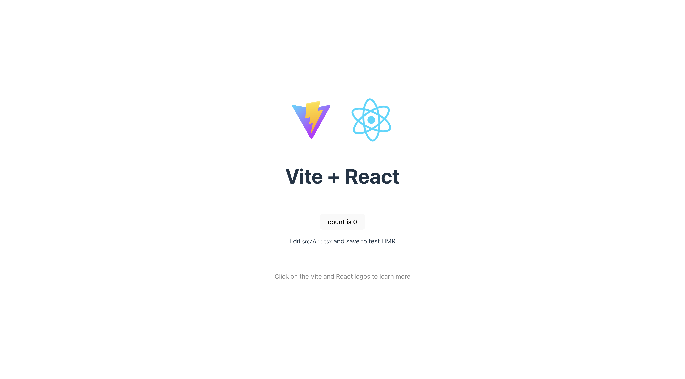

HTML や CSS、JavaScript で Web ページを作った際はそれぞれに対応するファイルを作成するだけで良かったですが、React を使用して Web ページを構築する際には、少し複雑な環境構築を要します。本章では React を取り巻くツールなどについて述べた後、実際の環境構築の方法を解説していきます。

## 2.1 React を取り巻くツール

React を使用して Web ページを構築する際には、**Bun** と **Vite** といったツールが必要になります。これらのツールは React を使用して Web ページを構築する際の必須ツールであるため、まずはこれらをインストールしていきます。

:::tip[難しい話：Bunとパッケージマネージャ]

**Bun とはコンピュータ用の JavaScript ランタイム**で、従来 Web ブラウザ上で動作していた JavaScript をコンピュータ上で動かすためのソフトウェアです。React をはじめとした現在の Web アプリケーション開発で使用されるツール群の多くはこうした JavaScript ランタイム上で動作するので、今日 Web 開発をする際には必須のソフトウェアであると言っていいでしょう。

なお JavaScript ランタイムとしては、長く使われてきた Node.js や、比較的新しい Deno といったものもあります。Bun はその中でも特に動作が高速で、開発に必要なツールが最初から一通り同梱されているため、本書では Bun を採用しています。

Bun に同梱されているツールの代表が**パッケージマネージャ**です。パッケージとはライブラリやモジュールといった概念を包含するもので、公開されたオープンソースのコードと考えて差し支えないでしょう。プログラミングの世界では、**他人が書いたプログラムを自分のプロジェクトに導入して利用するという、ライブラリ**などと呼ばれる概念がありますが、これらを管理するためのツールがパッケージマネージャです。

例えば自分のプロジェクトでライブラリ A を使用するとします。そして、ライブラリ A は別のライブラリ B と C に依存しているとします。このとき、自分のプロジェクトのプログラムを正しく動作させるには、自分のプログラムに加えてライブラリ A, B, C すべてのプログラムが必要です。パッケージマネージャはこのように、ライブラリの依存関係を解析して必要なライブラリを集め（これを**解決**と言います）、管理する役割を果たす、重要なツールです。

パッケージマネージャとしては Node.js に同梱されている npm が有名で、他にも yarn や pnpm などがあります。Bun のパッケージマネージャはこれらと同じパッケージ（npm レジストリ）を扱えるうえ、高速に動作します。
:::

:::tip[難しい話：Vite]
**Vite（ヴィート）は Web 開発の場面で利用されるモジュールバンドラ**です。**バンドルとは、ライブラリやプログラムの依存関係を解決・結合すること**を指します。従来は Webpack と呼ばれるモジュールバンドラが利用されてきましたが、Vite はブラウザの [Native ES Modules](https://zenn.dev/uhyo/articles/what-is-native-esm-era) を使用するなどの理由で高速に動作することが特徴です。

また、Vite を利用することで **HMR（Hot Module Reload = ファイルの変更を検知して画面のリロードを行うことなく再描画を行うこと）** ができます。これは Webpack でも可能でしたが、Vite は部分的に再度トランスパイル（言語どうしの相互変換、ここでは TypeScript → JavaScript）を行うことができるためやはり高速です。

:::

## 2.2 環境構築
### 2.2.1 Bun のインストール
まだ Bun をインストールしていない人は、次の手順に従ってインストールしてください。

- Windows：[Windows向け環境構築ガイド](/windows-setup#bun)
- macOS：ターミナルで次のコマンドを実行してください

```sh
curl -fsSL https://bun.sh/install | bash
```

:::note[覚えていない人]

ターミナルで `bun -v` と入力して、Bun のバージョンが表示されるか確認してみましょう。もしエラーが出る場合は、インストールしてください。
インストールしたのに、エラーが出る場合は、TA に声をかけてください。

:::

### 2.2.2 プロジェクトの作成
Bun がインストールできたら、早速プロジェクトを作成していきます。以下の作業は Windows / macOS 共通です。なお、作業前にプロジェクトを作成しても良い適当なディレクトリに移動しておいてください。

まず、次のコマンド群を順に実行していきます。

```sh
# sample-app プロジェクトを作成する
bun create vite@latest sample-app --template react-ts
```

すると、このように質問されると思うので、yes のまま Enter を押してください。
```
◆  Install with bun and start now?
│  ● Yes / ○ No
└
```

続いて、このコマンドを実行してください。

```sh
# sample-app ディレクトリに移動する
cd sample-app

# パッケージのインストール
bun install
```

ここまで終わったら、あとは開発サーバを起動してブラウザからアクセスするだけです。次のコマンドで開発サーバを起動してみましょう。

```sh
bun run dev
```

そして http://localhost:5173 にブラウザでアクセスします。おそらく画像のような画面が表示されるはずです。



素晴らしい画面が出てきて感動できますが、今後使用するためにサンプルのコードは削除しておきましょう。

**src/App.tsx**
```tsx
function App() {

  return (
    <>
    </>
  );
}

export default App
```

**src/main.tsx**
```tsx
import React from 'react'
import ReactDOM from 'react-dom/client'
import App from './App.tsx'

ReactDOM.createRoot(document.getElementById('root')!).render(
  <React.StrictMode>
    <App />
  </React.StrictMode>,
)
```

- **src/App.css**：中身を空にする
- **src/index.css**：中身を空にする
- **src/assets**：削除

おめでとうございます！これで環境構築は完了です。
