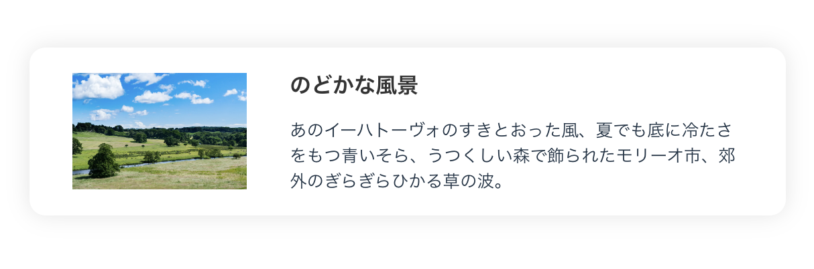

Vue（ビュー）は Web ブラウザなどで複雑なユーザインタフェース（UI）を構築する際に使用されるフレームワークで、**コンポーネント**と呼ばれる部品を用いて UI を実装することが特徴です。

:::tip[難しい話]

似たようなライブラリには React などがあります。これらはどちらもコンポーネント単位で UI を構築できるライブラリであるという点では共通しますが、データの流れ方（React が**単方向データバインディング** = UI 上でのインタラクションがイベントハンドラによって捕捉され、明示的に更新処理をする であるのに対し、Vue は**双方向データバインディング** = UI 上でのインタラクションがデータへ自動反映され、明示的な更新を必要としない）やプログラムの記述方法（React が TypeScript の中に HTML を書く **TSX** スタイルであるのに対し、Vue は HTML のテンプレートに `v-if` などの**ディレクティブ**と呼ばれる拡張構文を書き足していくスタイル）などの点で異なります。

:::

そしてなぜこの資料に Vue 編があるかというと、**Twin:te のフロントエンドが Vue 3 + TypeScript + Vite で開発されている**からです。この Vue 編を終えると、Twin:te のフロントエンドのコードが「読める」状態に近づきます。Twin:te の開発に興味がある人はぜひこちらを選んでください。

百聞は一見に如かず、まずは Vue のコードを眺めてみましょう。次のコードは **SFC（Single File Component）** と呼ばれる Vue 独自のファイル形式（後述）で記述された UI コンポーネントです。

**Thumbnail.vue**

```vue
<script setup lang="ts">
type Props = {
  srcUrl: string;
  title: string;
  description: string;
};

defineProps<Props>();
</script>

<template>
  <div class="thumbnail">
    
    <div class="inner">
      <h2>{{ title }}</h2>
      <p>{{ description }}</p>
    </div>
  </div>
</template>

<style scoped>
.thumbnail {
  width: 500px;
  display: flex;
  justify-content: center;
  align-items: center;
  padding: 16px 32px;
  border-radius: 12px;
  gap: 32px;
  box-shadow: 0 0 16px rgba(0, 0, 0, 0.1);
}

.thumbnail > img {
  width: 130px;
}
</style>
```

このコンポーネントは、別のコンポーネントの `template` の中から次のように呼び出して使います（詳しい書き方は 4 章で扱います）。

```vue
<Thumbnail
  src-url="https://user0514.cdnw.net/shared/img/thumb/elly20160701425018_TP_V.jpg"
  title="のどかな風景"
  description="あのイーハトーヴォのすきとおった風、夏でも底に冷たさをもつ青いそら、うつくしい森で飾られたモリーオ市、郊外のぎらぎらひかる草の波。"
/>
```



このように、「ロジック（TypeScript）」「見た目（HTML）」「スタイル（CSS）」が 1 つのファイルにまとまった形式によってコンポーネントを定義することができます。HTML の部分はほとんど普通の HTML に見えるはずです。Day 1 で学んだ知識がそのまま活きるので、身構えずに進んでいきましょう。
