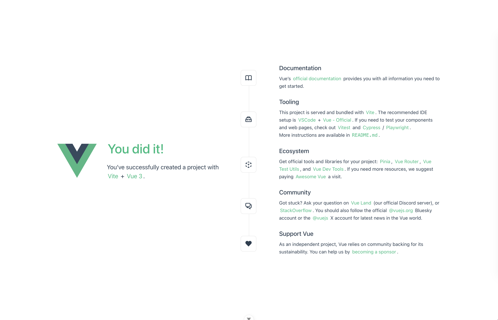

HTML や CSS、JavaScript で Web ページを作った際はそれぞれに対応するファイルを作成するだけで良かったですが、Vue を使用して Web ページを構築する際には、少し複雑な環境構築を要します。本章では Vue を取り巻くツールなどについて述べた後、実際の環境構築の方法を解説していきます。

## 2.1 Vue を取り巻くツール

Vue を使用して Web ページを構築する際には、**Bun** と **Vite** といったツールが必要になります。これらのツールは Vue を使用して Web ページを構築する際の必須ツールであるため、まずはこれらをインストールしていきます。

:::tip[難しい話：Bunとパッケージマネージャ]

**Bun とはコンピュータ用の JavaScript ランタイム**で、従来 Web ブラウザ上で動作していた JavaScript をコンピュータ上で動かすためのソフトウェアです。Vue をはじめとした現在の Web アプリケーション開発で使用されるツール群の多くはこうした JavaScript ランタイム上で動作するので、今日 Web 開発をする際には必須のソフトウェアであると言っていいでしょう。

なお JavaScript ランタイムとしては、長く使われてきた Node.js や、比較的新しい Deno といったものもあります。Bun はその中でも特に動作が高速で、開発に必要なツールが最初から一通り同梱されているため、本書では Bun を採用しています。

Bun に同梱されているツールの代表が**パッケージマネージャ**です。パッケージとはライブラリやモジュールといった概念を包含するもので、公開されたオープンソースのコードと考えて差し支えないでしょう。プログラミングの世界では、**他人が書いたプログラムを自分のプロジェクトに導入して利用するという、ライブラリ**などと呼ばれる概念がありますが、これらを管理するためのツールがパッケージマネージャです。

例えば自分のプロジェクトでライブラリ A を使用するとします。そして、ライブラリ A は別のライブラリ B と C に依存しているとします。このとき、自分のプロジェクトのプログラムを正しく動作させるには、自分のプログラムに加えてライブラリ A, B, C すべてのプログラムが必要です。パッケージマネージャはこのように、ライブラリの依存関係を解析して必要なライブラリを集め（これを**解決**と言います）、管理する役割を果たす、重要なツールです。

パッケージマネージャとしては Node.js に同梱されている npm が有名で、他にも yarn や pnpm などがあります。Bun のパッケージマネージャはこれらと同じパッケージ（npm レジストリ）を扱えるうえ、高速に動作します。
:::

:::tip[難しい話：Vite]
**Vite（ヴィート）は Web 開発の場面で利用されるモジュールバンドラ**です。**バンドルとは、ライブラリやプログラムの依存関係を解決・結合すること**を指します。従来は Webpack と呼ばれるモジュールバンドラが利用されてきましたが、Vite はブラウザの [Native ES Modules](https://zenn.dev/uhyo/articles/what-is-native-esm-era) を使用するなどの理由で高速に動作することが特徴です。

また、Vite を利用することで **HMR（Hot Module Reload = ファイルの変更を検知して画面のリロードを行うことなく再描画を行うこと）** ができます。これは Webpack でも可能でしたが、Vite は部分的に再度トランスパイル（言語どうしの相互変換、ここでは TypeScript → JavaScript）を行うことができるためやはり高速です。

:::

## 2.2 環境構築
### 2.2.1 Bun のインストール
まだ Bun をインストールしていない人は、次の手順に従ってインストールしてください。

- Windows：[Windows向け環境構築ガイド](/windows-setup#bun)
- macOS：ターミナルで次のコマンドを実行してください

```sh
curl -fsSL https://bun.sh/install | bash
```

:::note[覚えていない人]

ターミナルで `bun -v` と入力して、Bun のバージョンが表示されるか確認してみましょう。もしエラーが出る場合は、インストールしてください。
インストールしたのに、エラーが出る場合は、TA に声をかけてください。

:::

### 2.2.2 プロジェクトの作成
Bun がインストールできたら、早速プロジェクトを作成していきます。以下の作業は Windows / macOS 共通です。なお、作業前にプロジェクトを作成しても良い適当なディレクトリに移動しておいてください。

まず、次のコマンドを実行します。

```sh
# sample-app プロジェクトを作成する
bun create vue@latest sample-app
```

すると、いくつか質問されます[^version]。次のように答えてください。

- `Use TypeScript?` → **Yes のまま Enter**
- `Select features to include in your project:` → **何も選択せずそのまま Enter**（↑↓ とスペースキーで選択する画面ですが、今回は何も追加しません）
- `Select experimental features to include in your project:` → **何も選択せずそのまま Enter**
- `Skip all example code and start with a blank Vue project?` → **No のまま Enter**

[^version]: `create-vue` のバージョンによって質問の数や文言が多少変わることがあります。要は「TypeScript だけ有効にして、それ以外の追加機能は入れない」が選べていれば OK です。よくわからない選択肢が出てきたらデフォルトのまま Enter を押すか、周りの人に聞いてください。

続いて、このコマンドを実行してください。

```sh
# sample-app ディレクトリに移動する
cd sample-app

# パッケージのインストール
bun install
```

:::note[VS Code の拡張機能を入れよう]

作成したプロジェクトを VS Code で開くと、「この リポジトリ にはおすすめの拡張機能があります」のような通知が出るはずです。これは **Vue - Official** という拡張機能で、`.vue` ファイルのシンタックスハイライトやエラー表示（5 章で使います）に必要なので、**必ずインストールしてください**。通知を見逃してしまった人は、拡張機能タブで「Vue」と検索して、Vue 公式のものをインストールすれば OK です。

:::

ここまで終わったら、あとは開発サーバを起動してブラウザからアクセスするだけです。次のコマンドで開発サーバを起動してみましょう。

```sh
bun run dev
```

そして http://localhost:5173 にブラウザでアクセスします。「**You did it!**」と書かれた緑色の素敵な画面が表示されるはずです。



素晴らしい画面が出てきて感動できますが、今後使用するためにサンプルのコードは削除しておきましょう。

**src/App.vue**

```vue
<script setup lang="ts"></script>

<template></template>

<style scoped></style>
```

- **src/assets/main.css**：中身を空にする
- **src/components**：中のファイル・ディレクトリをすべて削除（`components` ディレクトリ自体は残しておいてください。4 章から使います）
- **src/assets/base.css、src/assets/logo.svg**：削除

なお、**必ず上から順に作業してください**。main.css は base.css を読み込んでいるので、main.css を空にする前に base.css を削除するとエラーが出ます（出てしまっても、main.css を空にすれば直ります）。

ブラウザに戻って、画面が真っ白になっていることを確認してください。おめでとうございます！これで環境構築は完了です。

---
