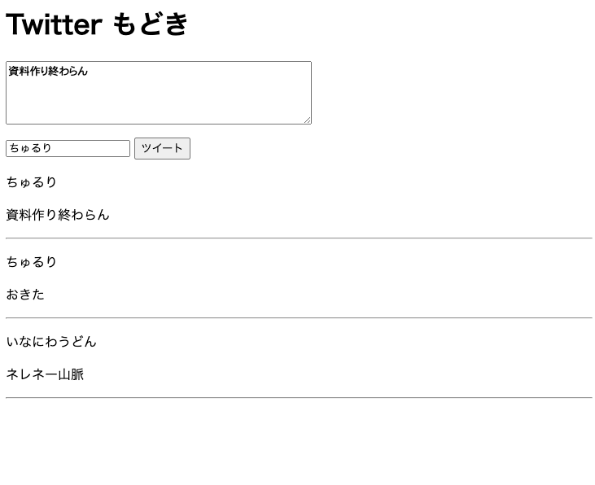

4 章では、コンポーネントの定義方法や props、式の表示などについて扱いました。本章では、Vue のコンポーネントにおける繰り返しや条件分岐の手法について述べていきます。

## 6.1 繰り返し

Vue では、繰り返しの手法を用いることによって同じコンポーネントを任意の数だけ表示させることができるようになります。次の例は、5 章で出てきた `Names.vue` の名前の表示方法を箇条書きに改善したプログラムです。

**Names2.vue**

```vue
<script setup lang="ts">
import { ref } from "vue";

const name = ref<string>("");
const names = ref<string[]>([]);

// ボタンがクリックされた時のイベントハンドラ
const onClickButton = () => {
  names.value.push(name.value);
};
</script>

<template>
  <div>
    <input type="text" v-model="name" />
    <button @click="onClickButton">名前を追加</button>
    <ul>
      <li v-for="(name, index) in names" :key="index">{{ name }}</li>
    </ul>
  </div>
</template>
```

このプログラムでは、`names.join()` によって行っていた処理が次のように変更されています。

```html
<li v-for="(name, index) in names" :key="index">{{ name }}</li>
```

このように、**繰り返したい要素に `v-for` ディレクティブを付けることで、配列の要素の数だけその要素を繰り返して表示することができます**。書式は次の通りです。

```html
<要素 v-for="(要素の変数, インデックス) in 配列" :key="キー">
```

インデックスが不要な場合は `v-for="name in names"` のように省略することもできます。また、配列の代わりに数値を渡す（`v-for="i in 10"`）と、1 から 10 までの繰り返しになります。3 章の宣言型プログラミングの例で登場したのはこの形です[^react-map]。

[^react-map]: React では同じことを `names.map((name, index) => <li key={index}>{name}</li>)` のように、JavaScript の `map` 関数で書きます。Vue は専用の構文（ディレクティブ）を用意している、というアプローチの違いです。

また、**繰り返される要素には `:key` 属性を渡す**必要があります。`key` は繰り返される要素 1 つ 1 つを Vue が区別するための目印で、これがないと要素の追加・削除時に表示が崩れたり、無駄な再描画が発生したりすることがあります。通常、この値は繰り返しのインデックスを指定します（データが ID を持っているならその ID を渡します）。

:::danger[key の重複に注意]
`key` は**同じ親要素の下で重複してはいけません**。次の例では、2 つの `v-for` がどちらも同じ `div` の下に要素を生成するため、`1` 〜 `10` の `key` が重複してしまいます。

```html
<div>
  <span v-for="a in 10" :key="a" />
  <div v-for="b in 20" :key="b" />
</div>
```

このような場合は、`:key="'a-' + a"` のように接頭辞を付けるなどして重複を避けましょう。
:::

## 6.2 演習 1

`src/components/TwitterModoki.vue` を作成して、次のようなコンポーネントを作成して下さい。ただし、今までに作成した `Tweet` と `CreateTweet` コンポーネントを使用して下さい（必要に応じて内容は修正して下さい）。

1. CreateTweet コンポーネントにて文字が入力できるようになっている
2. 「ツイート」ボタンを押すとツイート入力欄の下にツイートが表示される
3. 画面イメージ
   

<details>
    <summary>ヒント</summary>
    <p>今回の問題設定はやや難しめです。まず必要なものを整理してみます。</p>
    <ol>
        <li>名前とツイート内容の組がセットになったデータを保持するための状態</li>
        <li>「ツイート」ボタンがクリックされたとき用のイベントハンドラとなる関数</li>
        <li>各ツイートのコンポーネントを包含するための要素</li>
    </ol>
    <p>そして、おそらく 2 の関数が CreateTweet コンポーネントの <code>@submit-tweet</code> で受け取られるべきでしょう。2 のイベントハンドラの中では、引数として受け取ったデータを元に 1 の状態を更新する必要があります。また、<code>Tweet</code> には <code>:name</code> と <code>:text</code> で props を渡します。</p>
</details>

## 6.3 条件分岐

Vue では、状態や props の値に応じて表示するコンポーネントを出し分ける条件分岐のための仕組みがあります。次の例は、入力された値が 2 で割り切れるかどうかによって表示が切り替わるコンポーネントです。

**IsEven.vue**

```vue
<script setup lang="ts">
type Props = {
  n: number;
};

defineProps<Props>();
</script>

<template>
  <div>
    <p v-if="n % 2 === 0">偶数</p>
    <p v-else>奇数</p>
  </div>
</template>
```

`v-if` に書いた条件式が真のときだけ、その要素が表示されます。直後の要素に `v-else` を付けると「そうでないとき」を表せます。3 つ以上に分岐したいときは `v-else-if` も使えます[^react-if]。

[^react-if]: React では同じことを `{n % 2 === 0 && <p>偶数</p>}` のように論理演算子の短絡評価で書きます（React 編 6 章参照）。こちらも Vue は専用のディレクティブを用意しているわけです。

なお、`v-else` は **`v-if` が付いた要素の直後の要素**に付ける必要があります。間に別の要素を挟むことはできません。

## 6.4 演習 2

`src/components/TwitterModoki.vue` を修正して、投稿されたツイートがない時には「ツイートはありません」、そうでないときにはこれまで通りツイートが表示されるようにして下さい。

<details>
    <summary>ヒント</summary>
    <p>ツイートの有無は、ツイートを保持する状態変数（おそらく配列だと思います）の長さをみることによって判断することができます。即ち、その長さが 0 であるかそうでないかによって条件分岐をすればいいでしょう。</p>
    <p>1 つ注意点があります。<strong><code>v-else</code> と <code>v-for</code> を同じ要素に付けることはできません</strong>。<code>v-for</code> の要素を <code>&lt;template v-else&gt;...&lt;/template&gt;</code> というタグで囲むか、<code>div</code> などで囲むとうまくいきます。</p>
</details>

---
