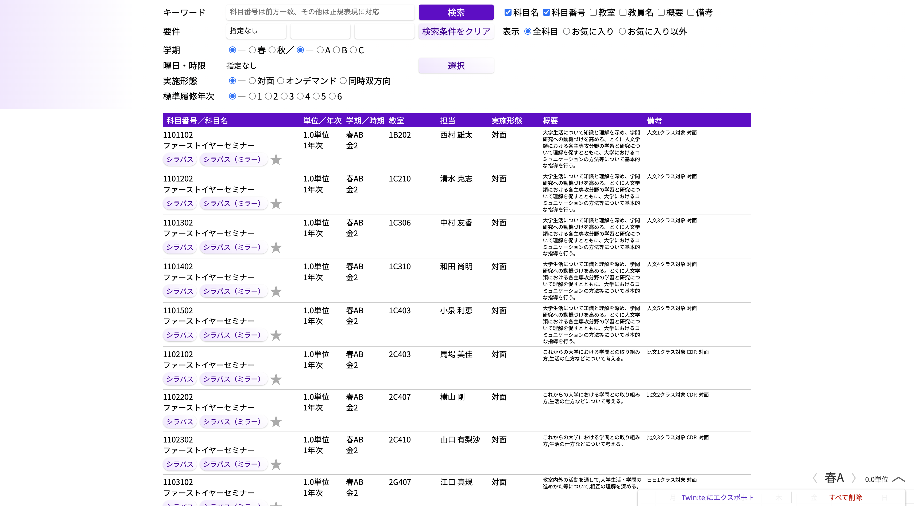

本研修の最終的な課題として、[KdB もどき](https://make-it-tsukuba.github.io/alternative-tsukuba-kdb/)のクローンを作成してください。KdB もどきは、有志によって開発された筑波大学生向けの授業検索ツールです。React 編の最終演習と同じ課題なので、React 編を終えた人は Vue での書き換えに挑戦することになります。



推奨する実装の順番は次の通りです。

- 新規 Vue プロジェクトの作成
  - 2 章と同じ手順で kdb-modoki-sample として作成
- 各行のコンポーネントの作成
- ヘッダのキーワードの部分と検索ボタンの作成
- 科目番号による検索
- デザイン
- その他機能の拡充

なお授業データの取得方法には非同期処理が必要ですが、本研修では取り扱っていません[^async]。そのため授業データを取得する部分のみのコードを下に与えます。このコードをコンポーネント内に記述してください。加えて、データには 2024/6/15 時点の KdB データを使用しています。以下のコードを実行する前に [kdb.json（約 4 MB）](/kdb.json)をダウンロードして、`kdb-modoki-sample/public` 以下に `kdb.json` として置いてください（ブラウザでリンクを開いた場合は、右クリック →「名前を付けて保存」でダウンロードできます）[^public]。

[^async]: `fetch` のような通信処理には待ち時間が発生します。データが届くのを待っていては画面が固まってしまうので、`fetch` は**非同期関数**として実装されており、「取り寄せ中」を表す値（Promise）をすぐに返します。関数呼び出しの前に `await` を付けることで、「データが届いたらその続きから再開する」という書き方ができます（`await` を使う関数には `async` を付けます）。

[^public]: Vite のプロジェクトでは、`public` ディレクトリに置いたファイルはそのまま開発サーバのルート（`http://localhost:5173/kdb.json`）で配信されるため、`fetch("kdb.json")` で読み込めるようになります。

```vue
<script setup lang="ts">
import { ref, onMounted } from "vue";

// ここからコンポーネントの内部
const kdbData = ref<KdbData | null>(null);

const callback = async () => {
  const DATA_URL = "kdb.json";

  const response = await fetch(DATA_URL);
  if (!response.ok) {
    alert("データ取得エラー");
    return;
  }

  kdbData.value = (await response.json()) as unknown as KdbData;
};

onMounted(() => {
  callback();
});
// ここまで
</script>
```

取得したデータを入れる状態 `kdbData` は、データが届くまでは値がないので、型を `KdbData | null`、初期値を `null` にしています。`onMounted`（7 章）で、マウント時に一度だけデータを取得し、届いたら `kdbData.value` に代入しています。あとはいつも通り、`kdbData` を使って `template` を書けば画面に反映されます（読み込み中の表示は `v-if="kdbData === null"` で出し分けられます）。

`kdb.json` の冒頭部分は次の通りです。上記のプログラムに加えて、このデータから類推して型 `KdbData` も作成してください。

```json
{
  "updated": "2024/06/15",
  "subject": [
    [
      "1101102",
      "ファーストイヤーセミナー",
      "2",
      " 1.0",
      "1",
      "春AB",
      "金2",
      "1B202",
      "西村 雄太",
      "大学生活について知識と理解を深め、学問研究への動機づけを高める。とくに人文学類における各主専攻分野の学習と研究について理解を促すとともに、大学におけるコミュニケーションの方法等について基本的な指導を行う。",
      "人文1クラス対象 対面"
    ],
    [
      "1101202",
      "ファーストイヤーセミナー",
      "2",
      " 1.0",
      "1",
      "春AB",
      "金2",
      "1C210",
      "清水 克志",
      "大学生活について知識と理解を深め、学問研究への動機づけを高める。とくに人文学類における各主専攻分野の学習と研究について理解を促すとともに、大学におけるコミュニケーションの方法等について基本的な指導を行う。",
      "人文2クラス対象 対面"
    ]
  ]
}
```

<details>
    <summary>解答（ここで詰まることは本質ではないので、わからなければ見てください！）</summary>
    <p>授業 1 件分は、オブジェクトではなく<strong>文字列が 11 個並んだ配列</strong>になっています。それぞれの位置の意味は次の通りです。</p>
    <pre>
// [0] 科目番号, [1] 科目名, [2] 授業方式, [3] 単位数,
// [4] 標準履修年次, [5] 開講モジュール, [6] 曜時限,
// [7] 開講場所, [8] 教員, [9] 詳細, [10] 備考
type Subject = string[];

type KdbData = {
  updated: string; // 更新日時
  subject: Subject[]; // 科目
};
    </pre>
    <p>もし <code>subject[0]</code> などにアクセスした際に「Object is possibly 'undefined'.」と怒られた場合は、<code>(subject[0] ?? "")</code> のように書くか、<code>Subject</code> を次のような<strong>タプル型</strong>（要素数と各位置の型が決まった配列の型）にすると解決できます。</p>
    <pre>
type Subject = [
  string, string, string, string, string, string,
  string, string, string, string, string,
];
    </pre>
</details>

## 実装のヒント

ここから先は自分の力で作ってみてください。詰まったら、これまでの章のほか、[Vue 公式ドキュメント（日本語）](https://ja.vuejs.org/guide/introduction)や周りの人を頼りましょう。以下に道しるべだけ置いておきます。

- **各行のコンポーネント**：授業 1 件分（`Subject`）を props として受け取り、`<tr>` を返すコンポーネントを作ると、`<table>` の中で `v-for` するだけで一覧が作れます（4 章・6 章）。`:key` には科目番号が使えます。
- **検索フォーム**：キーワード入力欄は `v-model`、検索ボタンは `@click` です（5 章）。「検索結果」は `kdbData` と検索条件から計算できる値なので、`computed` で絞り込んだ配列を作るときれいに書けます（5 章）。
- **科目番号による検索**：科目番号（`subject[0]`）が入力された文字列から始まるかどうかは、`String.prototype.startsWith` で判定できます。
- **パフォーマンス**：授業データは 7000 件以上あるので、全件を一気に表示すると重くなります。本家 KdB もどきのように「最初の 50 件だけ表示する」（`Array.prototype.slice`）などの工夫をしてみましょう。
- **デザイン**：`<style scoped>` や `:class` で自分好みのデザインにしましょう（8 章）。本家に寄せるもよし、オリジナルを追求するもよしです。

完成したら、ぜひ周りの人に自慢してください。そして余力があれば、曜時限での絞り込み、詳細の折りたたみ表示、お気に入り機能など、本家 KdB もどきにある機能をどんどん足してみましょう。ここまで来られたなら、**Twin:te のフロントエンドのコードももう読み始められます**。[Twin:te のリポジトリ](https://github.com/twin-te/twin-te)（`front` ディレクトリ）を覗いてみてください。
