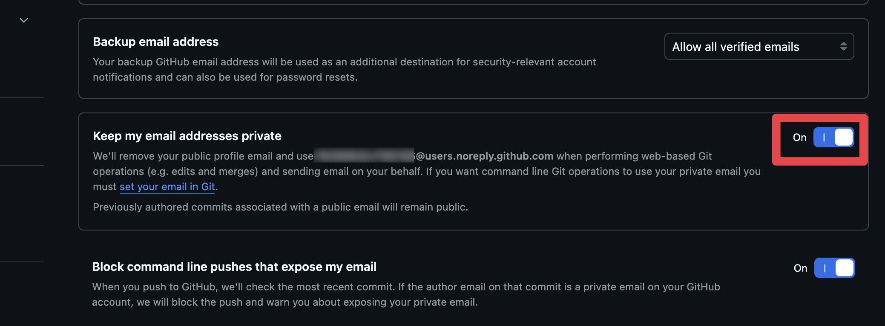

プロジェクトのコードは「Git」という仕組みを使って管理することが多いです。Gitを使うとコードのバージョン履歴を管理し、複数人での共同管理を実現することができます。本章ではGitの概念と使い方について学びます。

## 1.1 Gitのインストール

Gitが自分のパソコンにインストールされているかどうかは次のコマンドで確認することができます。

```sh
git version
```

次のように表示されていればインストールされています。

```sh
PS C:\Users\appare45> git --version
git version 2.54.0.windows.1
```

もしまだインストールしていないかたは、Windowsの人は[この手順に従ってインストールを進めてください](/windows-setup/#git)。macOSの人はターミナルで`git version`を実行すると表示されるダイアログから、コマンドラインツールごとインストールできます。

また、今回は主にVisual Studio Codeを用いてGitを操作します(仕上げの5章ではコマンドでの操作も登場します)。


## 1.2 なぜGitを使うのか

:::note
このセクションの内容は少し掴みどころがなく、わかりづらいかもしれません。わかりづらいところがあれば読み飛ばしてしまっても問題ありません。
:::

Gitは複数人で利用可能なバージョン管理ツールです。では、「バージョン管理」とは何でしょうか？最も原始的なバージョン管理はファイル名です。


ファイル名によるバージョン管理には次のような問題点があります。

- バージョンの前後関係が分からない
- どのバージョンが最新か分からない
- 誰がどんな目的でバージョンを作成したのか分からない
- 複数人で同じファイルを編集すると内容が壊れてしまう
- 複数人が編集して別々のコピーを作って編集するとそれらの統合が難しい

このような問題を解決してくれるのがGitというツールです。Gitではフォルダ全体を管理対象として指定し、フォルダ全体のバージョンを保存することができます。また、Gitが自動的にバージョンの前後関係を管理してくれるため毎度ファイルに手作業で保存した日付を保存する必要がありません。また、Gitには複数人で開発を進める手助けをしてくれる様々な機能があります（これらの機能については後ほど解説します）。

### 【脱線】 Gitは難しい

Gitは初心者にとって使用するのがとても難しいと思います。その理由には次のようなものがあると思います。

- 登場する単語に英語が多い
- 画面に変化がなく、何が起こっているのかわかりづらい
- 登場する概念が多い
- 処理を実行するたびにファイルが書き換わるので他人のファイルを破壊するのではないかと不安になる

本チュートリアルではなるべく図を使うことで、分かりやすい説明を心がけていますがもし不安なことや分からないことがあれば**早めにTAに質問する**ことをおすすめします。先輩たちの多くはGitの操作にある程度慣れ親しんでおり、日常で発生する大抵のトラブルを「いい感じ」に解決してくれます。本チュートリアルではじめてGitを学ぶ方も1年後には先輩として困っている初心者のかたを手助けしていることを楽しみにしています。

## 1.3 Gitにアカウント情報を登録する

最後に、Gitを使う準備をひとつ済ませておきます。Gitでの変更の記録(コミット。次章で学びます)には、記録した人の名前とメールアドレスが刻まれます。まずはGitにGitHubアカウントの情報を登録しましょう。

まず、GitHubの設定でメールアドレスを非公開にする必要があります。[https://github.com/settings/emails](https://github.com/settings/emails) を開き、「**Keep my email addresses private**」を有効にしてください。これを有効にすると、GitHubが `ID+ユーザー名@users.noreply.github.com` という形式の匿名メールアドレスを発行してくれます。コミットにはこの匿名アドレスを使うことで、実際のメールアドレスを公開せずに済みます。



設定が完了したら、次のコマンドを実行します(GitHub CLIのセットアップがまだの人は[こちらの手順](/windows-setup#github-cli)を先に進めてください)。

```sh
gh auth refresh -s "read:user,user:email"
git config --global user.name "$(gh api user --jq .login)"
git config --global user.email "$(gh api user/emails --jq '.[] | select(.email | endswith("@users.noreply.github.com")) | .email')"
```

これにより、コミット時にGitHubアカウントと紐づいた名前・匿名メールアドレスが自動的に使われます。

準備が整いました。次の章から、実際にリポジトリを触りながら学んでいきます。
