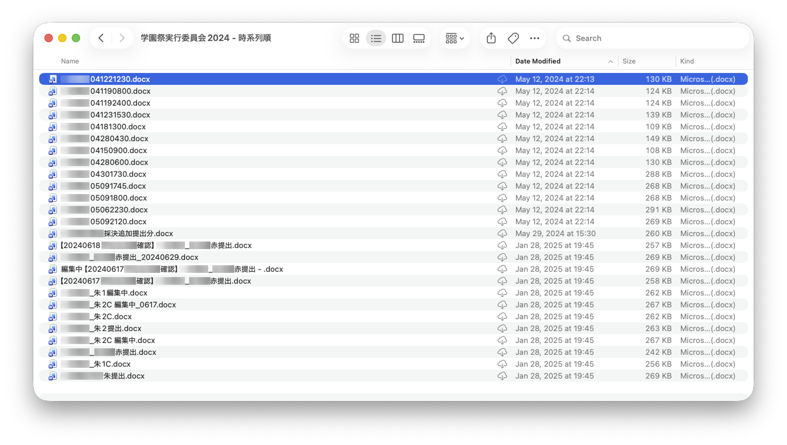

プロジェクトのコードは「Git」という仕組みを使って管理することが多いです。Gitを使うとコードのバージョン履歴を管理し、複数人での共同管理を実現することができます。本章ではGitの概念と使い方について学びます。

:::caution
本章は始める前に必ずTAに声をかけてるようにしてください。TAは[リポジトリ](https://github.com/sohosai/git-practice-2026)の`main`ブランチをresetして`7f78251f6a1d1cdfe04cbafcade179b3d91280c0`に書き戻し、Force Pushしてください。
:::

## 1.1 Gitのインストール

Gitが自分のパソコンにインストールされているかどうかは次のコマンドで確認することができます。

```sh
git version
```

次のように表示されていればインストールされています。

```sh
PS C:\Users\appare45> git --version
git version 2.54.0.windows.1
```

もしまだインストールしていないかたは[この手順に従ってインストールを進めてください](/windows-setup/#git)。また、今回はVisual Studio Codeを用いてGitを操作します。


## 1.2 なぜGitを使うのか

:::note
このセクションの内容は少し掴みどころがなく、わかりづらいかもしれません。わかりづらいところがあれば読み飛ばしてしまっても問題ありません。
:::

Gitは複数人で利用可能なバージョン管理ツールです。では、「バージョン管理」とは何でしょうか？最も原始的なバージョン管理はファイル名です。



ファイル名によるバージョン管理には次のような問題点があります。

- バージョンの前後関係が分からない
- どのバージョンが最新か分からない
- 誰がどんな目的でバージョンを作成したのか分からない
- 複数人で同じファイルを編集すると内容が壊れてしまう
- 複数人が編集して別々のコピーを作って編集するとそれらの統合が難しい

このような問題を解決してくれるのがGitというツールです。Gitではフォルダ全体を管理対象として指定し、フォルダ全体のバージョンを保存することができます。また、Gitが自動的にバージョンの前後関係を管理してくれるため毎度ファイルに手作業で保存した日付を保存する必要がありません。また、Gitには複数人で開発を進める手助けをしてくれる様々な機能があります（これらの機能については後ほど解説します）。

### 【脱線】 Gitは難しい

Gitは初心者にとって使用するのがとても難しいと思います。その理由には次のようなものがあると思います。

- 登場する単語に英語が多い
- 画面に変化がなく、何が起こっているのかわかりづらい
- 登場する概念が多い
- 処理を実行するたびにファイルが書き換わるので他人のファイルを破壊するのではないかと不安になる

本チュートリアルではなるべく図やGUIを使うことで、分かりやすい説明を心がけていますがもし不安なことや分からないことがあれば**早めにTAに質問する**ことをおすすめします。TAの多くはGitの操作にある程度慣れ親しんでおり、日常で発生する大抵のトラブルを「いい感じ」に解決してくれます。本チュートリアルではじめてGitを学ぶ方も1年後にはTAとして困っている初心者のかたを手助けしていることを楽しみにしています。
