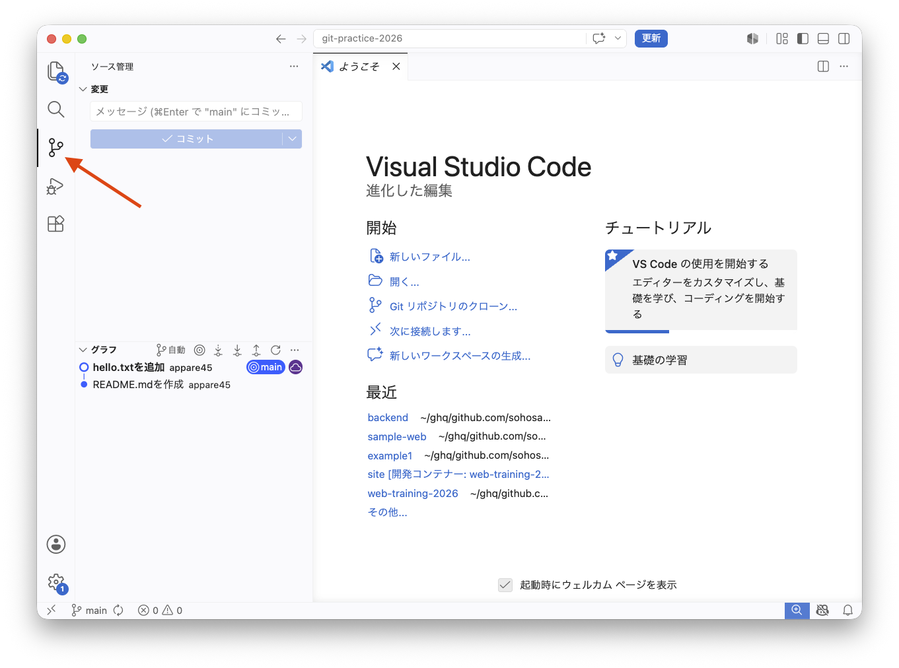
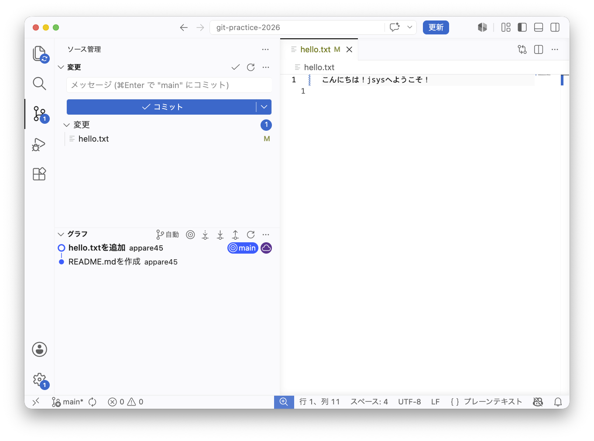
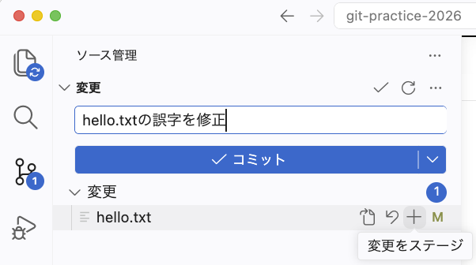
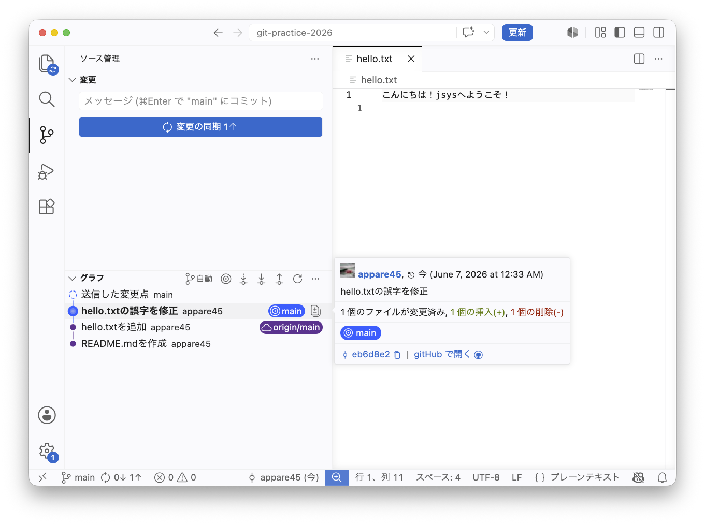
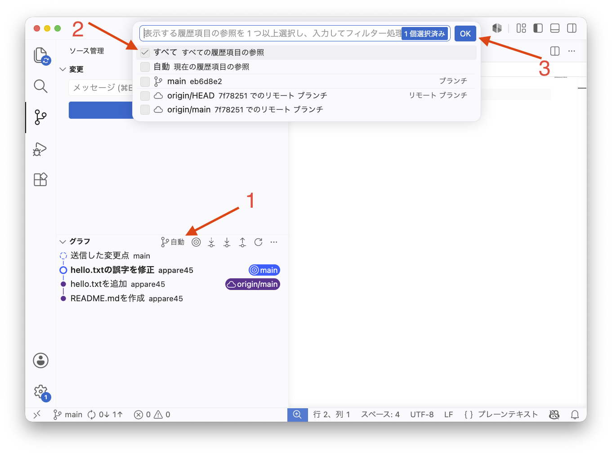
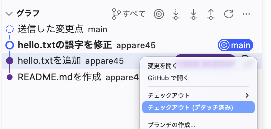
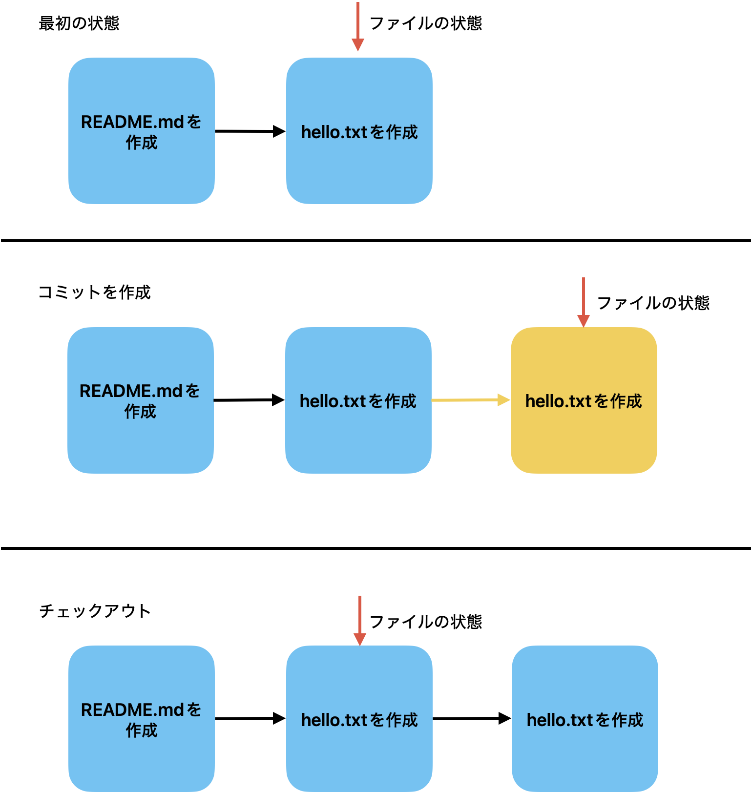

## 2.1 1人で練習する

まずはじめに共同編集などの高度な機能について学ぶ前に、手元のパソコンを使い1人でGitを使う練習を進めましょう。この段階では手元のコンピューターで作業が完結するので、他人に迷惑をかける心配はありません。

### 2.1.1 リポジトリをクローンする

Gitを使ってバージョン管理するフォルダを「リポジトリ」と呼びます。 **作業用のディレクトリに移動して、** 次のようなコマンドを入力してください。このコマンドの意味について後ほど改めて説明します。

```sh
git clone https://github.com/sohosai/git-practice-2026
```

次のように表示されたら成功しています。`git-practice-2026`というディレクトリが作られていると思うのでVisual Studio Codeで`git-practice-2026`ディレクトリを開いてください。

```sh
$ git clone https://github.com/sohosai/git-practice-2026
Cloning into 'git-practice-2026'...
remote: Enumerating objects: 3, done.
remote: Counting objects: 100% (3/3), done.
remote: Total 3 (delta 0), reused 3 (delta 0), pack-reused 0 (from 0)
Receiving objects: 100% (3/3), done.
```

もし次のように表示されている場合は認証が完了していません。[GitHub CLIのセットアップ手順](/windows-setup#github-cli)を進めてください。

```sh
$ git clone https://github.com/sohosai/git-practice-2026
Cloning into 'git-practice-2026'...
Username for 'https://github.com':
```

### 2.1.2 コミットとは何かを理解する

`git-practice-2026`ディレクトリにはREADME.mdとhello.txtが置かれていることを確認してみてください。

その後Visual Studio Codeが起動したらサイドバーからソース管理タブを開いてください。すると次のような画面が表示されるはずです。

<details>

<summary>Visual Studio Codeの言語設定を日本語にする方法</summary>

[日本語化する拡張機能](https://marketplace.visualstudio.com/items?itemName=MS-CEINTL.vscode-language-pack-ja)をインストールすると表示を日本語に変更することができます。

</details>



「グラフ」という場所に「hello.txtを追加」と「README.mdを作成」と表示されていることがわかります。これひとつひとつがGitでのバージョン管理の単位である「コミット」です。この「コミット」がすべてのファイルの状態を管理しているのでいつでも、特定のバージョンに移動することができるようになります。

これから実際に新しい「コミット」を作成してみましょう。hello.txtを開くと「こんにちは！jsyへようこそ！」と書かれているので「jsyへようこそ！」を「jsysへようこそ！」に修正して保存してみましょう。すると先ほどの「ソース管理」タブの「変更」というエリアにhello.txtが表示されます。



コミットを作るには次の2つを指定する必要があります。
- 前回のコミットから変更したファイル
- 変更の概要（「コミットメッセージ」といいます）

今回の場合は変更したファイルはhello.txt、変更の概要は「hello.txtの誤字を修正」とすることにします。先程確認した「変更」画面で「メッセージ」と書かれたテキストボックスに概要として「hello.txtの誤字を修正」と入力します。次に変更したファイルにカーソルを当てて「+」をクリックします。



そして「コミット」をクリックするとコミットが作成されます。実際に左下の「グラフ」の先頭に「hello.txtの誤字を修正」が表示されていることが確認できると思います。



この状態からリポジトリをダウンロードした直後の状態を確認してみます。まずはじめに「グラフ」の横にある「自動」というボタンをクリックして「すべて」にチェックを入れて「OK」を押してください。



左下のグラフで「hello.txtを追加」を右クリックして「チェックアウト（デタッチ済み）」をクリックします。すると、先ほどの修正がなかったことになりhello.txtを開くと「こんにちは！jsyへようこそ！」と表示されていることがわかります。このようにコミットを作ることで任意の地点に戻ることが可能になります。



ここまでの内容をまとめると次のようになります。



:::danger[Gitの危険性]
Gitでは先程確認したように「コミット」を作成した任意の地点に戻ることができます。そのため一度コミットしたファイルを削除しても、過去のコミットから削除したファイルの内容を確認することができます。

そのため、コミットには **個人情報やパスワードを含まない** ように注意してください[^github-risk]。もし、誤ってコミットしてしまったら速やかにTAや2年生に相談するようにしてください。
:::

[^github-risk]: 実際にリポジトリに保存された個人情報やパスワードが漏洩した事例は多くあります
