## 3.1 複数人で作業する

ここからは複数人で作業する手順について確認していきましょう。Gitの「リポジトリ」「コミット」情報は複数人で共有することができます。Twin:teではGitHubというサービスを共有に利用しています。

先程作業していた`git-practice-2026`というリポジトリもGitHubを使って共有しています。実際に[GitHubのページを開く](https://github.com/twin-te/git-practice-2026)ともともとのREADME.mdとhello.txtが置かれていることがわかります。

[2.1.1で実行した](/git/2commit#211-リポジトリをクローンする)`git clone https://github.com/twin-te/git-practice-2026`というコマンドでは、GitHub上に保存してあるこのリポジトリを自分のパソコンにダウンロードするという操作をしていました。

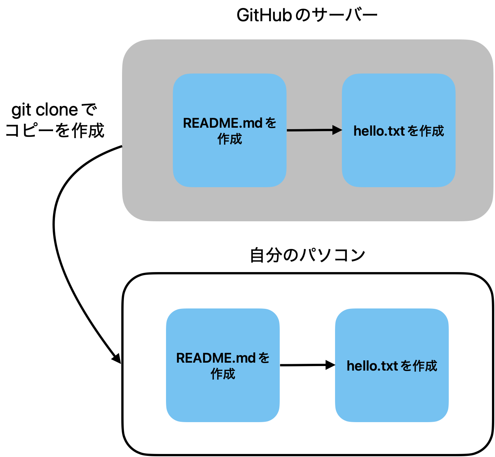

(概念図はごく小さなリポジトリの例です。以降の図も同様です)

Gitを使った共同編集ではクラウドでのファイルの編集と異なり手動で変更を同期する作業が必要です。先程手元で「自己紹介を追加」というコミットを作成しましたがこのコミットは、まだGitHubに手動で同期していないので反映されません。

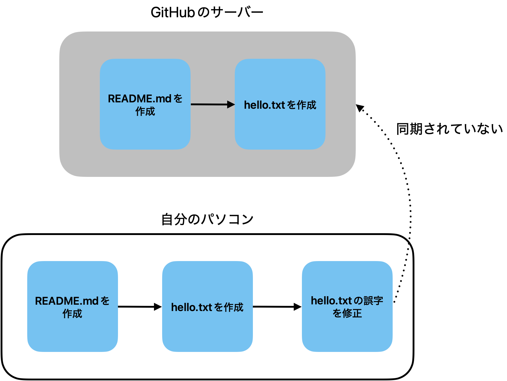

### 3.1.1 複数人が同時にコミットを作ると何が起こるか

1人で作業しているうちはコミットは常に1本の直線になります。しかし複数人が同時に作業しはじめると、コミットの流れが複数発生します。この勉強会ではまさに、参加者全員が同時に「自己紹介を追加」するコミットを作っていますね。

たとえば、Aさんがhello.txtの誤字を修正してコミットした一方で、Bさんが別のパソコンでworld.txtを作成してコミットした場合を考えます。

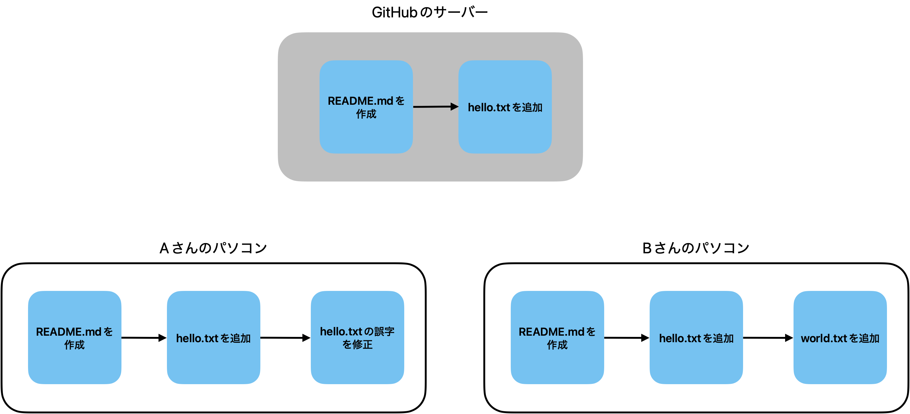

AさんのコミットとBさんのコミットは、どちらも同じコミット（「hello.txtを追加」）を元にして作られています。**どちらが先で、どちらが後か、Gitには判断できません。**

この状態で先にAさんが変更を同期しました。その後Bさんが同期しようとすると、次のようなエラーが発生します。

```sh
 ! [rejected]        main -> main (fetch first)
error: failed to push some refs to 'https://github.com/...'
hint: Updates were rejected because the remote contains work that you do
hint: not have locally.
```

これは「GitHubにはAさんのコミットがあるのに、あなたの手元にはそれがない状態で上書きしようとしている」というエラーです。もしそのまま強制的に上書きすれば**Aさんの変更がすべて消えてしまいます。**

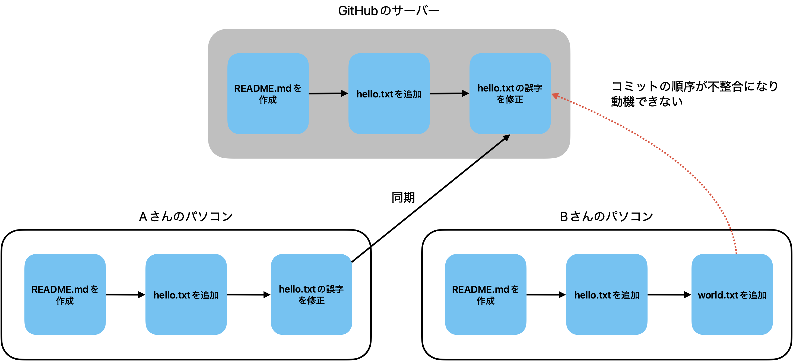

この問題の本質は、「誰かが作業している間にも、他の誰かが並行して別の歴史を作り始めてしまう」ことにあります。これは1人で作業していても起こりえます。手元とGitHubで別々に変更を加えてしまえば同じ状況が生まれます。

この「枝分かれした歴史をうまく扱う」ための仕組みが、次の章で解説する**ブランチ**です。

### 3.1.2 ブランチについて理解する

3.1.1で見た「並行する歴史の衝突」を解決するための仕組みが**ブランチ**です。まずは実際に操作してみて、その後で概念を整理しましょう。

はじめに次のコマンドを実行してリポジトリをクローンした直後の状態に強制的に戻します。**2.1.2で作ったコミットは手元から消えるので、自己紹介の文章は次でまた使えるようにコピーしておいてください。**

```sh
git checkout main
git fetch
git reset --hard origin/main
```

するとVisual Studio Codeのグラフがリポジトリをクローンした直後の状態に戻っていると思います。

次に新しいブランチを作成します。Visual Studio Codeの左下に現在のブランチ名「main」が表示されているのでクリックしてください。画面上部にメニューが表示されます。「新しいブランチの作成...」を選択してください。

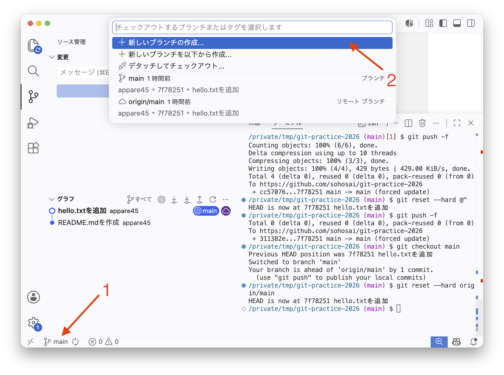

ブランチ名の入力を求められるので自分の名前でブランチを作りましょう。`practice/<自分のid>`と入力してEnterを押してください。するとブランチが作成され、左下の表示が`main`から作成したブランチ名に切り替わります。

切り替わったことを確認したら、2.1.2と同じように`members/<自分のGitHubユーザー名>.md`に自己紹介を書いてコミットしてください。**今度のコミットは最終的にみんなに共有されるので、少しちゃんと書いてみましょう**(名前、所属、ひとことなど。もちろん公開したくないことは書かないでください)。コミットメッセージは今回も「自己紹介を追加」とします。

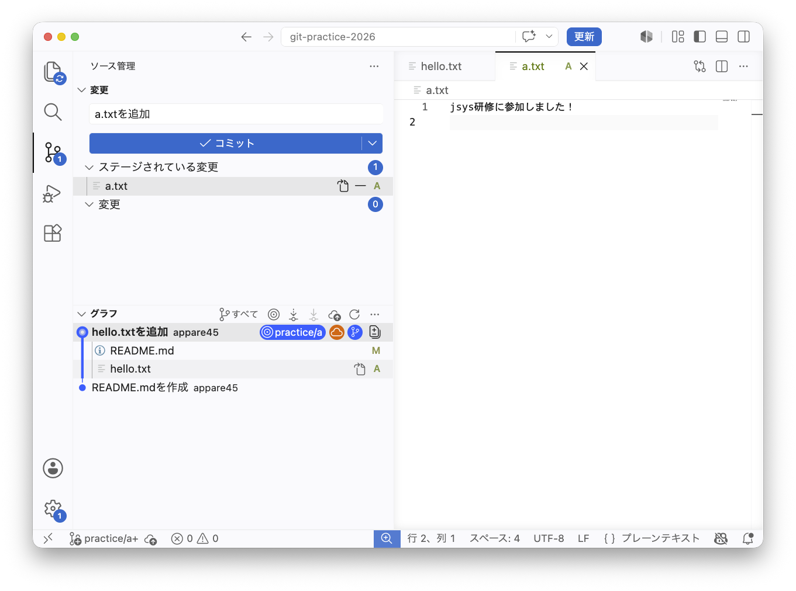

(スクリーンショットは`practice/a`ブランチで`a.txt`を追加した例です。以降の画面例も同様に読み替えてください)

グラフを確認すると自分のブランチに新しいコミットが追加されている一方、`main`は元の位置のままであることがわかります。自分のブランチでの変更は`main`にはまだ影響していません。

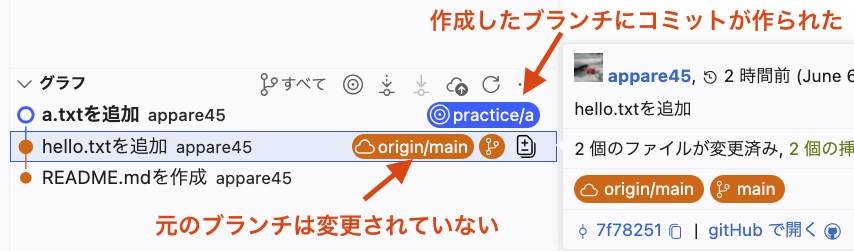

ここで改めて整理すると、実は**今までは`main`というブランチを使っていました**。2.1の練習でコミットを作っていたときも、ずっと`main`というブランチの上で作業していました。Gitでは必ずどこかのブランチの上で作業することになっており、`main`はリポジトリを作ったときに自動で用意されるデフォルトのブランチです。

ブランチとは、コミットの流れに付けた**名前**です。新しいブランチを作るとは、現在のコミットから別の流れを分岐させて、その流れに名前を付けることです。

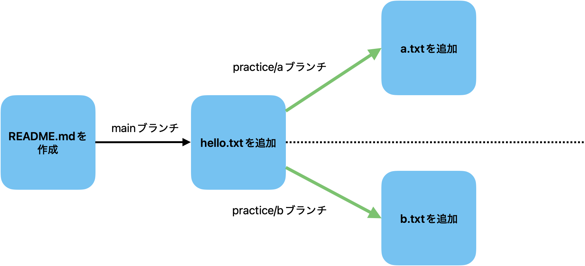

3.1.1で見た「並行する歴史の衝突」は、`main`という1本のブランチにAさんとBさんが別々のコミットを積もうとしたことが原因でした。ブランチを使うと、コミットを分離して管理することができるので複数人で作業しても問題なく進めることができます。

`main`は全員の作業の起点となる共有のブランチです。各自のブランチで作業した変更は、最終的に`main`に取り込むことで全員が同じ最新の状態を共有できます。

試しにVisual Studio Codeの「グラフ」でmainブランチに表示を戻してみましょう。左下のブランチ名をクリックすると利用できるブランチ一覧が表示されます。ここで`main`をクリックしてみましょう。

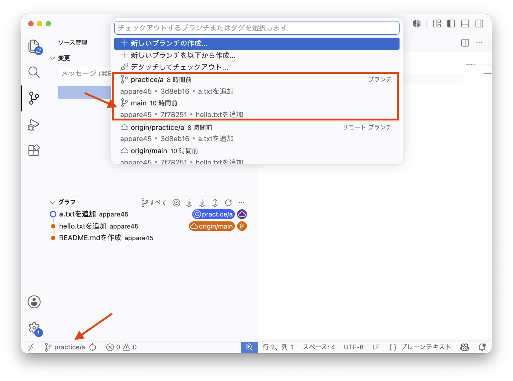

するとブランチが`main`に切り替わり、先程作成した自己紹介ファイルが消えて元の状態に戻りました。グラフの画面でも現在のコミットが`main`の位置に移動していることがわかります。

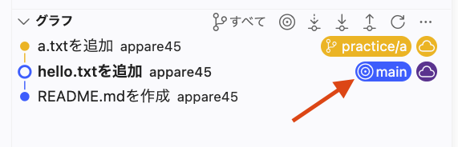

:::tip[演習]
もう一度先程自分が作成したブランチに切り替えて、自己紹介ファイルが復活していることを確認しましょう。
:::

### 3.1.3 ブランチをプッシュする

3.1.2でブランチを作ることで、安全にコミットすることができるようになりました。そのため、自分のパソコンで作成したコミットをGitHubにも同期することにします。

手元で作成したブランチやコミットをGitHubに同期することを「プッシュ」と呼びます。Visual Studio Codeの左下にある雲のマークをクリックすると自分のパソコンで作成したブランチやコミットが自動でGitHubに同期されます。

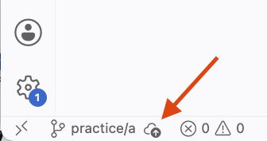

[GitHubを開いて](https://github.com/twin-te/git-practice-2026)`main`をクリックすると、GitHub上に同期されたブランチ一覧が表示されるので自分のブランチがあることを確認しましょう。

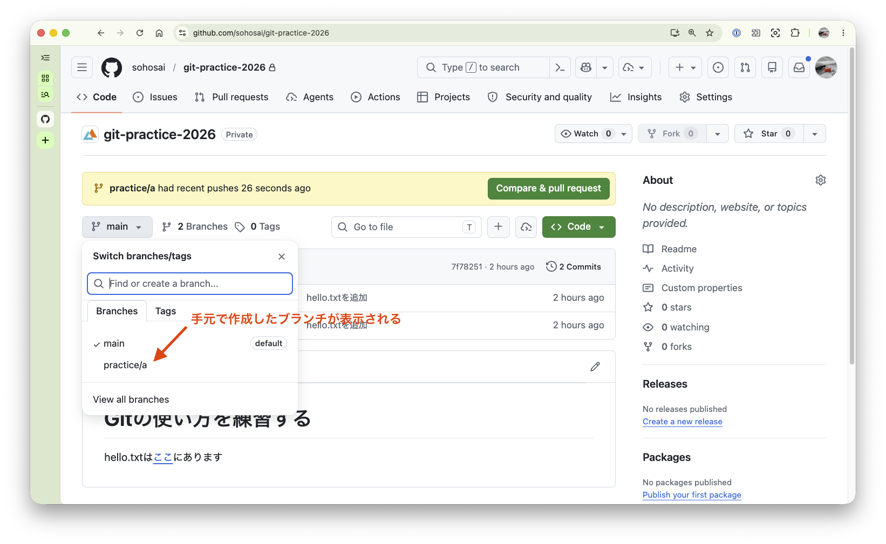

このときブランチを複数人で分けておくことで競合が発生せず自由に同期することができるようになります。

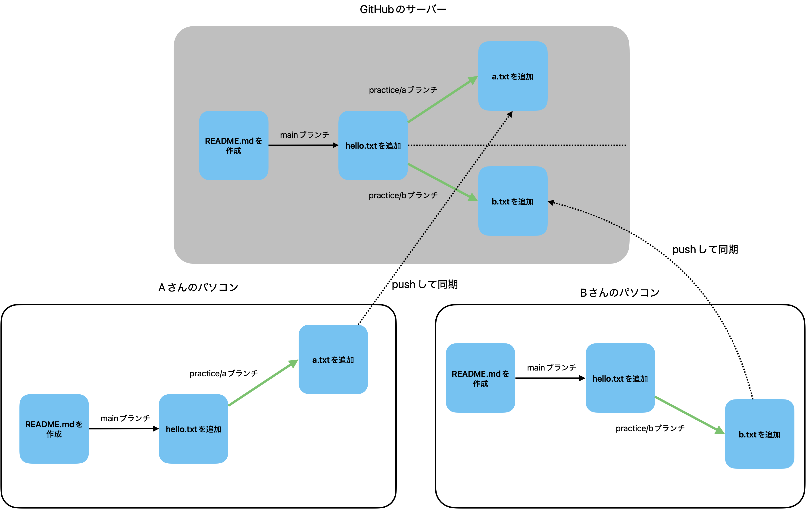
