## 4.1 mainブランチの運用

[3.1.2](/git/3branch#312-ブランチについて理解する)では、ブランチを使うことで複数人が同時に作業できるようになることを解説しました。ここでは、各自のブランチで行った作業を最終的に`main`ブランチに取り込む手順を学びます。

ブランチを作って作業するようになっても、`main`への取り込みをみんなが自由に行えてしまうと別の問題が起きます。

- 誰かが中途半端な状態のコードを`main`に取り込んでしまう
- バグが混入したまま`main`に取り込まれ、他の人が影響を受ける
- 変更の意図がわからないまま取り込まれる

これを防ぐために、チーム開発では **`main`への変更は必ずレビューを経由してから取り込む** というルールを設けることが多いです。そのための仕組みが**Pull Request**です。

## 4.2 Pull Requestを作成する

Pull RequestはGitHubの機能で、「このブランチの変更を`main`に取り込んでください」という申請のことです。申請を受けた他のメンバーが内容を確認し、問題がなければ取り込む（**マージ**する）という流れになります。

### 4.2.1 GitHubでPull Requestを作成する

[3.1.3](/git/3branch#313-ブランチをプッシュする)でブランチをプッシュした後、[GitHubのgit-practice-2026リポジトリ](https://github.com/twin-te/git-practice-2026)を開くと次のような黄色いバナーが表示されます。「Compare & pull request」をクリックしてください。

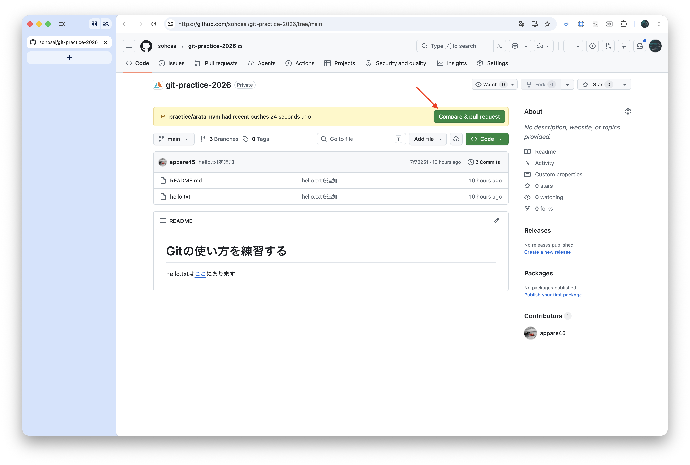

:::note
バナーが表示されない場合は、ページ上部の「Pull requests」タブ → 「New pull request」から手動で作成することもできます。「base」に`main`、「compare」に自分のブランチを選択したのち、「Create pull request」をクリックしてください。
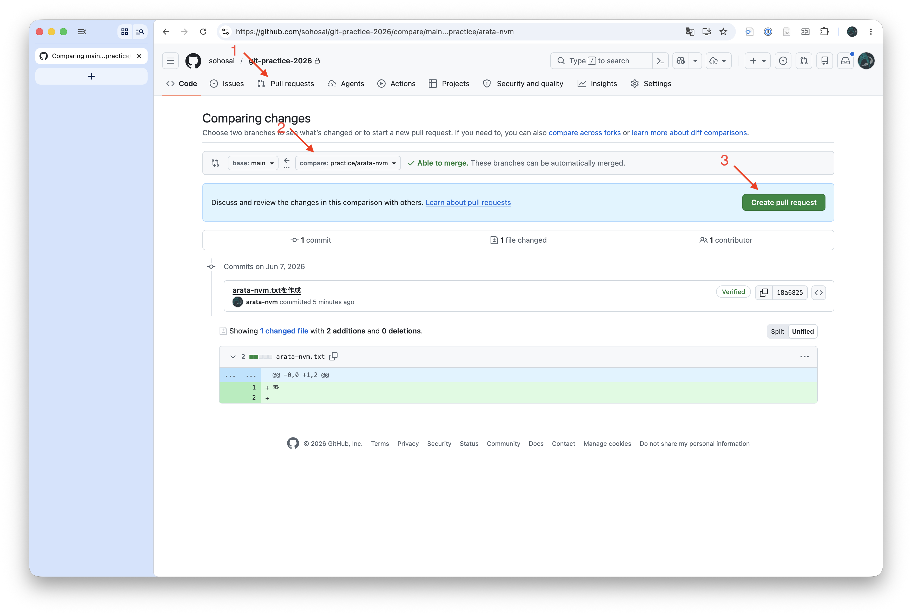
:::

Pull Requestの作成画面が開きます。ここでは次の項目を入力します。

- **title**: 変更内容を一言で表したもの（例：`自己紹介を追加: <自分のID>`）
- **description**: 変更の目的や内容の詳細（今回は空で構いません）

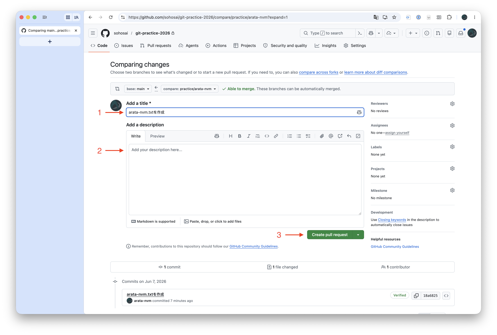

入力が終わったら「Create pull request」をクリックします。するとPull Requestが作成されます。

## 4.3 レビュー

Pull Requestの目的のひとつが**レビュー**です。レビューとは、マージする前に他のメンバーが変更内容を確認し、問題がないかをチェックする作業です。
ここでは、自分のPull Requestを自分でレビューしてみることで、レビューの手順を体験してみましょう。
もちろん、余裕がある場合は他のメンバーのPull Requestをレビューしても構いません。

### 4.3.1 変更内容を確認する

Pull Requestの「Files changed」タブを開くと、そのPRで変更されたファイルの差分を確認できます。

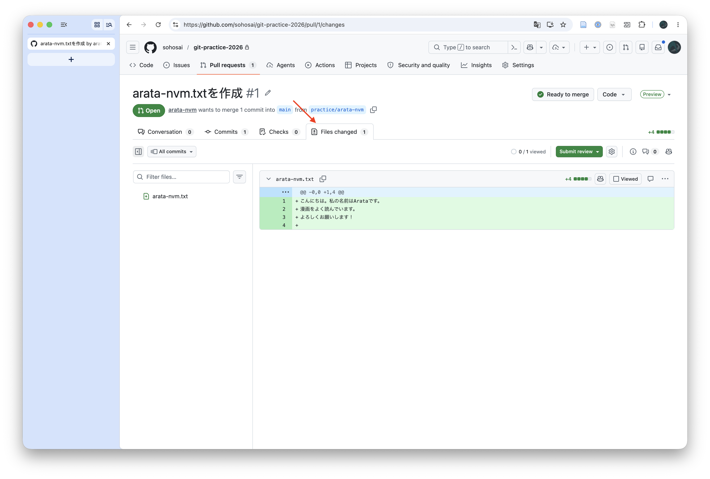

緑色の行が追加された部分、赤色の行が削除された部分です。今回のPull Requestでは追加のみでしたが、削除を含むPull Requestの場合は次のようになります。

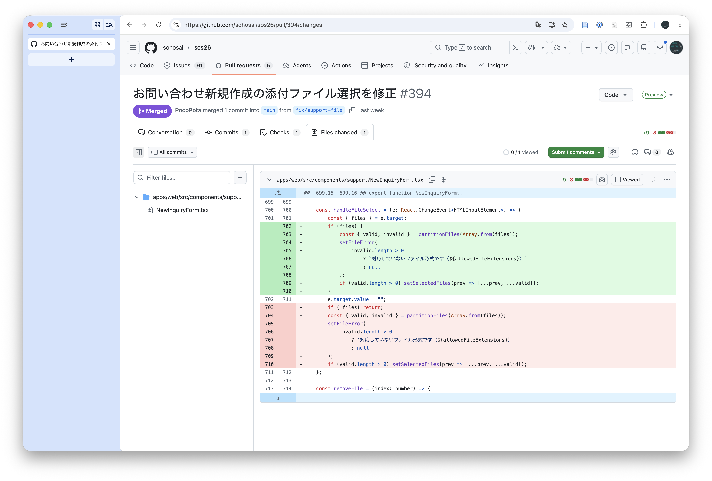

### 4.3.2 コメントを残す

レビュー中に気になる点があれば、コードの特定の行にコメントを残すことができます。差分の行にカーソルを合わせると「+」アイコンが表示されるのでクリックし、コメントを入力して「Start a review」をクリックします。

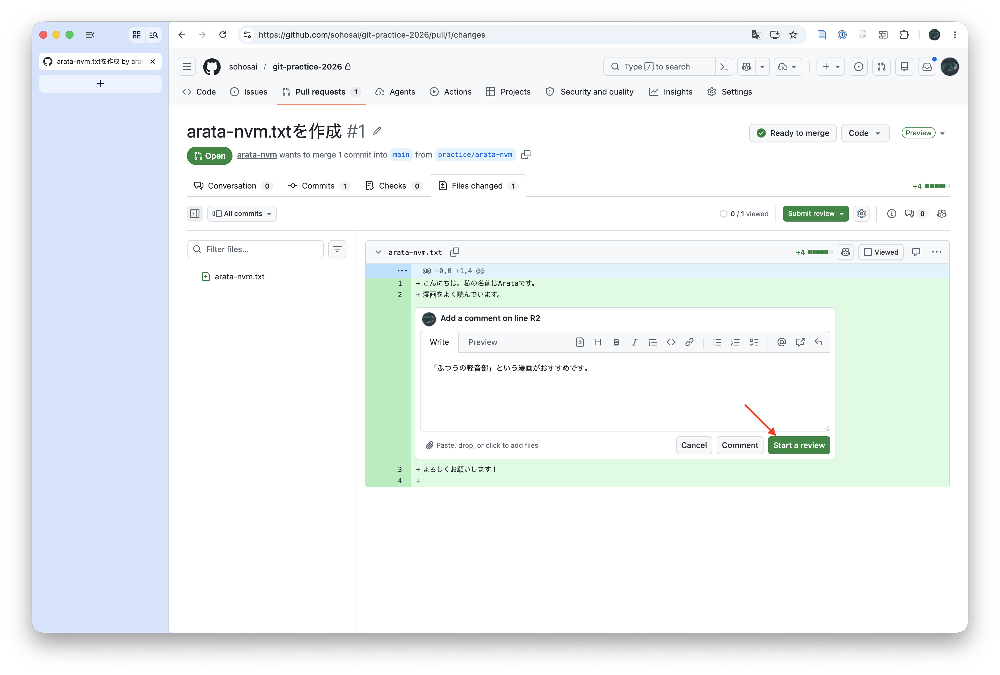

### 4.3.3 レビューを完了する

右上の「Submit review」をクリックすると、レビューを完了できます。ここでは次の3つの評価から1つを選びます。

- **Comment**: コメントのみ。特に問題はないが、気になる点がある場合などに選びます。
- **Approve**: 承認する。マージして問題ないときに選びます。
- **Request changes**: 変更を求める。指摘した内容を修正してから再度レビューを依頼してほしいときに選びます。

今回は自分のPull Requestに対して「Comment」を選び「Submit review」しましょう。

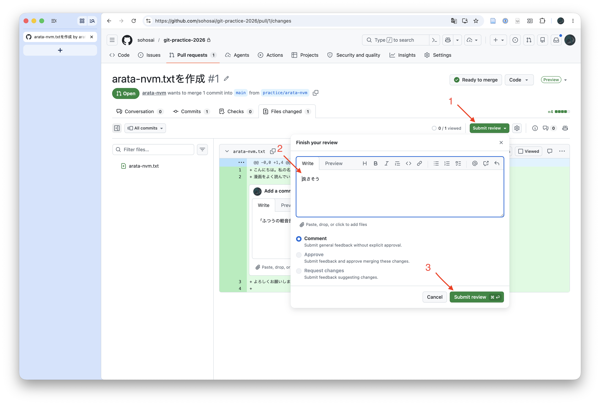

## 4.4 Pull Requestをマージする

レビューが完了したら、変更を`main`ブランチに取り込みます。この「取り込む」操作を**マージ**と呼びます。

### 4.4.1 マージとは何か

マージとは、分岐していたブランチのコミット履歴を`main`ブランチに統合する操作です。

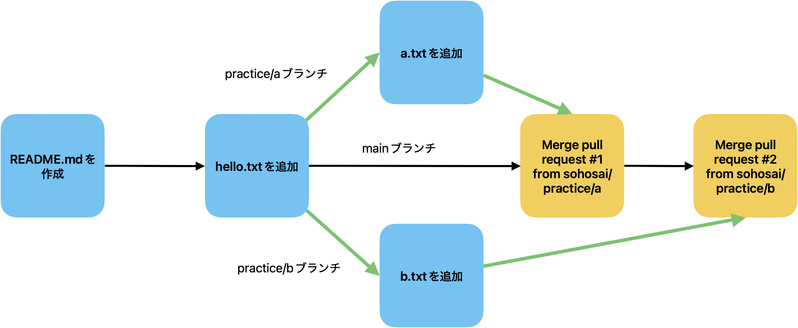

マージが完了すると、自分のブランチで行った変更が`main`ブランチにも反映されます。これにより、他の人が`main`をもとに新しいブランチを作ったときに、それらの変更も含んだ状態で作業を始められるようになります。

### 4.4.2 マージする

Pull Requestのページ下部にある「Merge pull request」をクリックします。

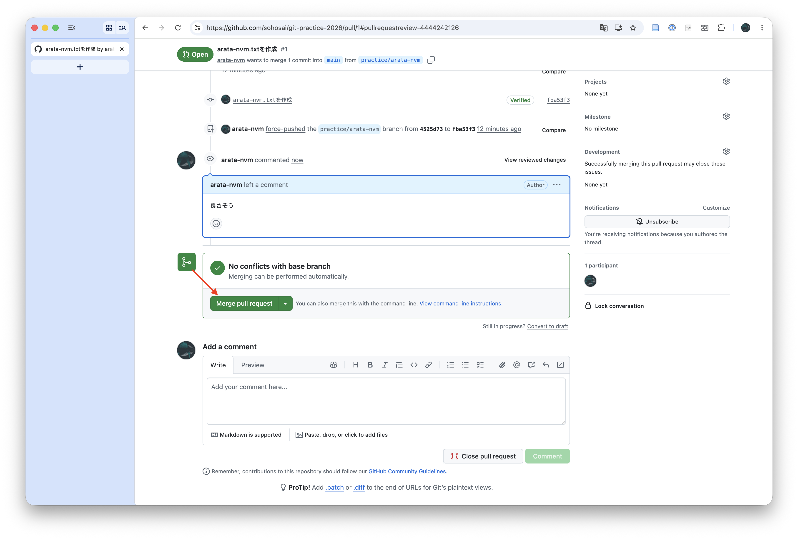

確認のダイアログが表示されるので「Confirm merge」をクリックします。すると次のような画面に切り替わり、マージが完了します。

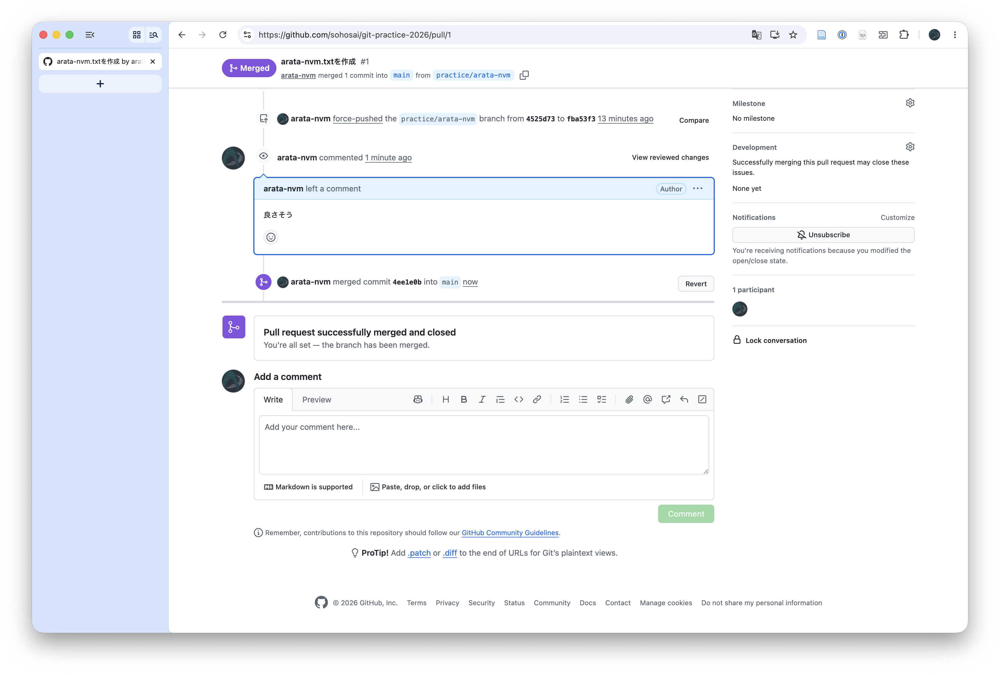

「Pull request successfully merged and closed」と表示されていれば成功です。マージ後は自分のブランチに加えた変更がすべて`main`に含まれています。あなたの自己紹介が、このリポジトリを使うみんなに共有されました。

### 4.4.3 マージ後に手元を最新の状態にする

GitHubではマージが完了しましたが、**手元の`main`ブランチはまだマージ前の状態のままです。** GitHubでマージしたコミットを手元にも取り込むには「プル」が必要です。

まず、Visual Studio Codeの左下のブランチ名をクリックして`main`に切り替えてください。

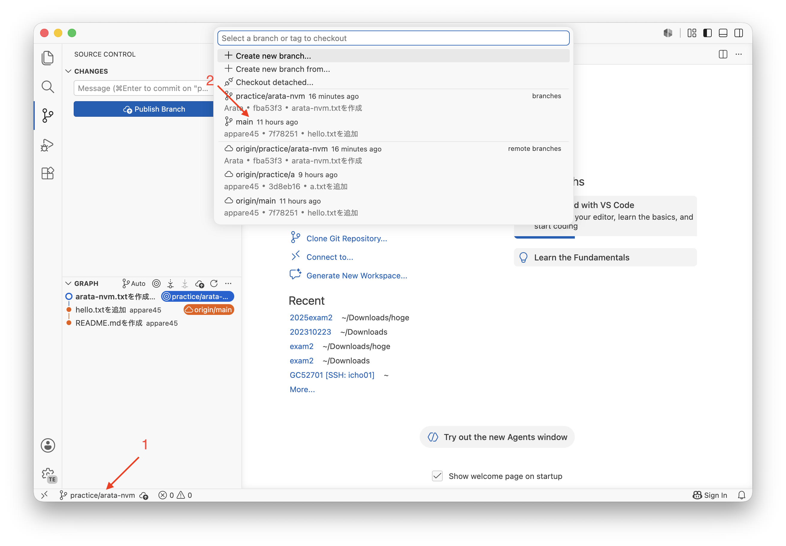

次に、Visual Studio Codeの左下にある🔃のマークをクリックしてください。するとGitHubでマージされた最新の状態が手元の`main`ブランチに反映されます（「プル」されます）。

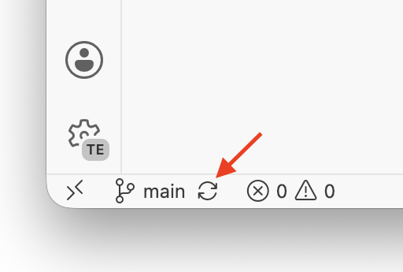

手元の`main`ブランチにも自分の変更が反映されていれば完了です。同じタイミングで他の人の自己紹介がマージされていたら、それも一緒に手元に届いているはずです。見てみましょう。

---

以上でGit/GitHubの基本的なワークフローは完了です。おさらいすると、今回学んだ開発の流れは次のようになります。

1. `main`から新しいブランチを作成する
2. ブランチ上で変更を加えてコミットする
3. ブランチをGitHubにプッシュする
4. GitHubでPull Requestを作成する
5. レビューを受けて必要であれば修正する
6. `main`にマージする
7. 手元の`main`をプルして最新の状態にする

次の章では、この流れを**本物のTwin:te公式サイトのリポジトリ**でもう一周します。今度はレビューするのは先輩、マージされれば本番のサイトに反映されます。
