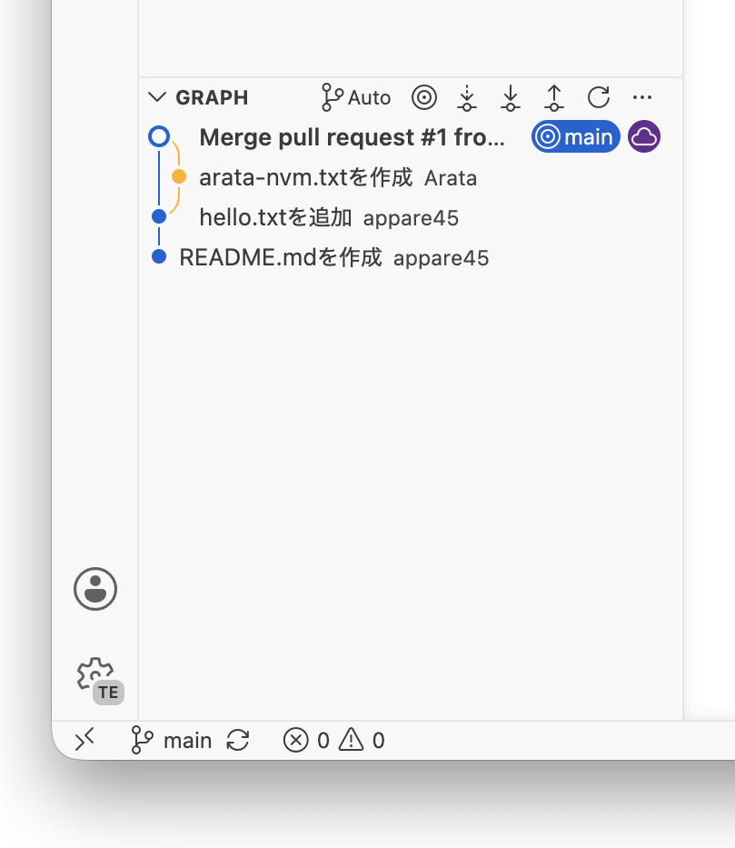

## 4.1 mainブランチの運用

[3.1.2](/git/3.branch#312-ブランチについて理解する)では、ブランチを使うことで複数人が同時に作業できるようになることを解説しました。ここでは、各自のブランチで行った作業を最終的に`main`ブランチに取り込む手順を学びます。

しかし、ブランチを作って作業するようになっても、`main`への取り込みをみんなが自由に行えてしまうと別の問題が起きます。

- 誰かが中途半端な状態のコードを`main`に取り込んでしまう
- バグが混入したまま`main`に取り込まれ、他の人が影響を受ける
- 変更の意図がわからないまま取り込まれる

これを防ぐために、チーム開発では**`main`への変更は必ずレビューを経由してから取り込む**というルールを設けることが多いです。そのための仕組みが**Pull Request**です。

## 4.2 Pull Requestを作成する

Pull RequestとはGitHubの機能で、「このブランチの変更を`main`に取り込んでください」という申請のことです。申請を受けた他のメンバーが内容を確認し、問題がなければ取り込む（**マージ**する）という流れになります。

### 4.2.1 GitHubでPull Requestを作成する

[3.1.3](/git/3.branch#313-ブランチをプッシュする)でブランチをプッシュした後、[GitHubのgit-practice-2026リポジトリ](https://github.com/sohosai/git-practice-2026)を開くと次のような黄色いバナーが表示されます。「Compare & pull request」をクリックしてください。

:::note
バナーが表示されない場合は、ページ上部の「Pull requests」タブ → 「New pull request」から手動で作成することもできます。「base」に`main`、「compare」に自分のブランチを選択してください。
:::

Pull Requestの作成画面が開きます。次の2つを入力してください。

- **タイトル**: 変更内容を一言で表したもの（例：`practice/自分のid のファイルを追加`）
- **本文（Description）**: 変更の目的や内容の詳細を書く欄です。今回は省略して構いません

入力が終わったら「Create pull request」をクリックします。するとPull Requestのページが作成されます。

ここまでの作業をまとめると次のようになります。

## 4.3 Pull Requestをマージする

作成されたPull Requestはチームメンバーがレビューし、問題がなければ`main`ブランチに取り込みます。この「取り込む」操作を**マージ**と呼びます。

### 4.3.1 マージとは何か

マージとは、分岐していたブランチのコミット履歴を`main`ブランチに統合する操作です。

マージが完了すると、自分のブランチで行った変更が`main`ブランチにも反映されます。これにより、他の人が`main`をもとに新しいブランチを作ったときに、自分の変更も含んだ状態で作業を始められるようになります。

### 4.3.2 マージを実行する

Pull Requestのページ下部にある「Merge pull request」をクリックします。

確認のダイアログが表示されるので「Confirm merge」をクリックします。すると次のような画面に切り替わり、マージが完了します。

「Pull request successfully merged and closed」と表示されていれば成功です。「Delete branch」をクリックして、マージ済みのブランチを削除しておきましょう。マージ後は自分のブランチに加えた変更がすべて`main`に含まれているため、そのブランチは不要になります。

:::note
ブランチを削除してもコミット履歴は`main`に残っています。誤って削除してしまっても変更内容が消えるわけではないので安心してください。
:::

### 4.3.3 マージ後に手元を最新の状態にする

マージが完了した時点では、**手元（ローカル）の`main`ブランチはまだ古い状態のままです。** GitHubでマージしたコミットを手元にも取り込むには「プル」が必要です。

Visual Studio Codeの左下のブランチ名をクリックして`main`に切り替え、その後「…」→「プル」を選択してください。

あるいはVisual Studio Codeの同期ボタン（↑↓のアイコン）をクリックしても同様の操作ができます。

手元の`main`ブランチにも自分の変更が反映されていれば完了です。

## 4.4 レビュー

Pull Requestの大きな目的のひとつが**コードレビュー**です。レビューとは、マージする前に他のメンバーが変更内容を確認し、問題がないかをチェックする作業です。

### 4.4.1 変更内容を確認する

Pull Requestの「Files changed」タブを開くと、そのPRで変更されたファイルの差分を確認できます。緑色の行が追加された部分、赤色の行が削除された部分です。

### 4.4.2 コメントを残す

レビュー中に気になる点があれば、コードの特定の行にコメントを残すことができます。差分の行にカーソルを合わせると「+」アイコンが表示されるのでクリックし、コメントを入力して「Start a review」をクリックします。

### 4.4.3 レビューを完了する

「Files changed」タブ右上の「Review changes」をクリックすると、レビューの最終評価を選べます。

- **Comment**: コメントのみ残す（承認も却下もしない）
- **Approve**: 変更を承認する。マージしてOKという意思表示
- **Request changes**: 変更を求める。指摘した内容を修正してから再度レビューを依頼してほしいという意思表示

今回の練習ではレビューの手順をひととおり体験することが目的なので、他のメンバーのPRに対して「Approve」を行ってみてください。

:::note
実際のチーム開発では、レビュアーが「Approve」を出してはじめてマージできるようにルールを設定することが多いです。このルールを**ブランチ保護ルール**と呼び、GitHubのリポジトリ設定から有効にすることができます。
:::

---

以上でGit/GitHubの基本的なワークフローは完了です。おさらいすると、今回学んだ開発の流れは次のようになります。

1. `main`から新しいブランチを作成する
2. ブランチ上で変更を加えてコミットする
3. ブランチをGitHubにプッシュする
4. GitHubでPull Requestを作成する
5. レビューを受けて必要であれば修正する
6. `main`にマージする
7. 手元の`main`をプルして最新の状態にする
