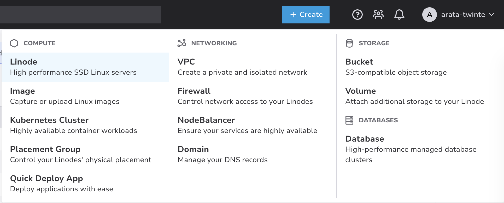

このページでは、Twin:te の引っ越し先になるサーバをクラウド上に用意します。

## SSH 鍵を用意しよう

クラウド上のサーバには SSH(Secure Shell)というプロトコルでログインして操作します。
パスワードでもログインできますが、推測や総当たりに弱いので、実際の運用では**公開鍵認証**を使うのが基本です。

公開鍵認証は、手元に秘密鍵・サーバに公開鍵を置いておき、「対応する秘密鍵を持っている人だけログインできる」という仕組みです[^pubkey]。

[^pubkey]: GitHub に SSH で push するときに使ったあの鍵と同じ仕組みです。既に鍵を作ったことがある人は、それを使い回しても構いません(公開鍵は名前の通り公開してよいものなので、複数のサービスに同じ公開鍵を登録して問題ありません)。

まだ鍵を持っていない人は、手元のターミナルで作りましょう。

```sh
$ ssh-keygen -t ed25519
```

いくつか質問されますが、全部そのまま `Enter` で大丈夫です。
すると `~/.ssh/` 以下に

- `id_ed25519`: **秘密鍵。絶対に人に見せない・送らない**
- `id_ed25519.pub`: 公開鍵。こちらをサーバに登録する

の2つのファイルができます。

公開鍵の中身を表示してみましょう。

```sh
$ cat ~/.ssh/id_ed25519.pub
ssh-ed25519 AAAA...(長い文字列)... yourname@yourpc
```

この1行を後で使うので、コピーできるようにしておいてください。

Windows で `ssh-keygen` が見つからない、などで詰まったら周りのTAに聞いてください。

## Akamai Cloud で VM を作ろう

いよいよ VM[^vm] を作ります。

[^vm]: あなたのPCと同じような「コンピュータ」のことです。仮想化技術を使って、1台の物理マシンの上に複数の仮想的なコンピュータ(Virtual Machine, VM)を作っているなど違いはありますが、使い方はほぼ同じです。

[Akamai Cloud](https://cloud.linode.com/) の右上の **Create** ボタンから **Linode** を選んでください。
Linode ではひとつひとつの VM のことを「Linode」と呼びます。



作成フォームでは以下のように設定します。

| 項目 | 設定値 |
|---|---|
| Region | **JP, Osaka (jp-osa)** |
| Images | **Ubuntu 24.04 LTS** |
| Linode Plan | **Shared CPU → Nanode 1GB** |
| Linode Label | **`training-<あなたの名前>`** |
| SSH Keys | **Add An SSH Key → 最初に用意したSSHの公開鍵(~/.ssh/id_ed25519.pub)の中身をペースト** |
| Root Password | **適当な強いパスワード（今後使用するのでパスワードマネージャなどに保存）** |

他の項目はデフォルトのままで問題ありません。

設定できたら **Create Linode** を押しましょう。
ステータスが `PROVISIONING` からしばらくして `RUNNING` になれば、あなたのサーバがインターネット上に誕生しています。
インスタンスの詳細画面に表示される **Public IP アドレス**をメモしておいてください。

## Cloud Firewall を作ろう

作った VM に SSH したいところですが、その前にファイアウォールを設定します。

インターネットに公開されたサーバには、世界中から**常時**怪しいアクセスが飛んできます[^scan]。
そのため「許可した通信以外は全部落とす」が基本の設定になります。
Linode にはこれを VM の外側でやってくれる **Cloud Firewall** という機能があります。

[^scan]: 大袈裟に聞こえるかもしれませんが本当です。演習が終わる頃に VM の `/var/log/auth.log` を見てみると面白いログが見られるかもしれません。

左メニューの **Firewalls** から **Create Firewall** を選び、次のように作ってください。

- Label: `training-<あなたの名前>-fw`
- Linodes: さっき作った自分のLinodeを選択

作成した Firewall の **Rules** タブを見てみましょう。
**Default Inbound Policy が `Drop`** になっていることを確認してください。
これは「明示的に許可した inbound(インターネットからサーバ)通信以外は全部捨てる」という意味です。
一方**Default Outbound Policy は `Accept`** になっているはずです。
これは「outbound(サーバからインターネット)通信は全部通す」という意味です。

さて、ここでルールを何も足さずに、試しに SSH してみましょう。
手元のターミナルから、先ほど作成した Linode の Public IP アドレスに対して SSH します。

```sh
$ ssh root@<あなたのVMのIPアドレス>
```

しばらく待つとこうなるはずです。

```sh
ssh: connect to host *.*.*.* port 22: Operation timed out
```

そうです、**SSH(ポート22)も inbound 通信**なので、Default Inbound Policy `Drop` によって遮断されてしまいました。

Backend 編の [Phase 2](/backend/2-practice/phase2/) で「ポートを開けないとアクセスできない」というのをやった人は、あのときの `docker-compose.yml` の `ports:` と似た話だと気づいたかもしれません。
場所も仕組みも違いますが、「通信はデフォルトで通らない。通したいものを明示的に開ける」という発想は同じです。

では SSH を通しましょう。Rules タブの **Add an Inbound Rule** で、

- Preset: **SSH**(Port:22, Sources: All IPv4, All IPv6 が自動で入ります)

を追加して、**Save Changes** を押してください。

もう一度 SSH してみると:

```sh
$ ssh root@<あなたのVMのIPアドレス>
...
Welcome to Ubuntu 24.04 LTS (GNU/Linux ...)
root@localhost:~#
```

入れました!成功です!
初回接続時に `Are you sure you want to continue connecting?` と聞かれたら `yes` と答えてください[^hostkey]。

[^hostkey]: 「このサーバ、初めて会う相手だけど本当に信用していい?」という確認です。接続先ホストの鍵(ホストキー)を記憶して、次回以降なりすましを検出できるようにしています。

ちなみに、いまインターネットに向けて開いているポートはこの **22 だけ**です。Web アプリの公開に使うポート(80/443)は、[公開する直前](/infra/5-publish/)に開けます。

確認できたら `exit` でいったんサーバから抜けておきましょう。

## VSCode でサーバに入ろう

SSH でサーバに入れるようになりましたが、この先はサーバの上で設定ファイルをいくつも作ったり書き換えたりします。ターミナル用のエディタ(nano や vim)でも作業できますが、せっかくなので**VSCode をそのままサーバに接続**しましょう。VSCode には **Remote - SSH** という拡張機能があり、SSH の先にあるサーバ上のファイルを、手元のファイルと同じ感覚で編集できます。

1. VSCode の拡張機能タブで「ms-vscode-remote.remote-ssh」を検索してインストールします
2. コマンドパレット(`Cmd/Ctrl + Shift + P`)で **Remote-SSH: Connect to Host...** を選びます
3. 接続先として `root@<あなたのVMのIPアドレス>` と入力して `Enter`
4. 新しいウィンドウが開きます。初回は接続先の OS を聞かれることがあるので **Linux** を選んでください。サーバ側に VSCode 用のプログラムが自動でインストールされるので、少し待ちます[^vscode-server]
5. ウィンドウ左下の緑色の表示が **`SSH: <あなたのVMのIPアドレス>`** になっていれば接続成功です

[^vscode-server]: Remote - SSH は、初回接続時にサーバ側へ「VSCode Server」という小さな本体を送り込んで動かしています。手元の VSCode は画面係になり、ファイルの読み書きやターミナルは全部サーバ側で実行される、という仕組みです。

<!-- TODO: screenshot (Remote-SSH で接続した VSCode のウィンドウ。左下の SSH: 表示がわかるもの) -->

接続できたら、メニューの **Terminal → New Terminal** でターミナルを開いてみてください。プロンプトが `root@localhost:~#` になっているはずです。これは手元の PC ではなく**サーバの中の**シェルです。さっき `ssh` コマンドでやったことと中身は同じで、VSCode が裏で SSH 接続を張ってくれている、というわけです。

以降のページでは、この VSCode のウィンドウで作業します。コマンドはこの統合ターミナルで実行し、ファイルの作成・編集はいつも通りエディタで行ってください。

:::note[TAに作業を依頼しよう]
この演習では、最後にあなたの Twin:te インスタンスを `https://training-*.twinte.net` のような URL で公開します。そのために、TAが以下の作業を行います。

- あなたのサブドメインの **DNS レコードの追加**
- Google ログイン用の **OAuth コールバック URL の登録**

どちらも反映に少し時間がかかることがあるので、ここに辿り着いたタイミングでTAに **Linode の Public IP アドレス**を伝えて作業を依頼してください。
:::

サーバの準備ができました。いよいよ [Twin:te を動かしに行きましょう](/infra/4-deploy/)!
